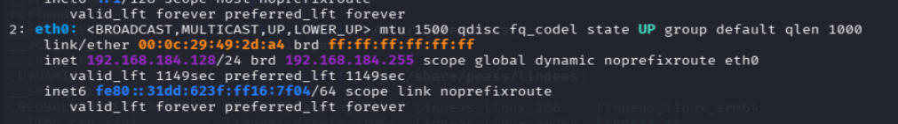
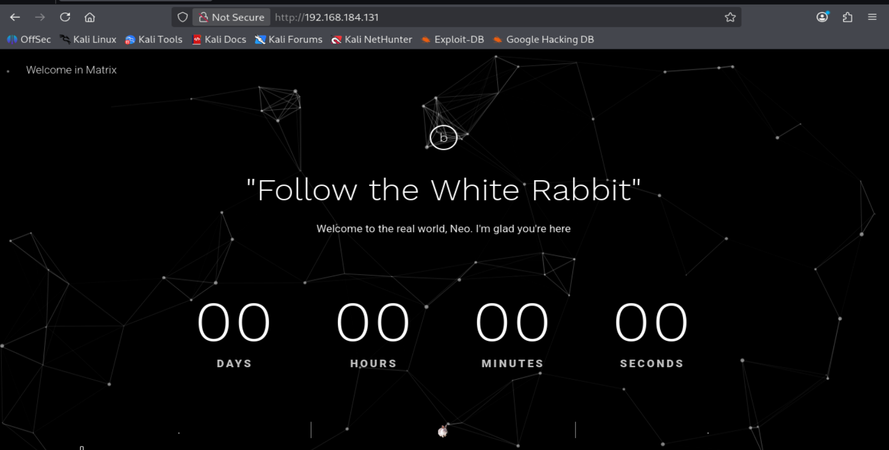
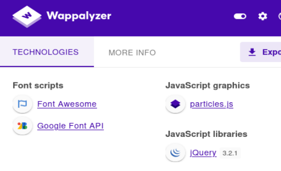
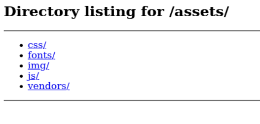
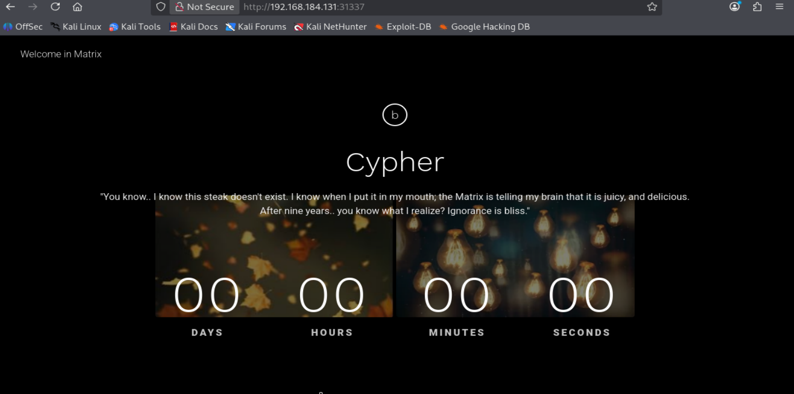
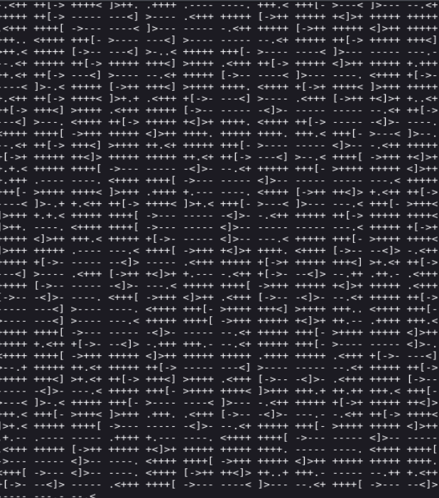

# Writeup muy detallado de **Matrix1** (VulnHub)

## Descripción original y traducción

**Texto original:**

> Description: Matrix is a medium level boot2root challenge. The OVA has been tested on both VMware and Virtual Box.  
> Difficulty: Intermediate  
> Flags: Your Goal is to get root and read /root/flag.txt  
> Networking: DHCP: Enabled IP Address: Automatically assigned  
> Hint: Follow your intuitions ... and enumerate!  
> For any questions, feel free to contact me on Twitter: @unknowndevice64

**Traducción al español:**

**Descripción:** Matrix es un reto *boot2root* de dificultad media. La máquina OVA ha sido probada tanto en VMware como en VirtualBox.  

**Dificultad:** Intermedia.  

**Objetivo / flags:** El objetivo es conseguir privilegios de **root** y leer el archivo `/root/flag.txt`.  

**Red:** DHCP habilitado. La dirección IP se asigna automáticamente.  

**Pista:** Sigue tu intuición… y enumera.  

---

## Qué significa “boot2root”

Una máquina *boot2root* es una máquina vulnerable pensada para practicar pentesting y escalada de privilegios. El flujo general es este:

1. Arrancas la máquina víctima.
2. Descubres cuál es su IP.
3. Enumeras servicios abiertos.
4. Encuentras una vía de entrada.
5. Consigues un usuario inicial.
6. Escalas privilegios hasta **root**.
7. Lees la flag final.

Es decir, no se trata solo de “entrar”, sino de recorrer toda la cadena de explotación hasta control total del sistema.

---

## Preparación del laboratorio y por qué usamos NAT

En esta máquina hemos configurado la red en **adaptador NAT** y no en puente.

### Por qué NAT es una buena opción en este escenario

Cuando usas **NAT** en VMware o VirtualBox:

- la máquina Kali y la máquina víctima quedan dentro de una **red privada virtual** creada por el hipervisor;
- ambas máquinas se ven entre sí;
- pueden salir a internet a través del servicio NAT del hipervisor;
- pero no quedan expuestas directamente a tu red física doméstica o corporativa.

Eso es muy útil en laboratorios como VulnHub porque:

- el entorno queda más aislado;
- el escaneo es más limpio;
- es más fácil identificar la IP víctima;
- reduces ruido al no ver todos los dispositivos reales de tu casa;
- evitas tocar por error otros equipos de tu red local.

### Diferencia mental entre NAT y Bridge

#### NAT
Piensa en NAT como una **red privada artificial** creada por el hipervisor.

Ejemplo típico:

- Kali: `192.168.184.128`
- Víctima: `192.168.184.131`

Ambas existen en una red virtual controlada por VMware.

#### Bridge
Piensa en Bridge como “enchufar” la máquina virtual a la misma red física donde está tu ordenador host.

Ejemplo:

- tu router de casa asigna IPs reales;
- tu Kali y tu víctima aparecerían junto a móviles, smart TV, impresoras, etc.

Para laboratorios, NAT suele ser más cómodo y controlado.

---

## Arranque de las máquinas

Una vez configurada la red NAT y encendidas ambas máquinas, en la víctima vemos una pantalla de login local. No conocemos ninguna credencial, así que por ahora no intentamos acceder desde consola y pasamos a la enumeración por red.

---

## Identificación de nuestra IP y del rango de red

Lo primero que hacemos en Kali es identificar nuestra interfaz y la IP asignada.

### Comando

```bash
ip a
```

### Qué hace `ip a`

`ip` es la herramienta moderna de Linux para gestionar interfaces, rutas y direcciones IP.  
La opción `a` viene de `address`, y sirve para mostrar las direcciones asignadas a las interfaces de red.

Nos interesa la interfaz **eth0**.



En nuestro caso vemos:

```bash
inet 192.168.184.128/24
```

### Qué significa exactamente `192.168.184.128/24`

- `192.168.184.128` es la IP de Kali dentro de la red virtual.
- `/24` significa que la máscara de red es de 24 bits, es decir, equivalente a `255.255.255.0`.

Eso implica que el rango lógico que vamos a explorar es:

- red: `192.168.184.0`
- hosts posibles: `192.168.184.1` a `192.168.184.254`

---

## Descubrimiento de hosts activos con Nmap

Ahora hacemos el escaneo de descubrimiento para saber qué IPs están vivas en esta red NAT.

### Comando

```bash
sudo nmap -n -sn 192.168.184.128/24
```

### Explicación de las flags

#### `sudo`
Nmap necesita privilegios elevados para algunos tipos de descubrimiento de hosts, especialmente cuando usa ciertos paquetes de bajo nivel.

#### `-n`
Le dice a Nmap que **no resuelva DNS**.

Sin `-n`, Nmap puede intentar convertir direcciones IP en nombres de host consultando DNS.  
Con `-n`:

- el escaneo va más rápido;
- se reduce ruido;
- solo vemos IPs, que es lo que aquí nos interesa.

#### `-sn`
Significa **Ping Scan** o escaneo de descubrimiento.

Le dice a Nmap:

- descubre qué hosts están activos;
- pero **no escanees puertos**.

Es decir:

- sí detecta equipos encendidos;
- no busca servicios abiertos todavía.

#### `192.168.184.128/24`
Es el rango de red que estamos indicando.  
Nmap recorre toda esa subred y comprueba qué direcciones responden.

---

## Resultado del descubrimiento

Tenemos las siguientes IPs vivas:

```bash
192.168.184.1
192.168.184.2
192.168.184.128
192.168.184.131
192.168.184.254
```

Sabemos que:

- `192.168.184.128` es nuestra Kali;
- `192.168.184.131` por descarte es la víctima.

### Por qué aparecen también `.1`, `.2` y `.254`

Esto es muy importante entenderlo bien, porque en redes NAT de VMware suele pasar siempre.

#### `192.168.184.1`
Suele ser el **gateway virtual** de la red NAT.  
Es la “puerta de salida” que usa la VM para salir hacia internet o hacia redes externas a través del motor NAT de VMware.

#### `192.168.184.2`
Suele estar relacionado con el **servicio DHCP** de VMware.  
Es decir, el componente que reparte direcciones IP automáticamente a las VMs.

#### `192.168.184.254`
Puede aparecer como otra interfaz interna o servicio auxiliar del entorno NAT de VMware.

### Conclusión

La IP que nos interesa como víctima es:

```bash
192.168.184.131
```

---

## Escaneo completo de puertos y servicios

Ahora sí hacemos el escaneo más serio sobre la víctima.

### Comando

```bash
sudo nmap -p- --open -sCV -Pn -T5 -vvv -oN fullscan 192.168.184.131
```

### Explicación detallada de cada flag

#### `-p-`
Escanea **todos los puertos TCP**, del 1 al 65535.  
Sin esto, Nmap solo escanearía un conjunto reducido de puertos frecuentes.

#### `--open`
Hace que en la salida final se muestren solo los puertos abiertos.  
Así se reduce ruido.

#### `-sC`
Lanza los **scripts por defecto** de NSE (Nmap Scripting Engine).  
Estos scripts ayudan a identificar información adicional, por ejemplo:

- cabeceras HTTP;
- banners;
- si un FTP permite acceso anónimo;
- títulos de páginas web;
- detalles SSH, etc.

#### `-sV`
Activa la detección de versiones de servicios.  
Sirve para saber no solo que hay “HTTP”, sino por ejemplo:

- `SimpleHTTPServer 0.6`
- `OpenSSH 7.7`

#### `-Pn`
Le dice a Nmap que **no haga descubrimiento previo de host** y trate la IP como activa de antemano.

Esto es útil cuando:
- algunos hosts filtran ping;
- o quieres forzar el escaneo directamente.

#### `-T5`
Aumenta mucho la agresividad y velocidad del escaneo.  
En laboratorio suele estar bien. En entornos reales puede provocar:

- falsos negativos;
- paquetes perdidos;
- ruido excesivo.

#### `-vvv`
Salida muy detallada.  
Nos sirve para ver más información durante el proceso.

#### `-oN fullscan`
Guarda la salida en formato “normal” en un archivo llamado `fullscan`.  
Esto es buena práctica porque te deja evidencia reutilizable y evita repetir el escaneo innecesariamente.

---

## Puertos encontrados

```text
22/tcp    open  ssh     OpenSSH 7.7
80/tcp    open  http    SimpleHTTPServer 0.6 (Python 2.7.14)
31337/tcp open  http    SimpleHTTPServer 0.6 (Python 2.7.14)
```

### Interpretación inicial

Tenemos tres superficies de ataque:

1. **SSH (22)**  
   Servicio de acceso remoto. Normalmente requiere credenciales válidas.

2. **HTTP en puerto 80**  
   Servicio web estándar.

3. **HTTP en puerto 31337**  
   Otro servicio web en un puerto poco habitual.  
   El puerto `31337` es muy típico en CTFs y labs porque llama la atención por su carácter “leet”.

### Detalle importante sobre `SimpleHTTPServer 0.6 (Python 2.7.14)`

Esto significa que no parece Apache ni Nginx, sino el servidor HTTP sencillo que se puede arrancar desde Python, algo equivalente a:

```bash
python -m SimpleHTTPServer
```

o, en Python 3:

```bash
python3 -m http.server
```

Eso suele implicar que:

- la aplicación puede ser muy simple;
- puede haber contenido estático;
- puede haber directorios listables;
- el autor ha montado algo más tipo laboratorio o prueba que una web “real”.

---

## Primera visita al puerto 80

Visitamos en navegador:

```text
http://192.168.184.131
```

Nos encontramos la página de la **imagen 2**.



La web muestra el mensaje:

> “Follow the White Rabbit”

Esto es una referencia clarísima a *The Matrix*.  
Ya desde aquí el reto nos está diciendo dos cosas:

1. la temática del reto gira en torno a Matrix;
2. el mensaje seguramente es una **pista operativa**, no decoración.

### Qué significa “Follow the White Rabbit” en contexto de hacking

No hay que interpretarlo solo como frase bonita. En un CTF o lab, una frase tan concreta suele insinuar:

- busca algo relacionado con un conejo;
- sigue una pista escondida;
- navega por recursos secundarios;
- hay una pieza visual o textual que te llevará al siguiente paso.

---

## Wappalyzer y por qué aquí aporta poco

También probamos Wappalyzer y no muestra gran cosa útil.



Detecta tecnologías de frontend como:

- Font Awesome
- Google Font API
- particles.js
- jQuery

### Por qué esto no ayuda demasiado aquí

Wappalyzer es útil para identificar stacks comunes:
- WordPress
- React
- Vue
- Bootstrap
- jQuery
- Nginx, etc.

Pero aquí lo que detecta es principalmente **parte visual del frontend**, no una tecnología backend vulnerable o algo directamente explotable.

Conclusión:
- interesante como reconocimiento;
- no da aún una vía de entrada.

---

## Fuzzing del puerto 80 con ffuf

Ahora hacemos enumeración de rutas.

### Comando

```bash
ffuf -u http://192.168.184.131/FUZZ -c -w /usr/share/wordlists/dirbuster/directory-list-2.3-medium.txt -t 100
```

### Explicación de las flags

#### `-u`
Especifica la URL objetivo.

`FUZZ` es el marcador que ffuf sustituye por cada palabra del diccionario.

Ejemplo:
- `/admin`
- `/login`
- `/assets`
- `/robots.txt`

#### `-c`
Activa color en la salida.  
No cambia el ataque, solo mejora la visualización.

#### `-w`
Indica el wordlist que se va a usar.

En este caso:
`/usr/share/wordlists/dirbuster/directory-list-2.3-medium.txt`

Es un diccionario grande de nombres de directorios y archivos comunes.

#### `-t 100`
Usa 100 hilos concurrentes.  
Eso acelera mucho el fuzzing.

En laboratorio suele ser aceptable. En producción podría ser demasiado agresivo.

---

## Resultado del fuzzing en puerto 80

Se encuentra:

```text
assets [Status: 301]
```

### Qué significa `301`

Un `301` es una redirección permanente.  
Aquí normalmente significa que `/assets` existe y te redirige a `/assets/`.

---

## Exploración de /assets

Entramos a:

```text
http://192.168.184.131/assets/
```

Y vemos un **directory listing**, como en la imagen 4.



### Qué significa un directory listing

Un **directory listing** es cuando el servidor web no muestra una página concreta, sino el contenido del directorio en forma de índice.

Esto es muy interesante porque:

- te deja navegar la estructura de carpetas;
- puedes descubrir archivos no enlazados desde la web;
- permite encontrar recursos olvidados, nombres raros, backups, ficheros temporales o pistas.

Dentro vemos carpetas como:
- `css/`
- `fonts/`
- `img/`
- `js/`
- `vendors/`

A priori parece solo frontend. Pero seguimos investigando porque el reto nos ha avisado de que enumeremos.

---

## Hallazgo importante dentro de /assets/img

Al revisar `img/` encontramos cosas interesantes, sobre todo:

- un `.gitkeep`
- un archivo llamado **`p0rt_31337.png`**

### Por qué `.gitkeep` llama la atención

`.gitkeep` se usa a veces para forzar que Git mantenga carpetas vacías en un repositorio.  
No es explotable por sí mismo, pero es una pista de que el contenido probablemente proviene de un árbol de proyecto o despliegue más “manual”.

### Por qué `p0rt_31337.png` es MUY importante

Ese nombre no parece casual.  
Nos está diciendo literalmente:

- **p0rt**
- **31337**

Y precisamente ese puerto estaba abierto.

Además, la imagen es un **conejo blanco**, como en la imagen 5.


### Conexión lógica de pistas

La cadena completa de razonamiento es:

1. La página inicial dice: **Follow the White Rabbit**
2. Dentro de `assets/img` encontramos una imagen de un conejo blanco
3. El nombre de esa imagen menciona el puerto **31337**
4. Ese puerto está abierto en Nmap

Conclusión:
👉 la web del puerto 80 nos está guiando al servicio del puerto **31337**

Este paso es importante porque enseña una lección real:
> Muchas veces una pista visual en la web no es solo decoración; es orientación hacia otra superficie de ataque.

---

## Acceso al puerto 31337

Visitamos:

```text
http://192.168.184.131:31337
```

Y encontramos una página diferente, como en la imagen 6.



### Texto que aparece

> "You know.. I know this steak doesn't exist. I know when I put it in my mouth; the Matrix is telling my brain that it is juicy, and delicious. After nine years.. you know what I realize? Ignorance is bliss."

### Traducción

> “Sabes... yo sé que este filete no existe. Sé que cuando me lo meto en la boca, la Matrix le está diciendo a mi cerebro que es jugoso y delicioso. Después de nueve años... ¿sabes de qué me doy cuenta? La ignorancia es la felicidad.”

Es una cita de Cypher en la película.  
De nuevo, la máquina insiste en la temática Matrix y, más importante, introduce el nombre **Cypher**, que más adelante resultará relevante.

---

## Fuzzing del puerto 31337

Hacemos de nuevo enumeración, ahora contra este servicio:

```bash
ffuf -u http://192.168.184.131:31337/FUZZ -c -w /usr/share/wordlists/dirbuster/directory-list-2.3-medium.txt -t 100
```

Y vuelve a aparecer `assets`. Exploramos esa ruta, pero esta vez no encontramos nada especialmente útil.

### Qué nos enseña esto

Aquí hay una lección importante:
> No siempre la segunda enumeración por rutas te da la clave directamente.  
> A veces hay que cambiar el enfoque: mirar HTML, comentarios, archivos estáticos, lógica visual o textos escondidos.

---

## Cambio de enfoque: revisar el código fuente

Como no encontramos nada útil por rutas, revisamos el **source code** de la página del puerto 31337 con `Ctrl + U`.

Y encontramos este bloque comentado:

```html
<!-- service -->
<div class="service">
    <!--p class="service__text">ZWNobyAiVGhlbiB5b3UnbGwgc2VlLCB0aGF0IGl0IGlzIG5vdCB0aGUgc3Bvb24gdGhhdCBiZW5kcywgaXQgaXMgb25seSB5b3Vyc2VsZi4gIiA+IEN5cGhlci5tYXRyaXg=</p-->
</div><!-- End / service -->
```

### Por qué esto es importante

Hay un comentario HTML que contiene una cadena larga terminada en `=`.  
Eso inmediatamente sugiere **Base64**, porque:

- Base64 usa caracteres alfanuméricos con `+`, `/` y `=`;
- el `=` al final es muy típico de padding;
- en CTFs es una de las primeras codificaciones que se prueban.

---

## Decodificación Base64

Probamos:

```bash
echo "ZWNobyAiVGhlbiB5b3UnbGwgc2VlLCB0aGF0IGl0IGlzIG5vdCB0aGUgc3Bvb24gdGhhdCBiZW5kcywgaXQgaXMgb25seSB5b3Vyc2VsZi4gIiA+IEN5cGhlci5tYXRyaXg=" | base64 -d
```

Resultado:

```bash
echo "Then you'll see, that it is not the spoon that bends, it is only yourself. " > Cypher.matrix
```

### Traducción del texto embebido

> “Entonces verás que no es la cuchara la que se dobla, sino solo tú mismo.”

Es otra referencia a Matrix.

### Lo realmente importante no es solo la frase

La clave es que lo decodificado **no es solo texto**, sino un **comando de shell**:

```bash
echo "..." > Cypher.matrix
```

Eso significa:

- alguien, en el contexto del reto, sugiere o revela que existe un archivo llamado `Cypher.matrix`;
- el operador `>` redirige salida a un archivo;
- por tanto el nombre `Cypher.matrix` es la pieza accionable.

### Qué hace exactamente `echo "..." > Cypher.matrix`

#### `echo`
Imprime texto por pantalla.

#### `>`
Redirige la salida a un archivo.

#### `Cypher.matrix`
Es el nombre del archivo destino.

Es decir, en lenguaje humano:

> “Escribe este texto dentro de un archivo llamado `Cypher.matrix`.”

La pista operativa aquí es:
👉 **buscar el archivo `Cypher.matrix`**

---

## Prueba directa del archivo en web

Probamos en la URL del puerto 31337:

```text
http://192.168.184.131:31337/Cypher.matrix
```

Y el archivo se descarga automáticamente.

Lo movemos a la carpeta de trabajo:

```bash
mv ~/Downloads/Cypher.matrix .
```

---

## Análisis del archivo Cypher.matrix

### Comando `file`

```bash
file Cypher.matrix
```

Resultado:

```bash
Cypher.matrix: ASCII text
```

### Qué significa esto

`file` es una herramienta que inspecciona un archivo y te dice de qué tipo parece ser.

Cuando te dice `ASCII text`, te está diciendo:

- no es un binario;
- no es una imagen;
- no es un ejecutable;
- es texto plano.

En principio uno pensaría: “perfecto, entonces con `cat` se leerá bien”.  
Pero no siempre. Un archivo puede ser texto y aun así estar escrito en un lenguaje raro, ofuscado o poco habitual.

### Al hacer `cat`

El contenido se ve extraño, como en la imagen 7.



Aparecen muchos símbolos como:

- `+`
- `<`
- `>`
- `[`
- `]`
- `-`
- `.`

Eso no parece texto legible normal.

---

## Identificación del lenguaje: Brainfuck

Aquí la intuición y la experiencia ayudan. Ese conjunto de caracteres es muy típico del lenguaje **Brainfuck**.

### Qué es Brainfuck

Brainfuck es un lenguaje de programación esotérico extremadamente minimalista.  
Utiliza solo ocho instrucciones, representadas por símbolos.

Los símbolos principales son:

- `>` mover puntero a la derecha
- `<` mover puntero a la izquierda
- `+` incrementar valor
- `-` decrementar valor
- `.` imprimir carácter
- `,` leer entrada
- `[` inicio de bucle
- `]` final de bucle

### Por qué es importante reconocerlo

No necesitas saber programarlo a mano, pero sí saber identificarlo.  
En CTFs, labs y retos temáticos es común encontrarse:

- Base64
- Hex
- Morse
- ROT13
- Brainfuck
- Base85
- etc.

Aquí la forma correcta de pensar es:

> “No entiendo este texto, pero parece una codificación o lenguaje esotérico. Voy a identificarlo y usar una herramienta para interpretarlo.”

---

## Uso de un intérprete / decompiler online de Brainfuck

Usamos una herramienta web como:

```text
https://copy.sh/brainfuck/
```

Pegamos el contenido del archivo y lo interpretamos.

### Resultado obtenido

El mensaje que nos devuelve es:

> You can enter into matrix as guest, with password k1ll0rXX  
> Note: Actually, I forget last two characters so I have replaced with XX try your luck and find correct string of password.

### Traducción al español

> Puedes entrar en la Matrix como **guest**, con la contraseña **k1ll0rXX**.  
> Nota: En realidad olvidé los dos últimos caracteres, así que los he reemplazado por **XX**. Prueba suerte y encuentra la cadena correcta de la contraseña.

### Qué significa esto operativamente

Ya tenemos:

- **usuario:** `guest`
- **contraseña parcial:** `k1ll0rXX`

Nos faltan solo dos caracteres.

---

## Generación de diccionario con `mp64`

Ahora necesitamos generar todas las combinaciones posibles para esos dos caracteres desconocidos.

Usamos:

```bash
mp64 k1ll0r?a?a > diccionario
```

### Qué es `mp64`

`mp64` es una herramienta de **generación rápida de máscaras** muy usada junto con ataques de fuerza bruta.  
Sirve para crear combinaciones a partir de un patrón.

### Qué significa la máscara `?a`

`?a` significa “cualquier carácter del conjunto completo”:
- letras minúsculas
- letras mayúsculas
- números
- símbolos

Como usamos dos veces `?a`, estamos generando todas las combinaciones posibles para dos posiciones.

### Por qué lo usamos aquí

Tenemos una contraseña casi completa:

```text
k1ll0rXX
```

y sabemos que los dos últimos caracteres son desconocidos.

La máscara:

```text
k1ll0r?a?a
```

significa:
- deja fijo `k1ll0r`
- rellena los dos últimos huecos con todas las combinaciones posibles

Eso genera un diccionario adecuado para probar por SSH.

---

## Ataque de fuerza bruta con Hydra

### Comando

```bash
hydra -l guest -P diccionario 192.168.184.131 ssh
```

### Explicación

#### `-l guest`
Indica un único usuario: `guest`

#### `-P diccionario`
Usa el archivo `diccionario` como lista de contraseñas

#### `192.168.184.131`
IP objetivo

#### `ssh`
Servicio sobre el que probar las credenciales

### Qué hace Hydra en lenguaje simple

Hydra toma el usuario `guest` y prueba una a una todas las contraseñas del diccionario contra el servicio SSH del servidor.

### Resultado

```text
[22][ssh] host: 192.168.184.131   login: guest   password: k1ll0r7n
```

La contraseña correcta es:

```text
k1ll0r7n
```

---

## Acceso inicial por SSH

Entramos:

```bash
ssh guest@192.168.184.131
```

Y obtenemos shell como el usuario `guest`.

---

## Primer obstáculo: shell restringida (`rbash`)

Cuando intentamos un comando simple como:

```bash
whoami
```

obtenemos:

```bash
-rbash: whoami: command not found
```

### Qué es `rbash`

`rbash` es **restricted bash**, es decir, una versión restringida de Bash.  
Es una shell que limita lo que el usuario puede hacer.

### Qué tipo de restricciones puede imponer

Dependiendo de la configuración, puede impedir:

- ejecutar comandos fuera del PATH permitido;
- usar rutas con `/`;
- cambiar directorio;
- modificar variables críticas;
- lanzar ciertos binarios;
- escapar fácilmente a una shell normal.

La idea del administrador es que el usuario quede “encerrado” en un entorno controlado.

### Importante: `rbash` no es root, solo restricción

No confundir:
- no estás sin privilegios por culpa de `rbash`;
- simplemente estás en una shell limitada.

Muchas veces el reto real consiste en:
1. escapar de la shell restringida;
2. restaurar entorno útil;
3. enumerar bien;
4. escalar privilegios.

---

## Entendiendo `$PATH` y por qué aquí es fundamental

### Qué es `$PATH`

`PATH` es una variable de entorno que le dice a la shell dónde buscar ejecutables cuando escribes un comando.

Por ejemplo, cuando escribes:

```bash
ls
```

la shell no sabe mágicamente dónde está `ls`. Lo busca en las rutas definidas en `$PATH`.

Ejemplo típico:

```bash
/usr/local/bin:/usr/bin:/bin
```

Entonces buscaría:
- `/usr/local/bin/ls`
- `/usr/bin/ls`
- `/bin/ls`

y ejecutaría el primero que encuentre.

### Qué pasa en esta `rbash`

Cuando hacemos algo como:

```bash
$PATH
```

obtenemos un error:

```bash
-rbash: /home/guest/prog: restricted: cannot specify `/` in command names
```

### Por qué ese error es útil

Aunque parezca un error feo, nos revela una información crucial:

```bash
/home/guest/prog
```

Es decir, el `PATH` del usuario restringido incluye esa ruta.

Eso significa que los comandos permitidos probablemente están ahí.

---

## Enumeración del PATH sin usar `ls`

Como `ls` no nos funciona, usamos `echo`, que sí aparece disponible en el `help`.

Hacemos:

```bash
echo /home/guest/prog/*
```

Resultado:

```bash
/home/guest/prog/vi
```

### Qué significa esto

Dentro del directorio permitido del PATH hay un ejecutable llamado:

```bash
vi
```

Y esto es una pista enorme.

---

## Por qué `vi` es peligrosísimo en entornos restringidos

`vi` o `vim` no es solo un editor de texto.  
También permite ejecutar comandos del sistema desde dentro del editor.

Por eso, en laboratorios y en seguridad ofensiva, si tienes acceso a `vi`, muchas veces tienes una vía de escape.

---

## GTFOBins y abuso de `vi`

Consultamos GTFOBins para `vi`.

GTFOBins es un repositorio de binarios legítimos de Linux que pueden abusarse para:
- escapar de restricciones;
- leer o escribir archivos;
- escalar privilegios;
- ejecutar comandos.

En `vi`, una técnica clásica es:

```vim
:!/bin/bash
```

### Qué significa exactamente

Dentro de `vi`, al escribir:

```vim
:!
```

le dices al editor:
> ejecuta un comando externo del sistema

Luego añades:

```vim
/bin/bash
```

Así que el editor lanza una shell Bash.

### Por qué esto rompe el confinamiento

Porque aunque tu shell original sea `rbash`, estás usando un binario permitido (`vi`) para lanzar otra shell más completa.

---

## Escape de rbash a bash normal

Usamos `vi` y dentro ejecutamos:

```vim
:!/bin/bash
```

Y efectivamente escapamos a una Bash normal.

### Cómo comprobamos que ahora ya no estamos tan limitados

Antes `ls` no funcionaba.  
Ahora sí:

```bash
ls
Desktop/  Documents/  Downloads/  Music/  Pictures/  Public/  Videos/  prog/
```

Eso ya nos indica que no estamos en el mismo nivel de restricción.

---

## Todavía hay un problema: el entorno sigue heredado y faltan comandos

Aunque ya estamos en una shell Bash, todavía hay comandos que fallan:

```bash
clear
sudo
whoami
```

Esto confunde mucho al principio, pero el problema no es que no existan, sino que el **entorno heredado** sigue limitado.

---

## Restauración del entorno con `export`

Usamos:

```bash
export SHELL=bash
export PATH=/usr/bin:$PATH
```

### Explicación detallada

#### `export`
Sirve para definir variables de entorno que la shell actual y sus procesos hijos van a usar.

---

### `export SHELL=bash`

Cambia la variable de entorno `$SHELL`.

Antes probablemente apuntaba a algo como:

```bash
/bin/rbash
```

Eso puede hacer que algunos programas sigan pensando que tu shell es restringida.

Con:

```bash
export SHELL=bash
```

le dices al entorno:

> mi shell es Bash normal

---

### `export PATH=/usr/bin:$PATH`

Esto antepone `/usr/bin` al PATH actual.

Si antes el PATH solo contenía algo muy reducido como:

```bash
/home/guest/prog
```

ahora pasará a ser algo como:

```bash
/usr/bin:/home/guest/prog
```

Y en `/usr/bin` viven un montón de binarios fundamentales, por ejemplo:

- `whoami`
- `sudo`
- `clear`
- `id`
- `find`
- muchos más

### Resultado

Tras eso ya funcionan:

```bash
whoami
sudo -l
clear
```

---

## Enumeración de sudo

Ahora sí ejecutamos:

```bash
sudo -l
```

Y obtenemos:

```text
User guest may run the following commands on porteus:
    (ALL) ALL
    (root) NOPASSWD: /usr/lib64/xfce4/session/xfsm-shutdown-helper
    (trinity) NOPASSWD: /bin/cp
```

---

## Interpretación correcta de `sudo -l`

Esto hay que entenderlo muy bien.

### Línea más importante

```text
(ALL) ALL
```

Esto significa:

> El usuario `guest` puede ejecutar **cualquier comando como cualquier usuario** usando sudo.

Eso ya es una vía de escalada brutal.

### Las otras líneas

```text
(root) NOPASSWD: /usr/lib64/xfce4/session/xfsm-shutdown-helper
(trinity) NOPASSWD: /bin/cp
```

Son permisos adicionales concretos, pero en realidad quedan totalmente eclipsados por:

```text
(ALL) ALL
```

porque eso ya te da control total.

---

## Por qué `sudo su` falló y `sudo -i` funcionó

Probaste:

```bash
sudo su
```

y salió:

```text
sudo: su: command not found
```

### Por qué pasó eso

No fue un problema de permisos, sino de **PATH**.

`sudo su` significa:
> usa sudo para ejecutar el comando `su`

Pero `su` suele vivir en:

```bash
/bin/su
```

Si `/bin` no está en el PATH que sudo estaba usando en ese momento, entonces sudo no encuentra el binario y falla con `command not found`.

### Cómo se podría haber arreglado también

Podrías haber hecho:

```bash
sudo /bin/su
```

porque ahí le das la ruta completa.

---

## Por qué `sudo -i` sí funciona

Cuando ejecutas:

```bash
sudo -i
```

no estás pidiendo que sudo busque un binario llamado `i`.  
`-i` es una **opción interna de sudo** que significa:

> abre una shell de login como el usuario objetivo (por defecto root)

Eso hace que sudo:

- cargue el entorno de root;
- use su HOME;
- use su PATH;
- abra directamente una shell de root.

Por eso obtienes:

```bash
root@porteus:~#
```

### Resumen mental importante

- `sudo su` = “ejecuta el comando `su` con sudo”
- `sudo -i` = “dame una login shell como root”

En una situación con PATH raro, `sudo -i` suele ser más robusto.

---

## Escalada final a root

Ejecutamos:

```bash
sudo -i
```

Y ya somos root.

---

## Lectura de la flag

Una vez como root:

```bash
cat flag.txt
```

Obtenemos el contenido del archivo.

### Conclusión de la escalada

La parte final de la escalada aquí es muy sencilla.  
La verdadera dificultad de la máquina no estaba tanto en la privesc final como en:

1. interpretar bien las pistas web;
2. encontrar el archivo oculto;
3. reconocer Base64;
4. reconocer Brainfuck;
5. usar una máscara para recuperar la contraseña;
6. entrar por SSH;
7. escapar de la `rbash`;
8. restaurar el entorno roto;
9. entender bien la salida de `sudo -l`.

Es decir, la máquina premia mucho más la **enumeración y el razonamiento** que una explotación compleja local.

---

## Resumen global del camino de ataque

1. Descubrimos IP víctima por red NAT.
2. Escaneamos puertos y vemos 22, 80 y 31337.
3. En puerto 80 encontramos una pista visual: “Follow the White Rabbit”.
4. En `assets/img` encontramos `p0rt_31337.png`, que nos dirige al segundo puerto web.
5. En el puerto 31337 inspeccionamos el HTML y encontramos una cadena en Base64.
6. La decodificamos y descubrimos la referencia al archivo `Cypher.matrix`.
7. Descargamos ese archivo.
8. Identificamos que contiene código Brainfuck.
9. Lo interpretamos y obtenemos:
   - usuario: `guest`
   - contraseña parcial: `k1ll0rXX`
10. Generamos un diccionario con `mp64`.
11. Hacemos fuerza bruta SSH con Hydra y obtenemos la clave correcta: `k1ll0r7n`.
12. Entramos por SSH como `guest`.
13. Nos enfrentamos a una shell restringida `rbash`.
14. Enumeramos el PATH permitido y descubrimos `vi`.
15. Abusamos de `vi` con `:!/bin/bash` para escapar a una shell Bash normal.
16. Reparamos el entorno con `export SHELL=bash` y `export PATH=/usr/bin:$PATH`.
17. Ejecutamos `sudo -l`.
18. Detectamos `(ALL) ALL`.
19. Escalamos con `sudo -i`.
20. Leemos `/root/flag.txt`.

---

## Conceptos clave aprendidos en esta máquina

### 1. Enumeración guiada por pistas
No siempre hay que pensar solo en fuzzing ciego. A veces las propias imágenes o frases te llevan al siguiente paso.

### 2. El source code manda
Aunque la web “a simple vista” no muestre nada, el HTML puede esconder comentarios, cadenas o rutas interesantes.

### 3. Reconocer codificaciones
Base64 y Brainfuck son ejemplos de contenido raro que no debe descartarse.

### 4. `rbash` no es el final
Una shell restringida no significa derrota. A menudo se puede escapar abusando de programas permitidos.

### 5. El PATH importa muchísimo
Muchos errores de “command not found” no son porque el comando no exista, sino porque la shell no sabe dónde buscarlo.

### 6. `sudo -l` es obligatorio
Siempre que consigas una shell con usuario válido, mira inmediatamente los privilegios de sudo.

---

## Comandos utilizados en la resolución

```bash
ip a
sudo nmap -n -sn 192.168.184.128/24
sudo nmap -p- --open -sCV -Pn -T5 -vvv -oN fullscan 192.168.184.131
ffuf -u http://192.168.184.131/FUZZ -c -w /usr/share/wordlists/dirbuster/directory-list-2.3-medium.txt -t 100
ffuf -u http://192.168.184.131:31337/FUZZ -c -w /usr/share/wordlists/dirbuster/directory-list-2.3-medium.txt -t 100
echo "ZWNobyAiVGhlbiB5b3UnbGwgc2VlLCB0aGF0IGl0IGlzIG5vdCB0aGUgc3Bvb24gdGhhdCBiZW5kcywgaXQgaXMgb25seSB5b3Vyc2VsZi4gIiA+IEN5cGhlci5tYXRyaXg=" | base64 -d
file Cypher.matrix
mp64 k1ll0r?a?a > diccionario
hydra -l guest -P diccionario 192.168.184.131 ssh
ssh guest@192.168.184.131
echo /home/guest/prog/*
vi
:!/bin/bash
export SHELL=bash
export PATH=/usr/bin:$PATH
sudo -l
sudo -i
cat /root/flag.txt
```

---

## Cierre

Esta máquina parece “sencilla” al final, pero realmente entrena varias cosas muy buenas para alguien que está empezando:

- observación;
- interpretar pistas;
- no ignorar comentarios HTML;
- reconocer codificaciones;
- usar diccionarios y máscaras;
- distinguir shell restringida de shell completa;
- entender `PATH`;
- entender `sudo -l` de verdad.

Es una máquina muy buena para practicar la idea de que en hacking muchas veces el progreso no depende de exploits complejos, sino de **entender bien lo que estás viendo** y **encadenar pistas pequeñas hasta llegar al acceso total**.
